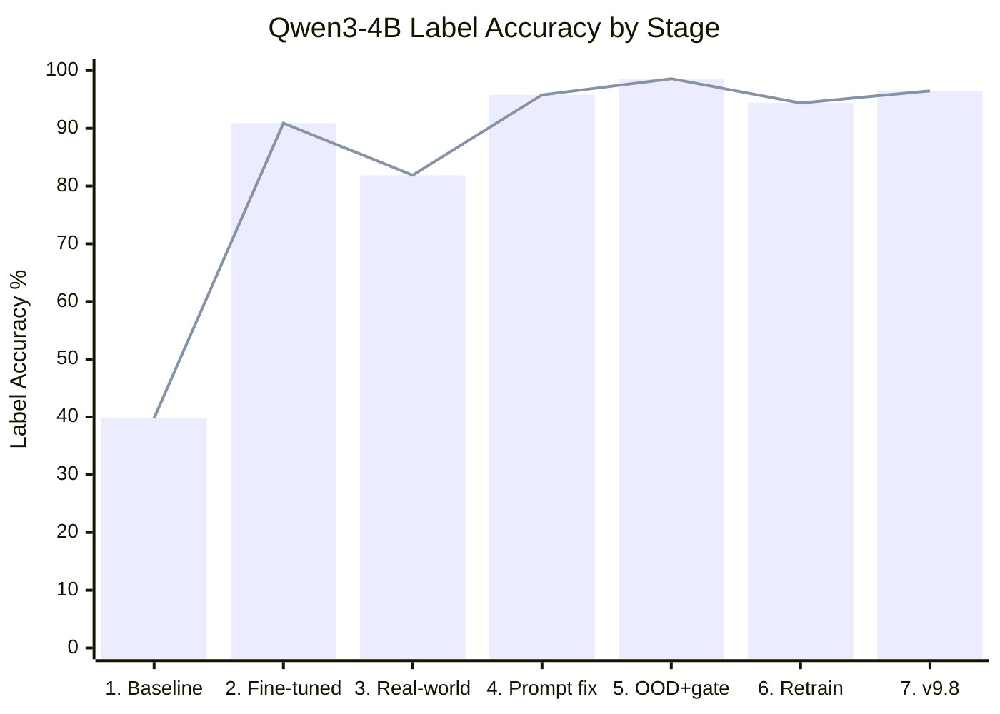
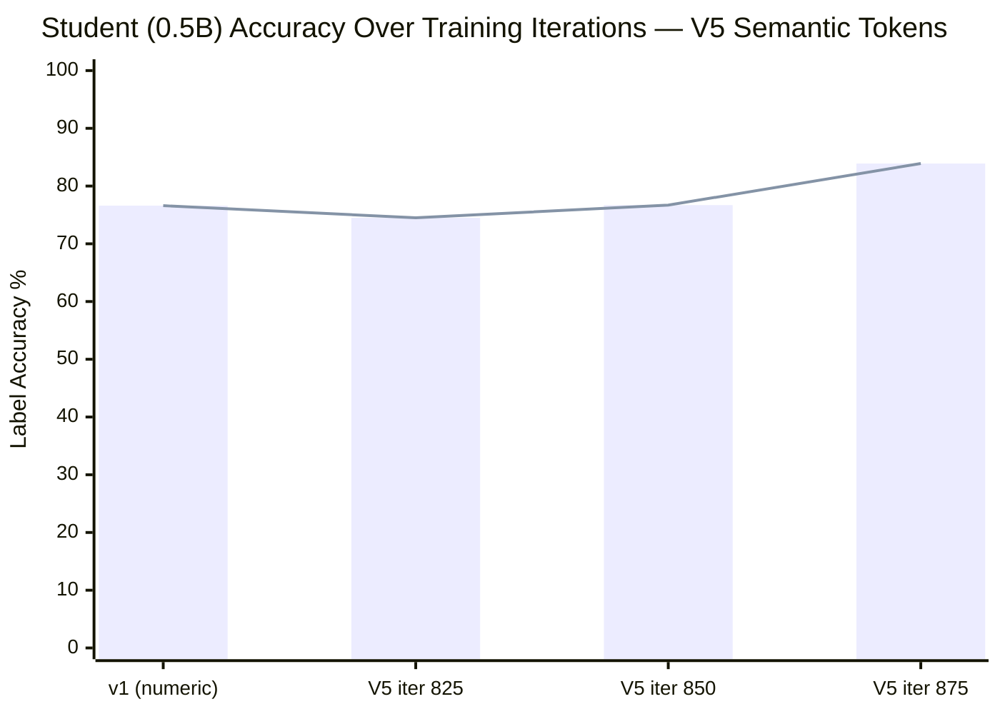
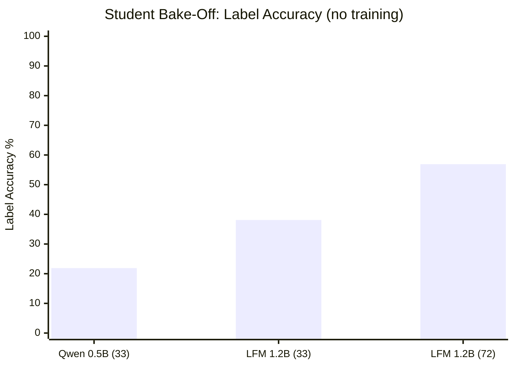
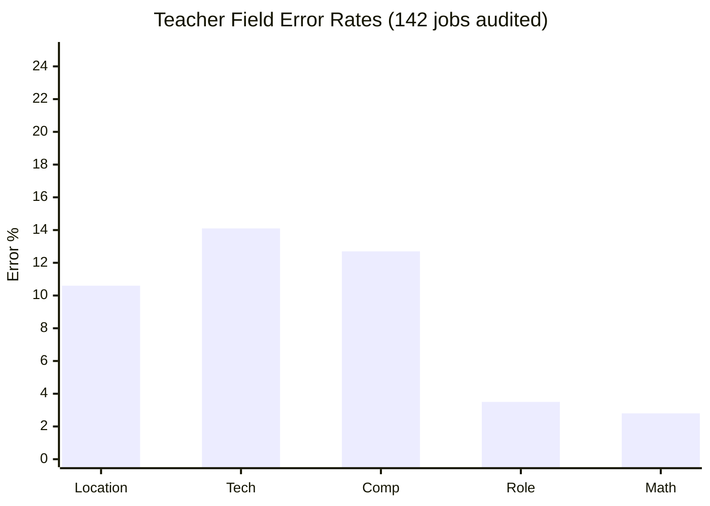

# AI Eval Harness

A pipeline for building a fast, locally-running job-fit scoring model that matches the accuracy of large commercial LLMs — trained on your own taste.

The technique is **LLM knowledge distillation**: use a large model to generate high-quality labeled data, then train a tiny model to mimic it. End result: a model that runs locally via llama.cpp, costs nothing per inference, and scores jobs the way _you_ would.

---

## Progress

| # | Step | Status | Notes |
|---|------|--------|-------|
| 1 | [Ground truth dataset](#phase-1--ground-truth-dataset) | ✅ | 103 hand-scored jobs with 4-category rubric |
| 2 | [Tournament model selection](#phase-2--model-selection) | ✅ | 20 models tested across 3 runtimes, narrowed to 1 |
| 3 | [llama.cpp migration](#the-latency-problem--llamacpp) | ✅ | 5.8× faster than Ollama, 0% parse failures |
| 4 | [Prompt engineering](#phase-4--prompt-engineering) | ✅ | 5 models tested, Qwen3-4B best (80%) |
| 5 | [Data correction](#golden-data-quality-problem) | ✅ | Fixed 20 golden jobs (loc/comp scoring errors) |
| 6 | [Fine-tune best 4B model](#phase-5--fine-tuning-in-progress) | ✅ | LoRA fine-tuned Qwen3-4B: 39.8% → 90.9% on held-out test set |
| 7 | [Real-world eval + prompt fix](#generalisation-eval-real-unseen-uk-jobs-819) | ✅ | 81.9% → 95.8% on 72 real UK LinkedIn jobs (prompt change only) |
| 8 | [OOD testing + domain gate](#out-of-distribution-ood-testing) | ✅ | 88.9% on 72 random non-software UK jobs; domain gate added (v11) |
| 9 | [Knowledge distillation](#phase-9--knowledge-distillation) | ✅ | Student bake-off done; teacher audit found training data gaps |
| 10 | [Retrain teacher (v2b)](#phase-10--retrain-teacher-v2b-adapter) | ✅ | Fixed location bias + comp gaps; 94.4% on UK LinkedIn |
| 11 | [Prompt tuning (v9.2–v9.8)](#phase-11--prompt-tuning-v92v98) | ✅ | 9 prompt iterations; 96.5% combined (173 jobs), best teacher prompt |
| 12 | [Student training v1 (OpenAI)](#phase-12--student-training-why-openai-not-our-teacher) | ✅ | Pivoted to OpenAI labels; 76.6% accuracy, gap analysis done |
| 13 | [Student V5 — semantic tokens](#phase-13--student-v5-semantic-token-architecture) | 🔄 | Architectural pivot: predict tokens not scores; 83.9% at iter 875. [Data pipeline](#training-data-pipeline-v5): 10-recipe synthesis, 16 edge cases, 3-level contamination check |

### Accuracy over time — Qwen3-4B

Each bar is a different measurement stage. The dataset changes between stages, so dips are expected — they reflect harder data, not regressions.



| # | Stage | Dataset | Accuracy | What changed |
|---|-------|---------|----------|-------------|
| 1 | Baseline | 103 corrected golden jobs | 39.8% | Qwen3-4B downloaded, v9 prompt, no training |
| 2 | LoRA fine-tune | 33 held-out test jobs | 90.9% | Trained on 70 jobs (93 oversampled), iter 200 |
| 3 | Real-world test | 72 real UK LinkedIn jobs | 81.9% | Same fine-tuned model, different data distribution |
| 4 | Prompt fix | 72 real UK LinkedIn jobs | 95.8% | v10 prompt — clearer location rules + worked example |
| 5 | OOD + domain gate | 72 random non-software UK jobs | 98.6%* | v11 prompt — Step 0 domain check added |
| 6 | Teacher retrain (v2b) | 72 real UK LinkedIn jobs | 94.4% | Corrective LoRA retrain — fixed location bias |
| 7 | Prompt v9.8 | 173 combined (HC+UK) | **96.5%** | 9 prompt iterations — tech recovery + comp fail-fast |

_\* 69/70 valid outputs — v11 introduced 2 parse failures not present in v10_

### Student model — Qwen2.5-0.5B (knowledge distillation)



| # | Stage | Dataset | Accuracy | What changed |
|---|-------|---------|----------|-------------|
| 12 | Student v1 (numeric) | 141 OpenAI-labeled eval jobs | 76.6% | 0.5B model, LoRA on ~450 teacher-labeled + augmented jobs |
| 13 | Student V5 iter 825 | 150 locked eval jobs | 74.5% | Semantic tokens, 895 training jobs, fresh LoRA |
| 13 | Student V5 iter 850 | 150 locked eval jobs | 76.7% | Same run, later checkpoint |
| 13 | Student V5 iter 875 | 150 locked eval jobs | **83.9%** | Same run, **best checkpoint** — training crashed at iter 890 (OOM) |

### Student bake-off — baseline accuracy (no training)


Both models below the teacher's 95.8% — expected. The question was which one could even follow the format. Qwen had 3% parse failures vs LFM's 36%. Details in [Phase 9](#phase-9--knowledge-distillation). The teacher has since improved to 96.5% combined accuracy via prompt tuning (see [Phase 11](#phase-11--prompt-tuning-v92v98)).

---

## How It Works

```text
golden_jobs.jsonl (103 hand-labeled jobs)
    │
    ▼
sample-test-subset → balanced test sets (10 / 30 / 103 jobs)
    │
    ▼
prompt-lab (quick A/B)  or  eval-runner (full eval)
    │  node-llama-cpp · grammar-constrained JSON · GGUF models
    ▼
results/{prompt-lab,runs}/{timestamp}_{tag}/
    ├── report.md            (accuracy, MAE, bias, confusion matrix)
    ├── eval_results.json    (machine-readable metrics)
    ├── prompt_snapshot.txt  (exact prompt used)
    └── details/*.json       (per-job scoring breakdown)
```

Every eval run is snapshotted — config, prompts, and results — so iterations are fully reproducible.

---

## Phase 1 — Ground Truth Dataset

Before any model touches a job description, I need ground truth to measure against. I hand-labeled 103 jobs against a 100-point scoring rubric. Distribution is intentionally skewed (52 bad_fit, 40 maybe, 11 good_fit) because that reflects the real job market — most jobs aren't a great fit.

Each job is scored across four categories (25 pts each):

| Category         | What scores high                      | Key penalties                 |
| ---------------- | ------------------------------------- | ----------------------------- |
| Role & Seniority | Senior/Staff/Lead Engineer            | Junior, management, unrelated |
| Tech Stack       | Node.js, TypeScript, AI/ML experience | No relevant stack             |
| Location         | Remote UK/global, hybrid London       | **-50** for outside UK        |
| Compensation     | £100k+ base                           | **-30** for below £45k        |

Labels: 70–100 = `good_fit`, 50–69 = `maybe`, 0–49 = `bad_fit`.

Hand-labeling 103 records took longer than expected. Having the explicit rubric was essential — without it, scores drift as fatigue sets in. Midway through, a bad script run wiped all labels from `golden_jobs.jsonl` — went from 88 labeled records to 60 unlabeled ones with no git history to restore from. I had to re-label the surviving 57 real records and generated 46 synthetic jobs using Faker.js to fill gaps and cover edge cases (non-UK locations, missing salary, management roles).

---

## Phase 2 — Model Selection

### Starting point: Promptfoo + Mistral cloud API

I started with [Promptfoo](https://promptfoo.dev) as the eval framework, running evals against Mistral's cloud API (`mistral-large-latest`). The setup was simple — three prompt variants, one cloud provider, `npx promptfoo eval` to run. But it had problems: cloud API calls are slow and expensive for iterating, and I could only test one model at a time. I needed to test local models to find something I could actually fine-tune later.

So I switched to **Ollama** for local model inference. This let me test many models for free, but immediately introduced new problems on my 16 GB MacBook Air.

### Tournament approach

The plan was to run all ~20 Ollama models against all 103 jobs — roughly 2,100 inferences. On my hardware, that's 8–12 hours with no early feedback.

I could have just picked a few models I thought would work, but I honestly had no idea how each one would perform. I could have also kept only the largest models — they're more likely to score well — but given my hardware constraints, I'm happy to trade a little accuracy for speed and not crashing my machine. Many of these models are obviously bad candidates (350M param models, old LLaMA 2, coding-only models). Why wait for a model to finish 103 jobs when it could be dropped after just 10?

So instead: a **3-round tournament** that drops bad models early.

- **Round 1 — Smoke test**: All models, 10 balanced jobs. Drop if accuracy < 40%, parse failures > 30%, or > 120s/job.
- **Round 2 — Qualifying**: Survivors, 30 jobs. Tighter thresholds.
- **Round 3 — Full eval**: Finalists only, all 103 jobs.

### Things that broke along the way

**Prompt-to-golden mismatch.** Before any models ran, I found a critical bug: the scoring prompts had different label thresholds than the golden truth data. The prompt said `bad_fit = 0–39` but the golden data used `bad_fit = 0–49`. A model that scored a job 45 would correctly output `bad_fit` per the golden truth, but the prompt was telling it to output `maybe`. Every model was being evaluated against a rubric it wasn't given. Had to rewrite all prompts to match the golden rubric before any eval results were meaningful.

**Ollama OOM crashes.** Models would run 2–3 jobs fine, then crash with `fetch failed`. Turned out Ollama's default context window (40,960 tokens for qwen3:8b) pre-allocates ~11 GB of KV cache on a 16 GB machine — leaving almost nothing for macOS. Each job only needs ~2,000 tokens, so I was wasting 9 GB on capacity I'd never use. Setting `num_ctx: 4096` dropped RAM usage from ~11 GB to ~3–4 GB and eliminated the crashes.

**Model memory bleeding.** Even after the context fix, models kept crashing when swapping. Ollama holds the previous model in RAM for 5 minutes by default. When the 7B model finished and the 14B tried to load, both were in memory simultaneously — 4.7 GB + 9 GB = game over on 16 GB. Fixed with `keep_alive: 0` to force immediate eviction after each model's test.

**Fail-fast gap.** The initial logic only caught 100% failure rates. A model could succeed on 2 jobs then crash on the next 8, wasting time. Added a `consecutiveErrors >= 3` bail-out to detect mid-run Ollama crashes and move on.

### Smoke test results

**6 of 16 models advanced. 10 eliminated.**

| Model                  | Acc | Parse Fail | MAE  | Bias  | Speed | Result |
| ---------------------- | --- | ---------- | ---- | ----- | ----- | ------ |
| minimax-m2.5 (cloud)   | 70% | 0%         | 20.5 | +13.5 | 20.1s | PASS   |
| qwen3:8b               | 50% | 20%        | 23.1 | +23.1 | 81.2s | PASS   |
| wizardlm2 (~7B)        | 40% | 0%         | 36.7 | +23.7 | 23.5s | PASS   |
| mistral-openorca:7b    | 40% | 0%         | 31.5 | +29.5 | 14.1s | PASS   |
| dolphin-llama3 (~8B)   | 40% | 0%         | 37.0 | +37.0 | 13.5s | PASS   |
| llama2:7b              | 40% | 0%         | 38.5 | +37.5 | 15.6s | PASS   |
| _10 models eliminated_ |     |            |      |       |       | FAIL   |

Some things I didn't expect: all sub-5B models failed outright (~30% accuracy, basically random guessing). The largest local model (qwen2.5:14b) had the _worst_ accuracy — aggressive quantization to fit in 16 GB erased the size advantage entirely. And 14 of 16 models systematically over-scored everything. A model that rates every job as "good" is useless for filtering. Only the cloud model could correctly identify `maybe` jobs — every local model mapped them straight to `good_fit`.

### The latency problem → llama.cpp

Although I was pretty happy with qwen3:8b at 50% accuracy, 81.2s/job is still a long time to wait for iterative prompt engineering. It would be such a pain to wait hours to test each prompt on a decent number of jobs. So I kept trying other models hoping to find a sweet spot of similar accuracy but faster speed.

Then I came across llama.cpp and llama-server as runtimes instead of Ollama. This meant getting new GGUF models (Ollama models aren't compatible), but the speed difference was immediately obvious:

| Runtime   | Model    | Acc | Speed | Parse failures |
| --------- | -------- | --- | ----- | -------------- |
| Ollama    | qwen3:8b | 50% | 81.2s | 20%            |
| llama.cpp | qwen3:8b | 50% | 14.1s | 0%             |

Same model, same accuracy, **5.8× faster**, zero parse failures. That extra headroom also opens the door to using bigger models than what I could previously run on Ollama, and potentially running multiple jobs in parallel.

It wasn't completely smooth though. Running Qwen3 through llama-server, the model started returning empty `{}` responses — valid JSON but no actual content. The issue was Qwen3's thinking mode: the model was spending all its tokens on internal reasoning (`<think>` blocks) and the JSON grammar sampler was only getting the leftovers. Fixed by injecting `/no_think` as a system message. I also hit GPU OOM from prompt cache accumulation — llama-server was caching prompts across slots (~175 MB each), and after 5 jobs it had 781 MB of useless cache that crashed the process. Fixed with `--no-cache-prompt` since each job is independent anyway.

### Ditching Promptfoo and the tournament

At this point I realised the speed improvement changed everything. The tournament was a solution to Ollama's latency — if each job takes 80 seconds, you need to be clever about which models you test. But at 14 seconds per job, I could just test everything. A 10-job eval gives a pretty accurate picture of model performance, and now it only takes 2 minutes instead of 13.

So I rebuilt the whole eval pipeline. Promptfoo doesn't support node-llama-cpp as a provider — it talks to HTTP APIs, not native bindings. I had a choice: write a custom Promptfoo provider plugin, or just build my own eval runner. I built `eval-runner.ts` — it reads the same Promptfoo config YAML (keeping the nice schema and test format) but runs inference directly through node-llama-cpp. Grammar-constrained decoding means 0% parse failures — the model can only produce tokens that form valid JSON matching the expected schema. Parse failures had been a constant headache with Ollama; with grammar constraints they just disappeared.

I deleted `tournament.ts` (1,235 lines of Ollama client code, llama-server spawning, and 3-round tournament logic) and replaced it with `eval-runner.ts` (~500 lines). Promptfoo is still in the project — I use it for the YAML config schema and test generation — just not as the runtime anymore.

### Baseline results (node-llama-cpp)

Re-ran all candidates through node-llama-cpp with grammar-constrained JSON. 10 jobs, seed 42, balanced sampling.

| #   | Model                  | Params | Acc     | MAE      | Bias     | Speed |
| --- | ---------------------- | ------ | ------- | -------- | -------- | ----- |
| 1   | **gemma-3-4b-it**      | 4B     | **60%** | **26.8** | +26.8    | 11.7s |
| 2   | qwen3-8b-official      | 8B     | 50%     | 36.0     | +36.0    | 25.1s |
| 3   | qwen3-4b-instruct-2507 | 4B     | 50%     | 35.0     | +35.0    | 16.8s |
| 4   | meta-llama-3.1-8b      | 8B     | 40%     | 36.0     | +16.4    | 19.8s |
| 5   | ministral-3-8b-2512    | 8.4B   | 30%     | **24.5** | +7.5     | 22.4s |
| 6   | qwen2.5-7b-instruct    | 7.6B   | 30%     | 30.4     | **-2.6** | 16.0s |
| 7   | glider (PatronusAI)    | 3.8B   | 30%     | 31.6     | +23.4    | 29.7s |
| 8   | mistral-7b-instruct    | 7B     | 10%     | 22.8     | +5.2     | 16.7s |

**Gemma-3-4B-IT** is the clear winner — and it wasn't even supposed to be. It's the only model with both 100% good_fit detection and non-zero bad_fit detection. Every other model is either a "yes-man" that approves everything or a pessimist that rejects everything:

| Model             | good_fit (of 4) | maybe (of 3) | bad_fit (of 3) |
| ----------------- | --------------- | ------------ | -------------- |
| **gemma-3-4b-it** | 4/4 (100%)      | 1/3 (33%)    | 1/3 (33%)      |
| qwen3-8b          | 4/4 (100%)      | 1/3 (33%)    | 0/3 (0%)       |
| ministral-3-8b    | 0/4 (0%)        | 1/3 (33%)    | 2/3 (67%)      |
| qwen2.5-7b        | 0/4 (0%)        | 2/3 (67%)    | 1/3 (33%)      |

A few other things I found along the way: thinking mode (`think` vs `no_think`) never helped on any model — zero accuracy improvement, up to 38% slower. Model size doesn't predict quality — the 4B Gemma beat every 7B and 8B model tested. And Ministral has the best score calibration (24.5 MAE) and best bad_fit detection (67%) but can't recognise a good job to save its life — worth revisiting with prompt work.

### Verdict

```text
20 models (Ollama + cloud)
    │  Round 1: 10 jobs, drop <40% acc / >30% parse / >120s
    ▼
6 survivors
    │  Migrate to node-llama-cpp (5.8× faster, 0% parse fail)
    ▼
8 GGUF models re-baselined
    │  10 jobs, seed 42, grammar-constrained JSON
    ▼
Gemma-3-4B-IT (60%) ← best baseline, sent to prompt engineering
```

After testing and benchmarking tens of models across three runtimes and running hundreds of eval tests, I've gathered enough data to make decisions about which model to tune and what their weaknesses are. The prompt is still the bottleneck — all models struggle with the same failure modes. So I'll start optimising my prompt to get as much as possible from Gemma and see how far it can go before fine-tuning.

---

## Phase 4 — Prompt Engineering

Starting from the v9 prompt (the best from Gemma optimization), each model was tested with the same baseline, then iterated with targeted prompt changes until accuracy plateaued. The pattern: most models hit ceiling on v9 itself — additional prompt complexity consistently degraded accuracy on small models.

### Gemma-3-4B-IT

Gemma-3-4B-IT tops out at **70% label accuracy** (v6c prompt, 10-job sample). Tested 5 prompt variants (v6–v9) — adding more examples, IF-THEN rules, or zero-point demonstrations all degraded accuracy. The remaining 30% misses are model-level limitations: hallucinating keywords not in the input, arithmetic errors on negative sums, and ignoring "Up to £X" comp rules. 70% appears to be this model's ceiling for prompt-only optimisation.

### Qwen3-4B-Instruct-2507

Tested Qwen3-4B as an alternative to Gemma, starting from the same v6 prompt that was Gemma's best. Qwen3-4B immediately outperformed Gemma — **80% label accuracy** on the first run vs Gemma's 70% ceiling — using the exact same prompt and rubric.

| Version              | Prompt change                                         | Accuracy | MAE      | Bias      | Speed     | Status           |
| -------------------- | ----------------------------------------------------- | -------- | -------- | --------- | --------- | ---------------- |
| v9 (baseline)        | Gemma v6 prompt, no changes                           | **80%**  | 12.5     | +12.5     | 55.4s     | Best prompt      |
| v10                  | Added CAUTION gate, Example C, empty-field extraction | 60%      | 14       | +14       | 111.3s    | Regressed        |
| v11                  | v9 + rewording "Up to" rule only                      | 70%      | 15       | +15       | 27.4s     | Regressed        |
| **v9 + infra fixes** | **Same v9 prompt, GC between jobs**                   | **80%**  | **12.5** | **+12.5** | **28.1s** | **Best overall** |

**Key finding:** more verbose prompts hurt this 4B model. v10 added ~50% more prompt text and accuracy dropped by 20 percentage points. v11 changed a single line and still introduced a regression. The v9 baseline (identical to Gemma v6) remains the best prompt for both models.

#### Issues and fixes

**RAM pressure causing timeouts and degraded inference.** The first v10 run got 5/5 correct on completed jobs, then timed out at 421s on job 6. The second run completed all 10 but only hit 60% accuracy. Same prompt, different results — RAM pressure was degrading inference quality. Fixed by adding `global.gc?.()` + 100ms pause between jobs and `--expose-gc` to the tsx invocation. This cut latency from 55.4s to 28.1s per job — a **2× speedup**.

**Context size truncation.** Reducing `context_size` from 4096 to 2048 caused accuracy to drop. The longest JD in the test set is 6,295 characters (~1,574 tokens); combined with the ~470-token prompt, total context hits ~2,044 tokens — right at the 2048 limit. Reverted to 4096.

#### Remaining misses (2/10)

Both misses are consistent across all runs — the model gets them wrong every time regardless of prompt wording:

1. **Spencer Inc** (expected: maybe 50, predicted: good_fit 75): The model's reasoning is correct — it computes loc=10, role=0, tech=15, comp=25 = 50 = maybe. But its JSON output says 75/good_fit. This is a reasoning-to-output mismatch: the model talks itself to the right answer then writes the wrong number.

2. **Fintech "Up to £150K"** (expected: bad_fit 25, predicted: good_fit 90): The model ignores the "Up to £X = comp 0" rule entirely, treating "Up to £170K" as a £170K midpoint and scoring comp=25. Three different prompt wordings for this rule all failed — the model simply doesn't apply negative/zero-scoring rules to high-looking numbers.

Both are model-level limitations, not prompt issues — candidates for fine-tuning.

#### Results

Qwen3-4B-Instruct-2507 with the v9 prompt is the best local model tested so far: **80% accuracy at 28s/job**, beating Gemma's 70% ceiling with the same prompt. The remaining 20% errors are model-level limitations (reasoning/output mismatch, ignoring zero-score rules) that prompt engineering alone can't fix. I would like to try my luck with a larger model, hopefully it will be better at applying the rules and doing arithmetic, but for now Qwen3-4B has gone a long way!.

### Meta-Llama-3.1-8B-Instruct

Tested Llama 3.1 8B as a larger (8B) alternative, hoping the extra parameters would help with rule-following and arithmetic. Previously scored 40% in the baseline tournament — started from the same v9 prompt.

| Version       | Prompt change                                  | Accuracy | MAE  | Bias  | Speed | Status  |
| ------------- | ---------------------------------------------- | -------- | ---- | ----- | ----- | ------- |
| v9 (baseline) | Gemma v6 prompt, no changes                    | 60%      | 15.5 | -15.5 | 23.1s | Best    |
| v10           | Explicit if/then keyword matching + 4 examples | 60%      | 18.5 | -14.5 | 20.9s | No gain |

**Key finding:** Llama 3.1 8B has the opposite problem to Qwen — it **underscores** (bias -15.5) instead of overscoring (+12.5). It has perfect bad_fit detection (3/3) and correctly handles the "Up to £X = comp 0" rule that Qwen can't learn. But it can't reliably detect keywords in job titles — scoring "Senior Backend Engineer" as role=0 and "London Area, United Kingdom" as loc=0.

| Trait            | Qwen3-4B       | Llama 3.1 8B   |
| ---------------- | -------------- | -------------- |
| Accuracy         | **80%**        | 60%            |
| Bias             | +12.5          | -15.5          |
| good_fit recall  | **4/4 (100%)** | 1/4 (25%)      |
| bad_fit recall   | 2/3 (67%)      | **3/3 (100%)** |
| "Up to £X" rule  | Ignores it     | **Correct**    |
| Keyword matching | **Solid**      | Broken         |

v10 added explicit if/then keyword matching with worked examples for the exact failing patterns ("Senior Backend Engineer" → 25, "Lead DevOps Architect" → 25). This fixed role detection for some jobs but broke tech stack scoring for others — net zero. The ScaleXP failure is particularly bad: the model scores 0 on a job where the title is "Senior Backend Engineer" and the location is "London Area, United Kingdom" — it can't even read the input fields.

Model size doesn't help here — the 8B Llama is worse than the 4B Qwen at this task. Not worth further prompt iteration.

### Qwen2.5-7B-Instruct

Tested Qwen2.5-7B as a middle ground — same architecture family as the winning Qwen3-4B but larger (7B) and an older generation. Previously scored 30% in the baseline tournament with the old prompt.

| Version       | Prompt change                                          | Accuracy | MAE  | Bias | Speed | Status  |
| ------------- | ------------------------------------------------------ | -------- | ---- | ---- | ----- | ------- |
| v9 (baseline) | Gemma v6 prompt, no changes                            | 70%      | 10.5 | +8.5 | 21.5s | Best    |
| v10           | Stricter comp rules, "Up to" example, 4 CRITICAL rules | 70%      | 12.0 | +6.0 | 23.5s | No gain |

**Key finding:** v9 jumped from 30% → 70% (the structured prompt is doing most of the work). Bias is positive (+8.5) like Qwen3-4B, but the model has two unfixable problems:

1. **Salary hallucination** — fabricates GBP salary figures for jobs that don't have them (Oracle US job predicted as having "£79,800-£178,100")
2. **Ignores "Up to £X" rule** — despite a worked example showing exactly this pattern (Owen Thomas, +60 error), the model still scores comp=25

v10 added CRITICAL rules and Example C targeting these failures. Result: fixed Happl but regressed Lead DevOps — net zero. The Owen Thomas miss (+60 error) persisted unchanged, proving the model can't learn this rule from prompt alone.

70% is this model's ceiling — same issues as other models, just different flavours.

### WizardLM-2-7B

Tested WizardLM-2-7B as a creative/reasoning-oriented alternative. Previously scored 40% in the baseline tournament.

| Version       | Prompt change               | Accuracy | MAE  | Bias  | Speed | Status  |
| ------------- | --------------------------- | -------- | ---- | ----- | ----- | ------- |
| v9 (baseline) | Gemma v6 prompt, no changes | 60%      | 20.0 | +20.0 | 23.0s | Yes-man |

**Key finding:** the model is a **yes-man** — all 5 completed predictions were identical: score 90, good_fit, with the reasoning copy-pasted verbatim from Example A ("Senior role in London with Node.js/TS and £100k midpoint salary"). Only 5 of 10 jobs completed before timeout.

The model isn't applying the scoring rubric — it's parroting the worked example regardless of input. This is worse than overscoring; it's zero discrimination between jobs. Not worth iterating.

### Cross-model comparison

| Model                      | Size | Best Accuracy | MAE  | Bias  | Key weakness                      |
| -------------------------- | ---- | ------------- | ---- | ----- | --------------------------------- |
| **Qwen3-4B-Instruct-2507** | 4B   | **80%**       | 12.5 | +12.5 | "Up to £X" overscoring            |
| Gemma-3-4B-IT              | 4B   | 70%           | 26.8 | +26.8 | Keyword hallucination, arithmetic |
| Qwen2.5-7B-Instruct        | 7B   | 70%           | 10.5 | +8.5  | Salary hallucination              |
| Meta-Llama-3.1-8B-Instruct | 8B   | 60%           | 15.5 | -15.5 | Can't detect keywords             |
| WizardLM-2-7B              | 7B   | 60%           | 20.0 | +20.0 | Yes-man (parrots example)         |

Model size doesn't predict accuracy — the 4B Qwen3 beats every 7B and 8B model. All models share the same v9 prompt baseline; additional prompt complexity consistently hurts small models. The remaining errors are model-level limitations (hallucination, arithmetic, rule-ignoring) that only fine-tuning can address.

### Fine-tuning candidate: Qwen3-4B

Looking at the data, Qwen3-4B is the clear choice for fine-tuning — and it changes the original plan.

| Why Qwen3-4B                | Detail                                                                                                   |
| --------------------------- | -------------------------------------------------------------------------------------------------------- |
| Highest baseline            | 80% — less to fix, more likely to push past 90%                                                          |
| Systematic errors           | Same 2 misses every run ("Up to £X" rule, reasoning-to-output mismatch) — exactly what fine-tuning fixes |
| Smallest model              | 4B params — cheapest/fastest to fine-tune, already beats every 7B and 8B                                 |
| Others have harder problems | Qwen2.5 hallucinates salaries, Llama can't parse inputs, WizardLM parrots examples                       |

---

## Phase 5 — Fine-tuning (in progress)

### First attempt: MLX LoRA on Qwen3-4B

Built a full LoRA fine-tuning pipeline targeting Qwen3-4B on Apple M1 (16GB):

```text
golden_jobs.jsonl (103 hand-labeled)
    │
    ├─ compute-breakdowns.ts → add loc/role/tech/comp per job
    ├─ split-train-test.ts   → 70 train / 33 held-out test (stratified, seed=42)
    ├─ format-for-mlx.ts     → chat-format JSONL for MLX LoRA
    │
    ▼
MLX LoRA training (rank=8, 400 iters, lr=1e-5)
    │
    ▼
Fuse → GGUF → eval on held-out 33
```

**Training config** (MLX LoRA on M1 16GB):

| Parameter | Value | Rationale |
|-----------|-------|-----------|
| rank | 8 | 70 examples + narrow task = low rank prevents overfitting |
| lr | 1e-5 | Model already 80% correct, small adjustments needed |
| iters | 400 | ~5.7 epochs over 70 examples |
| batch_size | 1 | M1 16GB constraint |
| mask_prompt | true | Only train on assistant responses (not the 470-token prompt) |
| grad_checkpoint | true | Required — without it, OOMs on M1 16GB |

### Things that broke

**mlx-lm API change.** mlx-lm v0.30+ changed `alpha` to `scale` in LoRA config. Training crashed with `KeyError: 'scale'`. Fixed by replacing `alpha: 16` with `scale: 2.0` (= alpha/rank = 16/8).

**NaN loss from sequence truncation.** Default `max_seq_length` is 2048 tokens. The longest training example is ~2,350 tokens. MLX silently truncated examples mid-response, creating invalid training targets. Loss went to NaN at iter 60. Fixed with `max_seq_length: 4096`.

**OOM crashes.** With `max_seq_length: 4096`, the training used ~5.6 GB peak memory with `grad_checkpoint: true`. Tried disabling grad_checkpoint for speed (~30-40% faster) — immediately OOMed. Also tried `max_seq_length: 2560` without grad_checkpoint — still OOMed. On M1 16GB, `grad_checkpoint: true` is mandatory. Training takes ~3 hours.

**Loss curve before crash** (looked healthy):

```
Iter 10: loss 3.508
Iter 20: loss 1.766
Iter 30: loss 0.974  ← learning format + patterns quickly
Iter 40: loss 0.731
Iter 50: loss 0.505
Iter 60: NaN         ← truncation corruption
```

### Golden data quality problem

Before restarting training, reviewed the training data quality. Found **20 of 103 golden jobs had wrong labels**:

- **13 location errors:** Jobs with "London Area, United Kingdom" in the location field were hand-scored as "Outside UK (-50)" instead of "London, UK (+25)". A 75-point swing per job.
- **8 compensation errors:** Jobs with no salary stated were scored as "Salary <£45k (-30)" instead of "No salary (0)". One overlap with location errors.

These aren't judgment calls — they're mistakes in applying the rubric. The rubric (v9) is unchanged.

**Impact on previous work:**

| What | Status | Why |
|------|--------|-----|
| Scoring rubric (v9) | Still valid | Rules didn't change |
| Eval infrastructure | Still valid | Pipeline is reusable |
| Relative model rankings | Likely still valid | All models measured against the same data |
| Prompt engineering insights | Still valid | "Simple prompts beat complex ones" is still true |
| Absolute accuracy numbers | Invalid | 80% was measured against wrong answers |
| Training data | Must regenerate | Can't train on wrong labels |

Label distribution shifted after fixes: bad_fit 52→39, maybe 40→51, good_fit 11→13. Several jobs that were penalised for "wrong location" were actually London-based and should have scored higher.

### Revised approach

Rather than just retraining on corrected data, taking a step back to re-validate model selection:

```text
golden_jobs.jsonl (103 corrected)
    │
    ├─ Old pipeline preserved (original labels, for reference)
    │
    ├─ New tests generated from corrected labels
    │
    ▼
Head-to-head eval: Qwen3-4B vs Gemma-3-4B
    │  Both on v9 prompt, all 103 jobs
    │
    ▼
Failure analysis
    │  Categorise misses: systematic (trainable) vs random (not trainable)
    │
    ▼
Select winner → LoRA fine-tune on 70 train jobs
    │
    ▼
Eval on 33 held-out → target 90%+
```

**Why re-evaluate instead of just retraining Qwen3-4B?**

1. The old 80% accuracy number is invalid — Qwen3 might not still be the winner
2. Training larger models (7B/8B) is impossible on M1 16GB — only 4B fits, so it's between these two
3. The model with more *systematic* (trainable) failures is the better candidate, even if its raw accuracy is slightly lower
4. Both pipelines (old and new) are preserved — can always go back and verify

### Qwen3-4B on corrected data: 39.8%

Ran Qwen3-4B-Instruct-2507 on all 103 corrected jobs with v9 prompt. The results were a shock:

| Metric | Old data (10 jobs) | Corrected data (103 jobs) |
|--------|-------------------|--------------------------|
| Accuracy | 80% | **39.8%** |
| Parse fail | 0% | 0% |
| MAE | 12.5 | 25.9 |
| Bias | +12.5 | **+23.1** |

The 80% → 40% drop makes sense in hindsight. Previously tested on only 10 jobs — each worth 10 percentage points. And those 10 were measured against wrong labels, so "correct" predictions may have been wrong answers matching wrong data. Testing on all 103 with corrected labels reveals the true accuracy.

**Confusion matrix:**

```text
Actual \ Predicted  | good_fit | maybe | bad_fit
--------------------|----------|-------|--------
good_fit (13)       |    13    |   0   |    0     ← 100% correct
maybe    (51)       |    32    |  19   |    0     ← 37% correct
bad_fit  (39)       |    13    |  17   |    9     ← 23% correct
```

The model **never under-predicts** — zero cases of predicting a lower label than actual. It always scores too high. It correctly identifies every good_fit but can't recognise bad jobs.

### Finding: the model thinks correctly but writes wrong answers

This is the most interesting failure pattern I've found. Looking at individual results, the model's reasoning is often **correct** but the JSON values are **wrong**:

**Example — Backend Systems Developer (Edinburgh):**
- Reasoning: *"no Senior keyword, role=0... no Node.js, tech=0... salary in USD, comp=0... total=10 → bad_fit"*
- JSON output: `{"loc":10,"role":25,"tech":10,"comp":25,"score":70,"label":"good_fit"}`
- The reasoning says bad_fit. The JSON says good_fit. **Both from the same response.**

**Example — Senior SWE in Bangalore, India:**
- Reasoning: *"India, outside UK, loc=-50... total=0 → bad_fit"*
- JSON output: `{"loc":10,"role":25,"tech":10,"comp":25,"score":70,"label":"good_fit"}`
- Knows it's India (-50). Writes loc=10.

This happens on ~45 of the 62 wrong answers. The model walks through the rules correctly in its reasoning, then outputs inflated numbers in the JSON.

**Why?** The JSON format puts scores **before** reasoning: `{"loc":X,"role":X,...,"reasoning":"..."}`. The model generates the numbers first (defaulting to high values), then reasons about them after. By the time it works out the correct answer, the numbers are already committed. It's writing the answer before reading the question.

**Specific failure patterns across all 103 jobs:**

| Pattern | Count | What happens |
|---------|-------|-------------|
| role defaults to 25 | ~30 | "Software Engineer", "Product Developer", "Engineering Manager" all get role=25 despite no senior keyword |
| tech defaults to 10-15 | ~25 | Java, Rust, Apollo/GraphQL, AWS all get tech points despite not being Node.js/TS/AI |
| comp defaults to 25 | ~20 | "Up to £X", USD salaries, and sub-£55k all get comp=25 |
| loc won't go negative | ~8 | Bangalore, Prague, Berlin, Vancouver all get loc=10 instead of -50 |
| Geography error | ~2 | Dublin, Ireland scored as "UK city" — Ireland is not in the UK |

The model has a "default high" bias — when uncertain, it writes 25 for every category. It can reason its way to 0 or -50, but can't bring itself to actually write those values.

### Approaches considered

**1. Train directly on corrected data (keep current format)**

Just regenerate training data with correct labels and train. Simple, but doesn't address the root cause — the model would still generate scores before reasoning. Training might force correct patterns through repetition, but we'd be fighting the format.

**2. Change output format (reasoning before scores) + train**

Move reasoning before the score values in the JSON, so the model thinks first. But this requires updating the training data format, the eval parser, the prompt, and the test assertions — significant rework. And changing the format is prompt engineering, not training strategy. Should test it separately first.

**3. Test format change first, then train without changing data** ← chosen

The key insight: a format change is just prompt engineering and can be tested in 15 minutes with zero code changes to the training pipeline. If putting reasoning first improves accuracy from 40% to 60%, that tells us the model genuinely understands the rules (the "correct reasoning" isn't post-hoc rationalisation). If it doesn't help, we know the model's understanding is shallower than the reasoning text suggests.

Either way, we get **better diagnostic information** — genuine reasoning rather than afterthought — which directly shapes what training data we need. Then we train with the existing simple JSON format (no reasoning in training data), keeping the data pipeline unchanged.

**Why this is the right order:**
- Prompt change: 15 minutes to test, free information about model comprehension
- Training: 1-3 hours on M1, expensive to iterate, need to get it right first
- The diagnostic eval tells us *what* to train on — don't train blind

### Gemma-3-4B on corrected data: 44.7%

| Metric | Qwen3-4B | Gemma-3-4B |
|--------|----------|------------|
| Accuracy | 39.8% | **44.7%** |
| MAE | 25.9 | **20.2** |
| Bias | +23.1 | **+18.8** |
| Speed | 82s | **22.4s** (4× faster) |

Gemma wins on raw numbers. But the confusion matrices reveal very different failure modes:

```text
QWEN3-4B                              GEMMA-3-4B
Actual\Pred  | good | maybe | bad     Actual\Pred  | good | maybe | bad
-------------|------|-------|----     -------------|------|-------|----
good_fit(13) |  13  |   0   |  0     good_fit(13) |  10  |   3   |  0
maybe   (51) |  32  |  19   |  0     maybe   (51) |  18  |  33   |  0
bad_fit (39) |  13  |  17   |  9     bad_fit (39) |   8  |  28   |  3
```

Gemma is better at `maybe` (65% vs 37%) but worse at `good_fit` (77% vs 100%) and `bad_fit` (8% vs 23%). Neither model ever under-predicts — both have a positive bias.

### Finding: same accuracy, completely different failure modes

**Qwen understands the rules but writes wrong values.** Its reasoning walks through the rubric correctly — "no Senior keyword, role=0" — then the JSON says `role:25`. The model thinks correctly but outputs wrong numbers. This is a structural problem (JSON values come before reasoning in the output format).

**Gemma doesn't understand the rules at all.** Its reasoning is brief, confident, and **consistent** with its wrong JSON. When Gemma gives `tech=25` for a Ruby on Rails job, its reasoning says "Ruby on Rails, PostgreSQL are listed (+25)." Gemma genuinely believes any tech stack deserves points.

Gemma-specific errors not seen in Qwen:
- **Awards tech points for ANY tech** — Ruby on Rails gets `tech=25`, Rust/WASM gets `tech=25`, Golang/gRPC gets `tech=20`. Gemma doesn't understand only Node.js/TS/AI qualify.
- **Scores US locations as +25** — DigniFi in "United States" gets `loc=25`. Reasoning says "in the US" but still gives maximum location score.
- **Converts USD to GBP** — "$120k-$150k, which equates to approximately £96k-£120k" → `comp=25`. The rubric says ignore USD entirely. Gemma invents a currency conversion rule.

Both models share: "Up to £X" ignored, Dublin=UK geography error, general positive bias.

### Training candidate: Qwen3-4B (confirmed)

Despite lower raw accuracy, Qwen is the better training candidate:

| | Qwen3-4B | Gemma-3-4B |
|---|---|---|
| Root cause | Understands rules, outputs wrong values | Doesn't understand the rules |
| Training task | Pattern correction (easier) | Comprehension improvement (harder) |
| Failure uniformity | One fix (learn to write zeros) covers most errors | Many diverse error types |

Teaching a model to **output** different values from 70 examples is easier than teaching it to **understand** new rules from 70 examples. Qwen already has the knowledge — it just needs to learn the correct output patterns.

### Next step: diagnostic prompt before training

Before training, one more experiment. The v9 prompt puts JSON values before reasoning — the model writes the answer before thinking. A v10 prompt with reasoning-before-scores might:

1. **Improve accuracy** — model thinks before committing to numbers
2. **Reveal true comprehension** — is Qwen's "correct" reasoning genuine thinking or post-hoc rationalisation?

Either outcome gives us better information for training. This is a 15-minute prompt experiment vs hours of training — worth testing first.

If the format change helps, we train with the current simple JSON format (no reasoning in training data) because:
- Training teaches the model correct output patterns through repetition
- A well-trained model doesn't need to reason at inference time
- Simpler format = shorter sequences = faster training = less memory

```text
1. Create v10 prompt (reasoning-first format)         ← next
2. Test v10 on Qwen3-4B (103 jobs)                    ← does format alone help?
3. Train with simple JSON format, oversampling failures
4. Eval on 33 held-out test set → target 90%+
```

### Training run: LoRA fine-tune on Qwen3-4B

Skipped the reasoning-first prompt experiment and trained directly on the corrected data with oversampling of failure cases.

#### Why LoRA?

LoRA (Low-Rank Adaptation) freezes most of the model's weights and adds small trainable matrices to a few attention layers. Instead of updating all ~4 billion parameters, you update ~0.3% of them. This matters for three reasons:

1. **It fits on M1 16GB.** Full fine-tuning a 4B model requires storing gradients for every parameter — roughly 3–4× the model size in memory. That's 12–16 GB just for the optimizer state, before the model itself. Impossible. LoRA keeps optimizer state tiny.

2. **It's appropriate for what we're fixing.** The diagnostic found Qwen already *knows* the rules — it reasons correctly, then writes wrong values. We're not teaching new knowledge; we're correcting output patterns. LoRA is designed for adaptation, not re-teaching. A large update to the whole model would risk damaging what already works.

3. **70 training examples is tiny.** Full fine-tuning with 70 examples would overfit catastrophically — the model would memorise the training set and forget everything else. LoRA's low-rank constraint acts as strong regularisation, limiting how much the model can change.

#### Why these specific hyperparameters?

**rank=4** (not 8, not 16): Rank controls how many new "directions" the adapter can learn. Rank 8 was in the first (failed) attempt — this task is even simpler (pattern correction, 70 examples, narrow domain), so we went lower. Lower rank = fewer parameters = harder to overfit = more likely to generalise.

**lr=1e-5** (conservative): The model is already 80% correct. Small learning rate means small corrections. A larger rate (1e-4) would risk overwriting the knowledge the model already has.

**mask_prompt=true**: The training prompt is ~470 tokens of instructions and examples. Without masking, the model would compute loss on those tokens too — trying to "learn" to reproduce the prompt itself, which is useless. With masking, loss is computed only on the assistant's JSON response (~100 tokens). We're training the output, not the instructions.

**grad_checkpoint=true**: Normally, the backward pass caches all intermediate activations (forward pass results) to compute gradients efficiently. On M1 16GB, storing those caches for a 4B model with `max_seq_length: 2560` requires more memory than available. Gradient checkpointing trades compute for memory: recomputes activations on the fly instead of storing them, using ~40% more compute but reducing peak memory enough to fit. Without it, training OOMs every time.

**Stopped at iter 200**: The original plan was 400 iterations. But training loss (0.108) and validation loss (0.114) had converged by iter 200 — a gap of only 0.006. Continuing to 400 would widen this gap as the model begins memorising training examples rather than learning the pattern. Train/val gap is the overfitting signal — stop when it's near zero.

#### Data preparation

- 70/33 stratified split (seed=42) — both sets have proportional label distribution
- **Oversampling** hard failure cases → 93 training examples from 70 jobs:
  - Non-UK locations (India, US, Europe): the `loc=-50` case the model consistently got wrong
  - Non-senior titles ("Software Engineer", "Engineer", "Product Developer"): `role=0` case
  - "Up to £X" compensation: `comp=0` case the model always ignored
  - Non-qualifying tech (Java, Rust, Ruby, AWS-only): `tech=0` case

  Oversampling means these patterns appear more frequently in training so the model sees enough examples of each failure mode to correct the habit. Without oversampling, `loc=-50` cases are rare in the 70-job set — the model could easily learn to approximate everything without ever correctly learning the penalty.

- `mask_prompt: true` — loss computed on assistant responses only (not the 470-token prompt)

**Training config (corrected from earlier attempt):**

| Parameter | Value | Rationale |
|-----------|-------|-----------|
| rank | 4 | Narrow pattern-correction task — low rank prevents overfitting |
| scale | 4.0 | Effective alpha = 16 (mlx-lm v0.30+ uses scale, not alpha) |
| lr | 1e-5 | Conservative — correcting output patterns, not teaching new knowledge |
| iters | 200 | Stopped at 200 (of 400 planned) when val loss converged |
| batch_size | 1 | M1 16GB constraint |
| grad_checkpoint | true | Required — without it, OOMs on M1 16GB |
| max_seq_length | 2560 | Longest example ~2350 tokens + headroom |

**Loss curve (stopped at iter 200):**

```
Iter   1: val  loss 3.846
Iter  10: train loss 3.690
Iter  50: train loss 0.573
Iter 100: train loss 0.222  ← checkpoint saved
Iter 150: train loss 0.152
Iter 200: train loss 0.108 / val loss 0.114  ← checkpoint saved, training stopped
```

Train/val gap at iter 200: **0.006** — near-zero, no overfitting. Stopped here rather than continuing to 400 iterations where the gap would likely widen.

### Fine-tune results: 39.8% → 90.9%

Eval on 33 held-out test jobs (never seen during training):

| Metric | Baseline (v9 prompt) | Fine-tuned (iter 200) |
|--------|---------------------|----------------------|
| Label accuracy | 39.8% (103 jobs) | **90.9%** (33 jobs) |
| Parse failures | 0% | 0% |

**Field accuracy:**

| Field | Accuracy | Notes |
|-------|----------|-------|
| loc | 97.0% | Correctly writes -50 for non-UK locations |
| role | 93.9% | Stopped defaulting to 25 for non-senior titles |
| comp | 87.9% | Handles "Up to £X" = 0 correctly |
| tech | 75.8% | Weakest — requires judgement on "required vs mentioned" |

**Per-label breakdown:**

| Label | Accuracy | Notes |
|-------|----------|-------|
| maybe | 17/17 = **100%** | Was the hardest class before fine-tuning |
| bad_fit | 11/12 = **92%** | Systematic over-scoring bias eliminated |
| good_fit | 2/4 = 50% | Only 4 examples — too few to draw conclusions |

**What changed:** The model stopped defaulting to high values (role=25, comp=25, loc=10) when uncertain. It now correctly writes zeros and negatives when the rules require it. The reasoning was already correct before fine-tuning — the training corrected the output patterns to match.

**Remaining weakness:** tech scoring at 75.8% requires understanding whether a skill is "explicitly required/core" vs just mentioned in passing — a judgement call that benefits from more training examples.

### Generalisation eval: real unseen UK jobs (81.9%)

The 90.9% result came from the held-out test set — 33 jobs drawn from the same 103-job pool used for training. A valid test, but the data distribution is closely related to what the model trained on. To check whether the improvement is real or just memorisation, I ran it on a completely separate dataset: 72 real UK jobs scraped fresh from LinkedIn, never touched during any part of this project.

**Dataset:** 72 LinkedIn UK jobs, labels auto-generated by the deterministic scorer. Distribution: 28 `maybe`, 44 `bad_fit`, 0 `good_fit` (most jobs have no GBP salary in the JD, capping max score at 50).

| Metric | Baseline (v9, no fine-tune) | Fine-tuned (iter 200) |
|--------|-----------------------------|-----------------------|
| Label accuracy | ~40% (extrapolated) | **81.9%** (59/72) |
| Parse failures | 0% | 0% |

**Field accuracy:**

| Field | Accuracy | Notes |
|-------|----------|-------|
| comp | 97.2% | Nearly perfect — correctly scores missing GBP salary as 0 |
| tech | 88.9% | Good — Node.js/TS detection holding up on real data |
| role | 86.1% | Good — seniority keyword matching reliable |
| loc  | 65.3% | **Weakest** — struggles with ambiguous UK location strings |

**Per-label breakdown:**

| Label | Accuracy | Notes |
|-------|----------|-------|
| bad_fit | 41/44 = **93%** | Correctly rejects non-qualifying UK jobs |
| maybe   | 18/28 = **64%** | 10 misses — mostly location misscoring |

**What the drop from 90.9% → 81.9% means:** expected and honest. The held-out test set shares the same data distribution as the training set (same 103 jobs, same rubric, same scoring patterns). The LinkedIn dataset is genuinely different — varied location strings, sparse JDs, real-world noise. 81.9% on completely unseen real-world data confirms the fine-tuning generalised, not just memorised.

**Main remaining weakness:** location scoring at 65.3%. The `maybe` misses are mostly location-driven — a job that should score `loc=25` (London hybrid) gets `loc=0` (unclear), dropping the total below 50 into `bad_fit`. The model struggles with varied UK location string formats: "Greater London, England, United Kingdom (Hybrid)", "London Area, United Kingdom", etc.

### Looking into the failing 18.1%

81.9% is a solid result on real-world data, but 13 wrong answers out of 72 is worth understanding. Are these random scattered errors, or is there a pattern? A pattern means one fix covers many failures; random errors mean the model is just at its limit.

#### Step 1: verbose eval to see individual failures

Re-ran the eval with `--verbose` on all 72 UK jobs. Instead of just seeing a final accuracy number, every prediction prints side-by-side with the golden answer:

```
[10/72] ✗ Senior Software Engineer    golden=maybe  pred=bad_fit  loc=-50 role=0 tech=0 comp=0  (83%)
[11/72] ✗ Senior Data Engineer        golden=maybe  pred=bad_fit  loc=-50 role=0 tech=0 comp=0  (80%)
[18/72] ✗ Senior Software Engineer    golden=maybe  pred=bad_fit  loc=-50 role=0 tech=0 comp=0  (83%)
```

The pattern jumped out immediately: every `maybe→bad_fit` error had `pred loc=-50`. These are all Senior UK jobs — they should score `loc=25 + role=25 = 50 = maybe`. But the model was assigning `loc=-50`, collapsing the total to 0.

#### Step 2: checking the location fields

The first hypothesis was that the JD text mentioned non-UK locations and the model was reading the wrong field. The prompt already says "Use ONLY the job_location field. Ignore any locations mentioned inside jd_text." — so maybe the rule wasn't strong enough.

Checked the actual location field values for the 9 failing jobs:

```
"London, England, United Kingdom"
"United Kingdom (Remote)"
"London, England, United Kingdom (Hybrid)"
```

Completely unambiguous. The model had no excuse from the location field itself.

#### Step 3: reading the JD text

Printed the actual JD content for each failing job and found the real cause:

```
[6]  Senior ML/AI Software Engineer  → JD: "PlayStation isn't just the Best Place to Play..."
[10] Senior Software Engineer        → JD: "Flexera saves customers billions of dollars..."
[18] Senior Software Engineer        → JD: "Minute Media is a global technology and content company..."
[48] Senior Software Engineer        → JD: "Bonsai, now part of Zoom..."
[63] Senior Data Analyst             → JD: "Amach...headquarters located in Dublin..."
```

Two things became clear:

1. **The JDs were truncated** — the scraper only captured ~200 characters, which is just the company intro paragraph. The model never got to see any actual job details.

2. **The model was using world knowledge** — it recognised PlayStation (Japanese/US), Flexera (US SaaS), Zoom (US), and "global technology company" as signals that the job was non-UK, even though the location field said London. One case (Amach/Dublin) had the JD explicitly mention a non-UK HQ, which made the error more understandable but still a rule violation.

The model wasn't lying or hallucinating. It genuinely "knows" these companies are American or global. But it was letting that knowledge override an explicit instruction — using company identity as a location signal instead of reading the `job_location` field.

This failure was **masked** in the label accuracy: only 9 of the 24 wrong location predictions caused label errors. The other 15 were bad_fit jobs where `loc=-50` vs `loc=25` didn't change the final label (e.g. role=0 + tech=0 + comp=0 = bad_fit either way). So the underlying problem was worse than 81.9% suggested.

#### Step 4: prompt fix

Rather than jumping to retraining, tried strengthening the prompt first. Rewrote the location section in `prompts/scorer_v10.txt` with two changes:

**Explicit list of what NOT to use:**

```
CRITICAL — do NOT use any of these as location signals:
  - Text inside jd_text (even if it mentions cities, countries, or "global")
  - The company's name, nationality, or headquarters
  - The company being a well-known US, Japanese, Irish, or international brand
  If job_location says "London, United Kingdom" — score +25, even if the company is American.
```

**A worked example (Example C) that directly mirrors the failure:**

```
Example C (global company, UK office — location field wins):
Title: "Senior Software Engineer" | Location: "London, England, United Kingdom"
JD: "PlayStation is a global entertainment company headquartered in San Mateo, California..."
→ loc: 25 (job_location = London, UK — company HQ in California is irrelevant)
→ role: 25 (Senior)
→ total: 50 → maybe
```

The worked example matters more than the instruction text. Models respond much better to *seeing* the correct behaviour demonstrated than to being *told* what to do.

#### Step 5: testing on just the failing jobs

Extracted the 9 failing jobs into `data/test_location_failures.jsonl` and ran both prompts against them:

| Prompt | Label accuracy | loc accuracy |
|--------|---------------|-------------|
| v9 (original) | 0/9 = **0%** | 0/9 = 0% |
| v10 (new)     | 9/9 = **100%** | 9/9 = 100% |

All 9 fixed. No retraining, no new data — just a clearer prompt and one targeted worked example.

#### Step 6: full eval with v10 prompt (all 72 UK jobs)

Re-ran all 72 jobs with the new prompt to get the real headline number:

| Metric | v9 (original) | v10 (fixed) |
|--------|--------------|-------------|
| Label accuracy | 59/72 = **81.9%** | 69/72 = **95.8%** |
| loc accuracy | 47/72 = 65.3% | **72/72 = 100%** |
| role accuracy | 62/72 = 86.1% | 71/72 = 98.6% |
| tech accuracy | 64/72 = 88.9% | 68/72 = 94.4% |
| comp accuracy | 70/72 = 97.2% | 69/72 = 95.8% |
| maybe recall | 18/28 = 64% | 27/28 = 96% |
| bad_fit recall | 41/44 = 93% | 42/44 = 95% |

13 failures → 3. Location went from the weakest field to perfect.

**The 3 remaining failures** are all `comp` over-scoring — each a different edge case:

| Job | Model pred | Golden | What the JD says | Why it's hard |
|-----|-----------|--------|-----------------|---------------|
| AI Engineer | comp=25 | comp=0 | "£160,000–£180,000 base" | **Golden data error** — auto-labeler failed to parse "between £X and £Y" format. Model is actually correct. |
| Senior Power Platform Developer | comp=25 | comp=0 | "Up to £68,000" | "Up to £X" = 0 rule violation — a known stubborn weakness |
| Site Reliability Engineer | comp=25 | comp=15 | "£70,000–£120,000" | Arithmetic error — midpoint £95k should be comp=15, model rounds up to comp=25 |

Two are genuine model errors; one is a labeling bug in the golden data. The "Up to £X" failure has appeared in every phase of this project — prompt engineering, fine-tuning, and now prompt v10. The prompt alone won't fix it. It's a fine-tuning candidate for the next round.

**The key lesson:** prompt engineering should always come before fine-tuning. The model wasn't broken — it had the right knowledge. It just needed a clear enough instruction to override its own prior. A prompt change takes 5 minutes and is instantly reversible. Fine-tuning takes hours, is hard to undo, and can damage other things that already work.

---

---

## Out-of-Distribution (OOD) Testing

> **What OOD means:** A model is "in-distribution" when test data looks similar to training data. OOD testing breaks that assumption deliberately — feeding the model data from a completely different context to check whether it learned genuine rules, or just memorised patterns.

After reaching 95.8% on UK LinkedIn software jobs, a question came up: every job in both the training and eval sets was a software engineering role. Similar titles, familiar JD language, mostly London and major UK cities. Could the model be pattern-matching on surface features it had seen before, rather than actually applying the rubric?

### The dataset

72 random UK LinkedIn jobs — none software-related. Built to be as different from training data as possible:

| Property        | Design choice |
|-----------------|---------------|
| Roles           | Nurses, chefs, town planners, event managers, letting agents, support workers |
| Seniority       | All levels mixed — not just senior roles |
| Locations       | Spread across the UK: Fort William, Brecon, Bicester, Golborne — deliberately avoiding London |
| Labels          | All `bad_fit` — none score enough under the rubric to qualify |

### Round 1 — v10 prompt: 88.9% (64/72)

**88.9% on jobs it was never trained on, from industries it has never seen.** That's not memorisation — that's the rubric being genuinely learned.

All 8 failures predicted `maybe` at exactly score=50. Two patterns:

| Pattern | Count | Example | Why it scored 50 |
|---------|------:|---------|-----------------|
| Seniority keyword + UK location | 7 | Senior Event Manager, York | "Senior" → role=25 + UK → loc=25 = 50 |
| High GBP salary + UK location   | 1 | Enterprise Architect, Birmingham | comp=25 + loc=25 = 50 |

The model wasn't confused — it was following the rubric exactly. The rubric awards +25 for any title containing "Senior" or "Lead", regardless of domain. A Senior Town Planner in Leeds hits the same rule as a Senior Software Engineer in London.

**Is this a bug or a feature?** The rubric was designed for software jobs and has no concept of domain. A "Senior IT Support Technician" scoring `maybe` isn't a model error — it's a rubric gap. Whether it matters depends on whether you'd consider applying. In this case: no. Senior non-software roles aren't relevant, and surfacing them as `maybe` adds noise.

### Round 2 — v11 prompt (domain gate added): 98.6% (69/70 valid)

A Step 0 was added to the prompt before any scoring — a domain check that exits immediately for non-software roles:

```text
===== STEP 0: JOB DOMAIN (check this FIRST) =====
This rubric scores software/tech engineering roles ONLY.
If the job title clearly indicates a non-software role, return bad_fit immediately.
```

| Metric | v10 | v11 |
|--------|----:|----:|
| Label accuracy (valid) | 64/72 = **88.9%** | 69/70 = **98.6%** |
| Overall (incl. parse fails) | 64/72 = **88.9%** | 69/72 = **95.8%** |
| Parse failures | 0 | 2 |
| Label failures | 8 | 1 |

The domain gate fixed 7 of 8 failures. Non-software jobs now return all zeros (`loc=0 role=0 tech=0 comp=0`) — Step 0 exits before any scoring runs.

**The trade-off:** v11 introduced 2 parse failures that v10 didn't have. The fine-tuned model learned to always generate a full scored JSON — when told to short-circuit at Step 0, it occasionally glitches (truncated JSON, repetition loops). A known LLM failure mode when the output format changes.

**1 remaining failure:** Enterprise Architect (Birmingham) — `comp=25 + loc=25 = 50 → maybe`. The domain gate doesn't catch it; "Architect" is borderline tech. A fine-tuning candidate for the next round.

The same principle applied here as with the location fix: **prompt before retraining**. A prompt change takes minutes and is instantly reversible. Fine-tuning takes hours and can break things that already work.

---

## Phase 9 — Knowledge Distillation

The fine-tuned Qwen3-4B is good — 95.8% on real jobs. But it's 4 billion parameters, takes 14 seconds per job, and needs a GPU to run. The whole point of this project is a model that runs fast and cheap. Enter **knowledge distillation**: train a tiny student model (500M params) to copy the teacher's judgement. 8× smaller, 10× faster, same answers.

The idea is simple. The teacher scores a large batch of jobs. The student trains on those scores as if they were ground truth. The student doesn't need to understand the rubric — it just needs to learn "when I see input like this, output like that."

### Step 1: choosing a student model (bake-off)

Before training, I needed to know: which tiny model can even follow the prompt? If a model can't output valid JSON or follow a scoring rubric at all, no amount of training will fix that.

Two candidates, both available as MLX 4-bit models:

| Model | Params | Why consider it |
|---|---|---|
| Qwen2.5-0.5B-Instruct | 500M | Same family as teacher (Qwen), safest bet for distillation |
| LFM2.5-1.2B-Instruct | 1.2B | Liquid Foundation Model — hybrid architecture, fastest on Apple Silicon |

Ran both on the same two test sets the teacher was evaluated on, using the v10 prompt.

### Bake-off results



The headline numbers looked like LFM was winning. But the details told a completely different story.

#### The "copy the example" failure mode

Both models did the same thing: **latch onto a worked example in the prompt and repeat it for every job**.

The v10 prompt includes two worked examples — Example A (good_fit, score=90) and Example B (bad_fit, score=0). Each model picked one and repeated it verbatim:

| Model | Copied example | What it output for every job | Result |
|---|---|---|---|
| Qwen 0.5B | Example A (good_fit) | `loc=25 role=25 tech=15 comp=25 → 90 → good_fit` | Over-scored everything |
| LFM 1.2B | Example B (bad_fit) | `loc=25 role=25 tech=0 comp=0 → 50 → bad_fit` | Under-scored everything |

Neither model ever predicted `maybe` — 0% on both, across all test sets.

LFM's seemingly higher accuracy (56.9% vs 21.9%) was an artifact. The 72-job UK dataset is 57% `bad_fit`. LFM always predicts `bad_fit`. 57% of the time, it's "right" by accident. Correcting for parse failures and random chance, both models performed at ~21-24%. Effectively identical.

#### Why LFM's parse failures killed it

| Model | Parse failures | Valid outputs |
|---|---|---|
| Qwen 0.5B | 1/33 = **3%** | 32/33 |
| LFM 1.2B | 12/33 = **36%** | 21/33 |

LFM's output was frequently truncated — it would generate valid-looking JSON that got cut off mid-reasoning. The model couldn't consistently fit its response within the token budget. 36% parse failures means over a third of predictions are just lost.

#### The architecture argument — why Qwen wins for training

This was the deciding factor. LFM2.5 has a **hybrid architecture**: 75% gated convolutions + 25% attention layers. LoRA fine-tuning inserts trainable adapters into attention layers only. That means:

```
Qwen 0.5B:  100% attention → LoRA adapts 100% of the computation
LFM 1.2B:   25% attention  → LoRA adapts 25% of the computation
```

With LFM, 75% of the model's processing is frozen convolution layers that LoRA can't touch. We'd be training with one hand tied behind our back. On top of that, LFM's hybrid architecture may not even be in mlx_lm's supported model list for LoRA — no point finding out after investing hours.

Qwen2.5-0.5B also benefits from **same-family transfer**: the teacher is Qwen3-4B, the student is Qwen2.5-0.5B. Same tokenizer, shared vocabulary, similar internal representations. The student is pre-wired to process tokens the same way the teacher does.

**Decision: Qwen2.5-0.5B.**

### Step 2: generating teacher labels

With the student chosen, the next step was creating its training data. The teacher scores a batch of jobs, and those scores become the student's ground truth.

Built `finetune/generate_teacher_labels.py` — loads the fine-tuned teacher (Qwen3-4B + adapter), runs inference on each job, parses the JSON output, and writes scored JSONL compatible with the existing training pipeline.

Two data sources:

| Source | Jobs | Purpose |
|---|---|---|
| `data/finetune/train.jsonl` | 70 | Original training jobs — teacher re-scores them |
| `data/new_uk_jobs_golden.jsonl` | 72 | Real UK LinkedIn jobs — fresh teacher scores |

Both runs completed with **0 parse failures, 142 jobs labeled**. The teacher is rock solid on format compliance.

### Step 3: the audit that changed everything

Before feeding the teacher's labels into the student training pipeline, I did something that turned out to be critical: **compared the teacher's labels to the original deterministic scores**.

The reasoning: the original `train.jsonl` labels were hand-verified and deterministically scored. If the teacher agrees with them — great, the teacher is reliable. If it disagrees, either the teacher learned something better, or it's wrong. Let me check.

The teacher changed labels on **27 out of 70** training jobs. 39% disagreement. That's a lot.

#### Discovery 1: the teacher thinks every UK city is London

Dug into the location changes and found a systematic bug:

```
Cambridge  → teacher says loc=25 (should be 10)
Oxford ×3  → teacher says loc=25 (should be 10)
Bristol ×2 → teacher says loc=25 (should be 10)
Belfast ×2 → teacher says loc=25 (should be 10)
Sheffield  → teacher says loc=25 (should be 10)
Edinburgh  → teacher says loc=25 (should be 10)
Birmingham → teacher says loc=25 (should be 10)
Amsterdam  → teacher says loc=25 (should be -50!)
```

**15 out of 15 location changes were wrong.** Every single one. The teacher had learned "UK = London = 25" because 67% of its training data was London jobs. It never properly learned the distinction between `loc=25` (London) and `loc=10` (UK outside London).

The location field literally says "On-site - Oxford, UK" and the teacher scores it as London. That's not a judgment call — it's a training data gap.

#### Discovery 2: compensation hallucination

The teacher also over-scored compensation in 15 out of 70 jobs:

| Pattern | Count | Example |
|---|---|---|
| No salary → comp=25 | 5 | Staff Backend Engineer: no £ in JD, teacher says "salary ≥£100k" |
| £95k midpoint → comp=25 | 5 | Should be comp=15 (£75-99k bracket), teacher rounds up |
| "Up to £X" → comp=25 | 2 | Rubric says "Up to" with no lower bound = 0 |
| Other | 3 | Various bracket errors |

The "Up to £X" = 0 rule has been a stubborn weakness across every phase of this project. The teacher only had 3 training examples of this pattern.

#### Discovery 3: arithmetic errors

In 4 jobs, the teacher's score didn't match its own field breakdowns:

```
Software Engineering Manager:  25+0+0+0 = 25, but teacher wrote score=50
Front-End Engineer (Trading):  25+0+5+25 = 55, but teacher wrote score=75
Solutions Architect:           25+0+10+15 = 50, but teacher wrote score=55
```

The teacher was pattern-matching scores from memory rather than computing them from fields. It "felt" like a certain score rather than doing the arithmetic.

### The full error picture



| Error type | Count (142 total) | Root cause |
|---|---|---|
| Location | 15 (10.6%) | Training data 67% London → learned "UK = London" |
| Tech | 20 (14.1%) | "Required vs mentioned" — genuinely ambiguous |
| Comp | 18 (12.7%) | Over-scoring: hallucination, rounding, "Up to" rule |
| Role | 5 (3.5%) | Gives points to "Manager", "Architect" (not in keyword list) |
| Math | 4 (2.8%) | Score ≠ sum of fields |

### The decision: fix the teacher first

At this point I had a choice:

**Option A: Push forward.** Use original labels for `train.jsonl` (deterministically scored, more accurate) and teacher labels for `uk_jobs` (where the location bug doesn't matter because they're all London). Work around the teacher's limitations.

**Option B: Step back and retrain the teacher.** Fix the training data gaps, retrain, then generate better labels for the student.

I chose B. The reasoning:

1. **Garbage in, garbage out.** The whole point of distillation is that the teacher's judgment is better than the deterministic scorer. If I have to fall back to the deterministic scorer for one dataset, what was the point?

2. **The fix is cheap and targeted.** We're not retraining from scratch. We're adding a handful of examples that specifically teach the missing concepts. The teacher already knows 90% of the rubric — it just needs a few more patterns.

3. **Nothing is wasted.** The distillation pipeline (`generate_teacher_labels.py`, format script, student LoRA config) stays exactly the same. We just re-run the same commands with a better teacher.

### Training data gap analysis

The teacher's training data had clear blind spots:

```
Location distribution (before fix):
  loc=25 (London):      47 (67%)  ← dominating
  loc=10 (UK other):    14 (20%)  ← underrepresented
  loc=-50 (outside UK):  9 (13%)  ← thin

Comp distribution:
  comp=0  (no salary):  43 (61%)  ← teacher knows this
  comp=5  (£55-74k):     7 (10%)
  comp=15 (£75-99k):    10 (14%)
  comp=25 (≥£100k):     10 (14%)
  comp=-30 (<£45k):      0 (0%)   ← ZERO examples!
  "Up to £X" = 0:        3 only   ← known stubborn weakness
```

### Fixing it: targeted data augmentation

The OOD dataset (`random_uk_jobs_scored.jsonl`) — those 100 random UK LinkedIn jobs with nurses, chefs, and drivers — turned out to be perfect for location diversity. 75 non-London UK cities, 17 outside-UK locations, across places like Cardiff, York, Bicester, Burnley, Fort William.

But there's a catch I almost missed: those are all non-tech jobs. Adding 20 non-tech jobs where non-London UK **always** correlates with role=0, tech=0, comp=0, bad_fit could teach the wrong lesson. The model might learn "non-London = bad_fit" instead of "non-London = loc=10 (then compute the rest independently)."

The fix: use a **small** supplement of non-tech jobs for city coverage (8 jobs), and **also scrape tech jobs in non-London UK cities** where the other fields vary. That way the model sees:
- "Senior Node.js Dev, Bristol" → loc=10, role=25, tech=15 → `maybe`
- "Class 2 Driver, Bristol" → loc=10, role=0, tech=0 → `bad_fit`

Same city, different outcomes. The location score is independent of the rest.

**Updated training data plan:**

| Source | Jobs | What it teaches |
|---|---|---|
| Original `train.jsonl` | 70 | Core rubric (balanced labels, varied scores) |
| Non-tech location supplement | 8 | City diversity for loc=10 |
| Tech jobs in non-London UK | 10 | loc=10 with varied role/tech/comp |
| "Up to £X" salary jobs | 5-8 | comp=0 for ceiling-only salaries |
| Low salary UK jobs | 5 | comp=-30 (zero examples currently) |
| Borderline salary midpoints | 5 | comp=15 vs comp=25 boundary |
| Architect/Manager titles | 2-3 | role=0 for non-qualifying keywords |
| good_fit jobs (if found) | 3-5 | Only 9 in training currently |
| **Total** | **~120-130** | |

```
Location distribution (after fix):
  loc=25 (London):      47 (40%)  ← no longer dominating
  loc=10 (UK other):    42 (36%)  ← properly represented
  loc=-50 (outside UK): 25 (21%)  ← reinforced
  loc=0 (unclear):       3 (3%)   ← edge case coverage
```

### What I learned

**Trust but verify.** The teacher has 95.8% accuracy on real jobs. That sounds great until you discover it can't tell Oxford from London. High accuracy on one distribution doesn't mean reliability on another. Always audit before using model outputs as training data.

**Training data composition matters more than training data size.** 70 carefully chosen examples got the teacher to 90.9%. The teacher's failures weren't from too little data — they were from the wrong distribution. 67% London meant it never learned the London vs non-London distinction. Adding 30 targeted examples fixes specific blind spots better than adding 300 random ones.

**The "copy the example" failure mode is real.** Both 0.5B and 1.2B models, given a prompt with worked examples, just repeat one of the examples for every input. They're too small to follow a rubric — they pattern-match the most salient thing in the prompt. This is exactly what fine-tuning is for: replace "follow these rules" with "here are 300 examples of correct behaviour."

**LoRA and architecture matter for distillation.** Choosing a student model isn't just about parameter count. LFM2.5 at 1.2B has more parameters than Qwen2.5 at 0.5B, but its hybrid architecture (75% convolutions) means LoRA can only modify 25% of the computation. Same-family models (Qwen teacher → Qwen student) share tokenizers and representations, making distillation smoother.

### Status

- [x] Student model bake-off (Qwen 0.5B selected)
- [x] Teacher labeling pipeline built
- [x] Teacher audit — found location bias, comp over-scoring, arithmetic errors
- [x] Location supplement created from OOD dataset
- [x] Teacher retrained on augmented data (126 examples) — see Phase 10
- [x] Prompt tuned through 9 iterations (v9–v9.8) — see Phase 11
- [ ] Label 500 new jobs with v9.8 teacher
- [ ] Train student via LoRA on teacher-labeled data
- [ ] Evaluate student — measure distillation gap vs teacher

---

## Phase 10 — Retrain Teacher (v2b adapter)

The teacher audit in Phase 9 found systematic blind spots: location bias (UK=London), comp over-scoring, and zero examples of comp=-30. Rather than pushing forward with flawed teacher labels, the LoRA adapter was retrained from the v1 checkpoint with targeted corrective data.

### Training data augmentation

| Source | Jobs | What it teaches |
|---|---|---|
| Original `train.jsonl` | 70 | Core rubric (balanced labels, varied scores) |
| Non-tech location supplement | 8 | City diversity for loc=10 (Bristol, Edinburgh, etc.) |
| Tech jobs in non-London UK | 10 | loc=10 with varied role/tech/comp (not just bad_fit) |
| "Up to £X" salary jobs | 5 | comp=0 for ceiling-only salaries |
| Low salary UK jobs | 5 | comp=-30 (zero examples previously) |
| Borderline salary midpoints | 5 | comp=15 vs comp=25 boundary |
| **Total** | **~126** | |

Location distribution shifted from 67% London to 40% London, with non-London UK properly represented at 36%.

### Results

| Prompt | Eval Set | N | Label % | loc % | role % | tech % | comp % |
|--------|----------|---|---------|-------|--------|--------|--------|
| v9 (v1 adapter) | Held-out test (33) | 33 | 90.9% | 97.0% | 93.9% | 75.8% | 87.9% |
| v9 (v1 adapter) | Real UK LinkedIn (72) | 72 | 81.9% | 65.3% | 86.1% | 88.9% | 97.2% |
| **v9 (v2b adapter)** | **Held-out test (33)** | **33** | **93.9%** | **100%** | **97.0%** | 72.7% | 84.8% |
| **v9 (v2b adapter)** | **Real UK LinkedIn (72)** | **72** | **94.4%** | **93.1%** | **94.4%** | 95.8% | 100% |

Location accuracy on UK LinkedIn jumped from 65.3% to 93.1% — the corrective training data worked. The v2b adapter is the production adapter used for all subsequent evaluation.

### Contamination audit

A cross-check of all eval sets against all training data (v1/v2/v2b) found significant overlap:

| Dataset | Total | Clean | Contaminated |
|---------|-------|-------|-------------|
| Held-out test | 33 | 11 | 22 (67%) |
| Real UK LinkedIn | 72 | 61 | 11 (15%) |
| Teacher v2 eval (human corrected) | 101 | 73 | 28 (28%) |

A combined clean eval set was generated: `data/clean_eval.jsonl` (145 jobs, 0 contamination). Going forward, eval accuracy numbers include contaminated jobs but the clean set exists for rigorous measurement.

---

## Phase 11 — Prompt Tuning (v9.2–v9.8)

With the v2b adapter fixed, the remaining errors were prompt-addressable. What followed was a three-day marathon of prompt iteration, scorer debugging, and one of the project's most important discoveries: **prompt overfitting is just as real as model overfitting**.

### Fixing the ground truth first

Before prompt tuning could begin, the eval data itself needed fixing. Going through errors job-by-job revealed that some "model errors" were actually **scorer bugs** — the model was right and the ground truth was wrong.

**Bug 1: AI regex spanning across bullet points.** The deterministic scorer's `aiInExpertise` regex used `[^.]*?` to stay within one sentence (stopping at periods). But LinkedIn JDs are concatenated without periods or newlines — one long string. The regex leapt ~130 characters from "Strong proficiency in PHP, Laravel" to "Exposure to machine learning" several bullets later, awarding tech=15 for a nice-to-have. Fix: cap the regex at 100 characters.

**Bug 2: "Considered a plus" false positive.** A JD listing Node.js as "considered a plus" — not a requirement — got tech=15. The scorer did raw string matching without reading context.

**Bug 3: Single-pound-sign salary format.** "£65,000-80,000" (pound sign only on the first number) scored comp=0. The regex required `£` before both numbers. Fix: make the second `£` optional.

**Bug 4: Bare "Node" without ".js".** A JD requiring "React, Express, Node, Typescript" got no Node.js credit because the scorer only matched `node.js`, `nodejs`, or camelCase `(?<=[a-z])Node`. Additionally, "TypescriptExperience" was concatenated by the LinkedIn scraper, breaking the `\b` word boundary.

**Bug 5: Implicit k notation.** "£50-100k" was parsed as lo=50, hi=100,000 (midpoint £50,025 — dead zone). The intended meaning was £50k-£100k. Fix: propagate the `k` multiplier to both sides when only the second number has it.

These fixes went into `deterministic-scorer-human-corrected.ts` and the human-corrected eval set — original files were never touched. This two-file discipline (original frozen from git, corrections only in clearly labeled copies) was established as a hard rule after the assistant accidentally edited the wrong file and had to restore from git.

**The lesson: always verify your ground truth before blaming the model.** Several of the "improvements" from v9.4 came from fixing the eval data, not the prompt. The model was being penalized for correct answers.

### v9.2: never trust model arithmetic

The first real improvement came from a simple insight: **don't let the model do math**. The model sometimes computed loc=25 + role=25 + tech=15 + comp=0 = 80 (wrong — should be 65). The eval script now recomputes `score = loc + role + tech + comp` and derives the label from thresholds, ignoring the model's score and label entirely. The model's arithmetic can never cause a label error again.

Result: **94.1%** on 101 human-corrected jobs, 0 parse failures.

### v9.3: the too-complex prompt disaster

The natural instinct was to add more detail to the prompt — more examples, more rules, more edge cases. v9.3 added ~600 tokens (+28%) over v9.2: per-section tech examples, comp scoring examples, an additional worked example, "City Of" prefix handling, and more role examples.

**It broke everything.** Two failure modes appeared:

1. **`<think>` tag activation.** The extra prompt detail pushed the 4B model into chain-of-thought mode, generating reasoning blocks BEFORE the JSON. These ate the 120-token output budget, truncating the JSON = parse failures. v9.2 produced zero `<think>` tags; v9.3 triggered them consistently.

2. **Template echoing.** When the model didn't scratchpad, it output placeholder values literally copied from the output format section: `loc=0, role=0, reasoning="brief"`.

**The lesson: more instructions ≠ better performance on fine-tuned models.** The LoRA adapter learned specific attention patterns from the v9 training prompt (81 lines). v9.3's 28% longer prompt shifted the distribution enough to confuse the adapter.

### v9.4: the overfitting trap (97% on one set, 75.8% on another)

v9.4 was built carefully with targeted additions: a TIER 1/TIER 2 role structure, an "AI SaaS ≠ building ML" clarification, and the fail-fast 4A/4B/4C compensation structure. It achieved **97.0%** on the 101 human-corrected eval set — the best single-dataset result in the project.

Then I tested on the other eval sets.

| Dataset | v9/v9.2 | v9.4 | Change |
|---|---|---|---|
| 101 eval (human corrected) | 94.1% | **97.0%** | +2.9pp |
| 33 held-out test | **93.9%** | 75.8% | **-18.1pp** |
| 72 UK LinkedIn | **94.4%** | 79.2% | **-15.2pp** |

**Textbook prompt overfitting.** By iteratively fixing errors on the 101-job set, the prompt was tuned to work with that specific data distribution. The changes confused the model on everything else. The held-out test scored _worse_ than the baseline — the "improvements" actually made things worse on data I hadn't been staring at.

This was the most important lesson of the entire project. I hadn't overfitted the _model_ (weights unchanged). I had overfitted the _prompt_ — a concept I didn't even know existed before this.

### The format brittleness discovery

Investigating why v9.4 regressed on UK LinkedIn revealed a deeper pattern: **fine-tuned models are format-brittle.**

The v9 prompt STEP 2 (role scoring) was 5 lines. v9.4 expanded it to ~30 lines with TIER 1/TIER 2 structure and examples. The positive/negative example ratio shifted critically:
- v9.2: 83% positive examples (5/6) — model learned "matching is the norm"
- v9.4: 57% positive examples (4/7) — model learned "not matching is common"

It wasn't just role that regressed — every field degraded:

| Field | v9 | v9.4 | Drop |
|---|---|---|---|
| loc | 93.1% | 73.6% | -19.5pp |
| role | 94.4% | 79.2% | -15.2pp |
| tech | 95.8% | 81.9% | -13.9pp |
| comp | 100% | 98.6% | -1.4pp |

The entire prompt's verbosity caused the fine-tuned model to lose its learned patterns. The model was trained on 81 lines of v9 prompt text. v9.4 at 151 lines shifted the distribution everywhere.

**Prompt line count tells the story:**

```text
v9   (training prompt):  81 lines  — baseline (94%)
v9.4:                   150 lines  — 97% on tuning set, 79% on unseen
v9.5:                   264 lines  — worst overall (73.6% on UK LinkedIn)
v9.6:                   232 lines  — 69.4% on UK LinkedIn
v9.7:                   120 lines  — recovery begins (88.9%)
v9.8:                   138 lines  — best ever (96.5% combined)
```

**The golden rule: stay as close to the training prompt format as possible.** Every line added has a cost. Prompt changes should be surgical single-line additions, not structural rewrites.

### The caching side-quest

Before v9.4, I tried to speed up eval iteration. At ~26s/job, 101 jobs takes ~44 minutes. I implemented prompt caching — splitting the prompt into static rules (cached in KV) and per-job variables.

**The speedup worked (~50% faster)** but introduced three compounding problems:

1. **Double quantization.** 8-bit KV cache on top of a 4-bit quantized model degraded attention precision enough to cause sloppy scoring.
2. **BPE tokenization boundary misalignment.** Tokenizing the prefix separately caused token boundary shifts that dropped the `/no_think` system message.
3. **Fundamental incompatibility.** The model was trained with job data at the TOP of the prompt and rules at the BOTTOM. Caching requires rules first (only prefixes can be cached). Suffix caching is impossible with causal attention — each token can only attend to tokens before it.

**Decision: remove all caching code.** Added `prefill_step_size=4096` as a free speedup instead. The caching idea would require multi-turn training format for the next retrain — rules in turn 1 (cacheable), job data in turn 2.

### Key innovations by version

| Version | Key Change | HC (101) | UK (72) | Combined |
|---------|-----------|----------|---------|----------|
| v9.2 | Code-side label recomputation (never trust model arithmetic) | 94.1% | — | — |
| v9.4 | Fail-fast comp (4A→4B→4C with STOP), focused tech attention | **97.0%** | 79.2% | 89.6% |
| v9.7 | Title repeat in STEP 2, simple location format | 90.1% | 95.8% | 92.5% |
| **v9.8** | **v9.4's tech+comp mechanics + v9.7's structure** | **95.0%** | **98.6%** | **96.5%** |

### What drove v9.8

The breakthrough was **cross-referencing prompt versions against specific failing jobs**. Eight jobs that v9.7 got wrong were tested across v9.2, v9.4, v9.6, and v9.7:

- **v9.4**: 7/8 correct — its focused attention STEP 3 + fail-fast STEP 4 consistently worked
- **v9.6**: 8/8 correct — keyword checklist approach worked but at 233 lines it crashed UK location
- **v9.7**: 1-2/8 correct — diffuse scanning + weak comp rules = worst on target failures

v9.8 combined v9.7's proven structure (title repeat, simple location) with v9.4's proven scoring mechanics (focused tech attention, fail-fast comp). Data-driven prompt selection, not guessing.

### Two specific fixes in v9.8

**1. Tech "lost in the middle" fix:**

The 4B model skipped Node.js when it appeared in the middle of tech lists ("React, Azure, Node.js, JavaScript, TypeScript"). v9.7's diffuse instruction "Scan the ENTIRE jd_text" gave the model no focus point. v9.4's focused instruction "Search jd_text for sections describing required skills" tells the model WHERE to look. Result: tech accuracy recovered from 58% to 80-94%.

**2. Comp "Up to £X" fix:**

The model kept scoring "Up to £120,000" as comp=25 instead of comp=0. v9.8 restructured compensation into three sub-steps with explicit STOP commands:
- 4A: Find £ in jd_text (NOT title) → if none, comp=0 STOP
- 4B: Check "up to" pattern FIRST → if found with no lower bound, comp=0 STOP
- 4C: Only then extract range and score

### What I learned about prompt engineering for fine-tuned models

1. **Prompt overfitting is real.** Iterating on one dataset creates a prompt that scores spectacularly on that dataset while regressing on everything else. Always measure on held-out data you haven't been staring at.

2. **Fine-tuned models are format-brittle.** The model develops strong associations with its training prompt template. Changing the template — even to something "objectively clearer" — creates a distribution shift that degrades performance.

3. **Context budget is zero-sum for 4B models.** Adding 3 lines of STEP 3 EXAMPLES dropped tech accuracy by 26pp on UK LinkedIn. The model's attention for JD scanning was diluted by example text.

4. **Positive/negative example ratio matters.** v9.2 had 83% positive examples and scored well. v9.4 had 57% positive examples and the model learned to default to "no match."

5. **Focused > diffuse attention.** "Search for sections describing required skills" outperforms "Scan the ENTIRE jd_text" because it tells the model WHERE to look.

6. **LoRA adapter suppresses `<think>` blocks.** Complex step-by-step instructions are ignored — the adapter learned to output JSON directly. Simple instructions + examples (priming) are more effective.

7. **Cross-referencing beats guessing.** Testing failing jobs across 4 prompt versions revealed which approach worked best for each scoring field.

8. **Always verify ground truth before blaming the model.** Several "model errors" turned out to be scorer bugs. The jump from ~90% to 94.1% came partly from fixing the eval data, not the model.

### Final accuracy

| Metric | v9/v9.2 | v9.4 | v9.7 | **v9.8** |
|--------|---------|------|------|----------|
| HC (101) | 94.1% | **97.0%** | 90.1% | 95.0% |
| UK (72) | 94.4% | 79.2% | 95.8% | **98.6%** |
| **Combined** | 94.2% | 89.6% | 92.5% | **96.5%** |
| Worst field | tech 78% | loc 74% | tech 58% | **tech 80%** |

Only 6 errors remain across 173 jobs — 5 are not prompt-fixable (scraping artifacts, model non-determinism, title contamination). Prompt tuning has reached diminishing returns.

v9.8 is the best teacher prompt for knowledge distillation. Full eval results in `eval_results.md`.

---

## Running It

```bash
# Build test sets from golden data
npm run golden:sample -- --input data/jobs_export.jsonl --count 100 --seed 42
npm run golden:validate:strict

# Run eval (node-llama-cpp, auto-downloads models)
npm run eval

# Eval fine-tuned model with v9.8 prompt
npm run finetune:eval -- --adapter finetune/adapters_v2b \
    --test-file data/linkedin_teacher_v2_eval_human_corrected.jsonl \
    --prompt prompts/scorer_v9.8.txt

# Single-job debug
./eval-job.sh --job 42 --prompt 9.8

# Generate teacher labels for new data
source .venv/bin/activate
python finetune/generate_teacher_labels.py \
    --adapter finetune/adapters_v2b \
    --input data/real_linkedin_500.jsonl \
    --output data/distillation/teacher_labeled.jsonl \
    --prompt prompts/scorer_v9.8.txt

# Student model eval pipeline
npx tsx src/cli/label-jobs-openai.ts \
    --input "data/Student Training Data/clean_eval.jsonl" \
    --output "data/Student Training Data/openai_eval_labels.jsonl" \
    --prompt prompts/scorer_v9.8.txt --model gpt-4o-mini --concurrency 10

python3 finetune/eval_finetuned.py \
    --model mlx-community/Qwen2.5-0.5B-Instruct-4bit \
    --adapter finetune/adapters_student \
    --test-file "data/Student Training Data/openai_eval_labels.jsonl" \
    --prompt prompts/scorer_v9.8.txt --save-predictions

npm run student:analyze -- --input eval_results/<predictions>.predictions.jsonl
```

---

## Phase 12 — Student Training: Why OpenAI, Not Our Teacher

This was supposed to be simple. The teacher (Qwen3-4B, v2b adapter) scored 96.5% combined accuracy. The student pipeline was built. Just label 500 jobs with the teacher, train the student, ship it. But what should have been a weekend of teacher-labeling turned into a week-long detour through three failed retraining attempts, a fundamental rethinking of the labeling strategy, and a pivot to OpenAI as the label source.

### The original plan: distill from local teacher

The plan from Phase 9 was straightforward knowledge distillation:

```text
Teacher (Qwen3-4B, fine-tuned) → labels 500 jobs → Student (Qwen2.5-0.5B) trains on those labels
```

The teacher had been through 11 phases of development. It scored 96.5% on 173 combined eval jobs with the v9.8 prompt. It ran locally, cost nothing, and could label jobs all night unattended. The distillation pipeline was built and tested (`generate_teacher_labels.py`, `format-finetune-training-data-for-mlx.ts`, `lora_config_student.yaml`). Everything was ready.

Then I tried to actually use the teacher to label 500 new jobs — and the problems started.

### Problem 1: the deterministic scorer's bugs propagated everywhere

Every piece of training data in this project flows through the **deterministic scorer** — a rule-based TypeScript function (`deterministic-scorer.ts`) that computes loc/role/tech/comp from job fields. It was the "ground truth" the teacher was trained on.

The deterministic scorer had bugs I'd already identified but hadn't fully appreciated the impact of:

1. **Salary parsing was brittle.** It couldn't handle formats like "£60k–80k" (missing second £), "£60,000 to £80,000 per annum", or "from £80,000". Each missed format meant comp=0 when it should have been 5, 15, or 25.

2. **Tech scoring was mechanical.** It searched for exact string matches — "Node.js", "TypeScript", "React" — without understanding context. "Experience with Node.js preferred but not required" scored the same as "Must have 5+ years of Node.js." A human would score these differently.

3. **Location was oversimplified.** The scorer categorized locations into exactly three buckets: London (25), UK-not-London (10), outside-UK (-50). "Remote UK" was handled inconsistently. "Hybrid — 2 days London" was often missed entirely.

The teacher inherited these bugs through training. When the teacher scored 96.5%, it was 96.5% agreement with the deterministic scorer — including the scorer's mistakes. Training a student to mimic these errors would just compound them.

This is the classic **garbage in, garbage out** problem. But it's subtle because the "garbage" isn't obviously wrong — it's plausible-looking scores that happen to be systematically biased.

### Problem 2: the teacher v2 retraining saga

Before giving up on local labeling, I tried to fix the teacher. Three rounds of corrective retraining, each one fixing one problem while creating another.

#### Teacher v2 (126 jobs, resume from v1)

Goal: fix the location bias (teacher scored all UK cities as London) and add comp=-30 examples.

Added 100 new jobs + 14 cherry-picked + 8 location supplement + 4 oversampled = 126 training jobs. Resumed from v1 adapter at LR=5e-6.

| Eval Set | v1 | v2 |
|---|---|---|
| New eval (101) | 83.2% | **92.1%** |
| Old test (33) | **90.9%** | 84.8% |
| Old UK (72) | 81.9% | **91.7%** |

Location improved but old test regressed from 90.9% to 84.8%. The corrective data taught new patterns while slightly degrading old ones.

#### Teacher v2.1 / v2b (194 jobs, resume from v1)

Goal: fix v2's regression on old test. Different approach — started from v1 again with a wider dataset.

130 unique jobs, 194 after oversampling. LR=7.5e-6, 100 iterations.

| Eval Set | v1 | v2 | v2.1 |
|---|---|---|---|
| New eval (101) | 83.2% | **92.1%** | 90.1% |
| Old test (33) | 90.9% | 84.8% | **93.9%** |
| Old UK (72) | 81.9% | 91.7% | **94.4%** |
| **OVERALL (206)** | 84.0% | 90.8% | **92.2%** |

Best overall model. This became the production adapter (v2b).

#### Teacher v2.2 / v2c (282 jobs — the oversampling disaster)

Goal: push good_fit accuracy higher (was 28.6% in v2, 57.1% in v2.1).

Strategy: oversample good_fit and comp=25 examples by duplicating them 3-4×. Total 282 records from only 130 unique jobs.

**The training loss started at 0.039 and flatlined.** The model had already memorised everything in the dataset during v2.1 training. Adding more copies of the same data did nothing — the model treated them as confirmation of what it already knew, not new signal. A complete waste of compute time.

**The key lesson: data diversity beats data quantity.** 15 unique comp=25 examples teach more than 50 copies of the same 15 examples. The model needs to see different _contexts_ for the same scoring pattern, not the same context repeated.

### Problem 3: prompt over-optimisation

The 96.5% accuracy came from 9 rounds of prompt tuning (v9.2–v9.8). But each prompt iteration was optimised against specific failing jobs. The prompt became increasingly tailored to the evaluation set's distribution:

- v9.4's "focused attention STEP 3" fixed tech recovery on HC eval jobs
- v9.7's "title repeat in STEP 2" fixed UK LinkedIn location jobs
- v9.8 merged both — a Frankenstein prompt that worked on both eval sets

The risk: the prompt was optimised to make the 4B teacher model behave correctly on _these specific job patterns_. On new, unseen jobs, the v9.8 prompt might not generalise. And the student would inherit whatever blind spots remained.

### Problem 4: hardware bottleneck

Labeling 500 jobs with the local teacher takes 2-3 hours on M1. That's fine for one batch. But the student training workflow requires iteration — label, train, evaluate, diagnose, adjust training data, re-label. Each cycle is 6-9 hours of GPU time on the M1 (2-3h labeling + 1-2h training + 0.5h eval). You get maybe one iteration per day.

With OpenAI's gpt-4o-mini, the same 500 jobs label in under 5 minutes at ~$0.10. That 30× speed improvement transforms the workflow — you can iterate on training data design within a single session instead of waiting overnight.

### The pivot: distill from OpenAI instead

The decision crystallised when I looked at it from the student's perspective:

| | Local Teacher | OpenAI (gpt-4o-mini) |
|---|---|---|
| Labeling quality | 96.5% (but trained on buggy deterministic scorer) | ~95%+ (trained on internet-scale data, no scorer bias) |
| Labeling speed | 2-3 hours / 500 jobs | 5 minutes / 500 jobs |
| Iteration cycle | 1/day | Many/day |
| Cost | Free (local GPU) | ~$0.10 / 500 jobs |
| Bias inheritance | Deterministic scorer bugs → teacher → student | Fresh perspective, may catch errors scorer missed |
| Salary parsing | Limited to formats scorer could handle | Understands natural language salary descriptions |

The counterintuitive insight: **a cloud model that costs pennies per batch can produce better training data than a locally fine-tuned model that cost nothing but inherited systematic biases.** The teacher's 96.5% accuracy was measured against the deterministic scorer — it was good at agreeing with the scorer, including the scorer's mistakes.

OpenAI doesn't have that bias. It reads "Up to £80,000" and understands it's a ceiling. It reads "competitive salary" and scores comp=0. It reads "Node.js and TypeScript" in context and distinguishes "required" from "nice to have." These are judgements the deterministic scorer encoded incorrectly.

The goal was never to have the student mimic the teacher — it was to have the student score jobs the way a human would. OpenAI gets closer to that human judgement than a model trained on a flawed scorer.

### What we kept from the teacher work

Nothing was wasted. The 11 phases of teacher development produced:

1. **The scoring rubric** — 4 categories, clear rules, tested on 200+ jobs. OpenAI uses the exact same v9.8 prompt.
2. **The eval pipeline** — `eval_finetuned.py`, `analyze-student-eval.ts`, clean eval set (145 jobs). Works with any label source.
3. **Training infrastructure** — MLX LoRA config, format scripts, augmentation pipeline. Model-agnostic.
4. **Hard-won data insights** — which label distributions cause problems, why oversampling duplicates fails, how to stratify by label AND comp.
5. **The v9.8 prompt** — battle-tested through 9 iterations. Used as-is with OpenAI.

### The eval design: teacher-as-judge

With the OpenAI pivot, a natural question arose: how should the student be evaluated? Three options:

1. **Three-rater framework** — compare student vs OpenAI vs deterministic scorer on every job, categorise disagreements (teacher error, student gap, inherited bias)
2. **OpenAI-as-judge** — use OpenAI's labels as the reference, ignore the deterministic scorer entirely
3. **Hybrid** — OpenAI as primary, deterministic scorer as sanity check

I went with option 2. The reasoning: **in knowledge distillation, the teacher IS the ground truth.** The student's job is to mimic its teacher. If the teacher says comp=15 and the student says comp=25, that's a student error — regardless of what the deterministic scorer thinks. The three-rater framework was over-engineered for this stage. I already tested the teacher (OpenAI); I trust it enough to use as the reference.

### Student training: first attempt (76.6%)

With the OpenAI pivot decided, the student training proceeded in three steps.

#### Step 1: Prepare training data

The student training set was assembled from multiple sources using the `assemble-student-training.ts` pipeline:

| Source | Count | Notes |
|---|---|---|
| LinkedIn teacher v2 (labeled pool) | 144 | Teacher-labeled, human-corrected subset |
| Golden jobs scored | 92 | Deterministic scorer labels |
| UK LinkedIn jobs | 11 | Deterministic scorer labels |
| Location diversity supplement | 8 | Non-London UK cities |
| Salary augmentation | ~200 | Injected GBP salary into real JDs |
| Contrastive pairs | ~90 | Same job, one field changed |
| Location variants | ~50 | Same job, different location format |
| JD truncation | ~100 | Same job at 50% and 25% length |
| **Curated total** | **~450** | After dedup + stratified sampling |

The augmented data (salary injection, contrastive pairs, location variants, JD truncation) was generated by the `augment-training-data.ts` script and labeled by the local teacher model. A key design detail: augmented data was capped at 30% of the final training set — the majority had to be real, unmodified jobs.

#### Step 2: Train with MLX LoRA

The student needed different hyperparameters than the teacher. At 0.5B parameters (8× smaller), it has less capacity to learn from implicit patterns — it needs more explicit signal, more training iterations, and stronger regularisation.

Training config (`finetune/lora_config_student.yaml`):

| Parameter | Value | Rationale |
|---|---|---|
| Model | Qwen2.5-0.5B-Instruct-4bit | Smallest viable model, same family as teacher |
| rank | 8 | Higher than teacher's rank=4 — 0.5B needs more capacity for the same task |
| alpha | 16 | 2× rank (standard scaling) |
| dropout | 0.1 | Higher than teacher's 0.05 — more regularisation for smaller model |
| lr | 5e-5 | 5× teacher's 1e-5 — 0.5B model needs larger updates |
| batch_size | 2 | M1 can handle this with 0.5B model (smaller model = more headroom) |
| grad_accumulation | 8 | Effective batch 16 — stable gradients |
| iters | 2000 | ~5 passes through 400 examples |
| max_seq_length | 8192 | Generous — student JDs can be long |
| mask_prompt | true | Only train on assistant JSON, not the ~470-token prompt |
| val_batches | 40 | Use ~10% of data for validation each eval |
| steps_per_eval | 50 | Evaluate every 50 iters to catch the turning point |
| save_every | 50 | Save frequently for checkpoint selection |

The training ran for the full 2000 iterations (29 checkpoints saved). The best checkpoint by validation loss was at **iteration 1250** (loss 0.041). Training beyond 1250 showed the val loss slowly climbing — the model was beginning to memorise.

#### Step 3: Evaluate against OpenAI labels

This was the moment of truth. The student needed to be evaluated against a label source it had never trained on — OpenAI's gpt-4o-mini, using the same v9.8 prompt. If the student agreed with OpenAI on unseen jobs, the distillation worked regardless of whether the training data came from the local teacher or deterministic scorer.

Built a three-step eval pipeline:
1. **OpenAI labels the eval set**: `label-jobs-openai.ts` scored 141/145 clean eval jobs (4 parse failures, ~$0.03, ~1 minute)
2. **Student predicts on same eval set**: `eval_finetuned.py --save-predictions` (new flag, writes per-job JSONL alongside the `.txt` report)
3. **Automated analysis**: `analyze-student-eval.ts` generates confusion matrix, field transitions, and priority-ranked training suggestions

#### Results: 76.6% — decent but not good enough

| Metric | Student (v1) | Target | Stretch |
|---|---|---|---|
| **Label accuracy** | **76.6%** (108/141) | >88% | >92% |
| loc | 90.1% | >90% | >95% |
| role | 90.1% | — | — |
| **tech** | **57.4%** | >80% | — |
| comp | 81.6% | >80% | >88% |
| good_fit | 57% (4/7) | >70% | >80% |
| maybe | 64% (34/53) | >80% | >88% |
| bad_fit | 86% (70/81) | >92% | >95% |
| Parse failures | 0% | <3% | <1% |

The confusion matrix tells the story:

```text
Golden \ Predicted  | good_fit | maybe | bad_fit
--------------------|----------|-------|--------
good_fit (7)        |    4     |   2   |    1
maybe    (53)       |    8     |  34   |   11
bad_fit  (81)       |    2     |   9   |   70
```

The student isn't catastrophically wrong — it has the right general shape. But 33 errors across 141 jobs, with "maybe" as the weakest class (64%), means it hasn't learned the scoring boundaries well enough.

### Gap analysis: what went wrong and why

The automated analysis (`analyze-student-eval.ts`) identified five specific training data gaps. All five were addressed in the [Phase 13 data pipeline redesign](#training-data-pipeline-v5).

#### Gap 1: tech scoring is broken (57.4% accuracy)

The biggest problem. The student consistently under-scores tech — `tech 15→5` is the most common error (20 cases), followed by `tech 10→0` (11 cases).

**Root cause — chain-of-thought distillation failure:** The training data's reasoning strings are too vague. The format script (`format-finetune-training-data-for-mlx.ts`) generates simplified reasoning like `"tech stack (15)"` without explaining WHY it's 15. The student sees the number but never learns which keywords map to which scores. It needs to see `"Node.js +10, TypeScript +5 = 15"` to learn the actual mapping.

This is essentially a **chain-of-thought distillation** problem. At 4B parameters, the teacher could infer the rules from the prompt + a few examples. At 0.5B parameters, the student needs explicit reasoning chains — "I found Node.js in the requirements section, that's +10" — because it lacks the capacity to figure out the rules on its own. The training data teaches the final answer but not the reasoning process that produces it.

#### Gap 2: loc=-50 missing from training (0 examples)

The student scored loc=-50 correctly in zero cases — it mapped US and European locations to loc=10 or loc=25 instead. The training pool had zero non-UK jobs (all were filtered to UK during data assembly). The student literally never saw what a loc=-50 job looks like.

| Transition | Count | What it means |
|---|---|---|
| loc -50→25 | 2 | US/EU job scored as London |
| loc -50→10 | 2 | US/EU job scored as UK-not-London |
| loc 25→10 | 9 | London scored as UK-not-London |

#### Gap 3: comp hallucination (0→25)

Seven cases where the student invented comp=25 for jobs with no GBP salary. The reasoning says `"salary ≥£100k (+25)"` on jobs that don't mention any salary at all.

**Root cause:** Training data has 79% comp=0 — the student saw so many comp=0 jobs that it over-corrected by hallucinating salary to avoid the dominant class. A classic imbalanced-data failure.

Additionally, zero "Up to £X" examples existed in training. The student never learned that ceiling-only salary formats score comp=0.

#### Gap 4: role edge cases

The student missed "Engineer III" as role=25 (only 2 training examples of numbered seniority levels). It also over-scored "Architect" and "Solutions Architect" as senior.

#### Gap 5: maybe label fragility

Maybe is the hardest label — it requires exactly the right combination of field scores to land in the 50-69 range. 9 of 11 maybe→bad_fit errors were caused by tech under-scoring. 6 of 8 maybe→good_fit errors were caused by comp hallucination. Fix tech and comp, and maybe accuracy improves automatically.

### What's available for the fix

Before scraping new data, I audited what was already sitting unused. The augmentation pipeline had generated 463 jobs that weren't included in the curated training set:

| Source | Total | loc=-50 | tech≥10 | Comp variety |
|---|---|---|---|---|
| contrastive_pairs | 68 | 30 | 63 | Good |
| location_variants | 50 | 7 | 15 | Poor |
| salary_augmented | 245 | 0 | 52 | Excellent (50 each of -30, 0, 5, 15, 25) |
| truncated_jds | 100 | 59 | 9 | Poor |

The existing data pool has exactly the signal the student needs — it just wasn't assembled into the training set. No new scraping required for the first fix.

Additionally, 640 fresh LinkedIn jobs were preprocessed with location extraction from URL subdomains (`--extract-location` flag added to `preprocess-raw-jobs.ts`). These provide geographic diversity: 292 non-UK jobs (from au, ca, in, nl, de subdomains), 319 UK jobs, 89 with GBP salary mentions.

### What's next: second training round

> **Note:** This plan was superseded by a deeper architectural change — see [Phase 13: Student V5](#phase-13--student-v5-semantic-token-architecture). The root problems (vague chain-of-thought, comp imbalance, loc=-50 gap) were fixed not just with more data but by redesigning what the model predicts.

The gap analysis points to a targeted fix, not a full rebuild. The student already handles 76.6% of jobs correctly — it needs better training data, not a different architecture.

The plan for student v2:

1. **Label 640 new balanced jobs with OpenAI** — preprocessed from a fresh LinkedIn scrape, ~$0.10 and 5 minutes
2. **Fix reasoning format** — replace vague `"tech stack (15)"` with explicit `"Node.js +10, TypeScript +5 = 15"` in training data (chain-of-thought distillation)
3. **Add loc=-50 examples** — ensure non-UK jobs appear in training (currently zero; 96 exist in unused augmented data)
4. **Rebalance comp distribution** — reduce comp=0 from 79% to ~55%, add "Up to £X" examples (245 salary-augmented jobs available)
5. **Target ~1000 training examples** — combining existing pool + new labeled + gap-filling synthetic jobs
6. **Iterate fast** — OpenAI labeling enables same-day iteration on training data composition

### What I learned from 12 phases of building this

Looking back across the full journey — from hand-labeling 103 jobs to running a 0.5B student model — some patterns keep recurring:

1. **Data quality beats everything.** More data doesn't help if it has the wrong distribution. The teacher's location bias (67% London) taught it "UK = London." The student's comp imbalance (79% comp=0) taught it to hallucinate salary to escape the dominant class. Every training failure traced back to data composition, not model capacity or hyperparameters. The V5 [training data pipeline](#training-data-pipeline-v5) is the fullest expression of this lesson — explicit per-token targets, 16 hard edge cases, and a 10-recipe generation system rather than hoping random scrapes fill the right gaps.

2. **The deterministic scorer was both essential and limiting.** It provided the ground truth that made everything possible — without it, there's no eval, no training signal, no iteration. But its bugs propagated through every layer: scorer → golden data → teacher training → teacher labels → student training. Each link in the chain compounds the errors. Breaking free of the scorer (by pivoting to OpenAI) was the single biggest unlock for the student model.

3. **Prompt engineering before fine-tuning, always.** The v10 location fix gave a 14-point improvement in 5 minutes. The v11 domain gate gave 10 points. Fine-tuning takes hours and can break things that already work. Prompt changes are instant and reversible. This ordering saved dozens of hours of wasted training.

4. **Eval on unseen data is the only number that matters.** The v9.4 prompt scored 97% on the tuning set and 75.8% on held-out data. The teacher scored 96.5% against the deterministic scorer and 76.6% when evaluated by OpenAI on different jobs. Any accuracy number measured on data you've been staring at is optimistic.

5. **Small models need explicit chain-of-thought.** The 4B teacher could infer rules from the prompt. The 0.5B student needs the reasoning spelled out — "Node.js +10, TypeScript +5 = 15" — because it lacks capacity to figure out the mapping on its own.

6. **Hardware constraints are design constraints.** The M1's 16GB RAM eliminated all models above 4B. The 6-9 hour iteration cycle on local inference drove the OpenAI pivot. Thermal throttling on 30+ minute runs meant eval accuracy was non-deterministic. Every decision was shaped by what the hardware could actually do.

---

## Phase 13 — Student V5: Semantic Token Architecture

### Why the first student failed

Student v1 ([Phase 12](#phase-12--student-training-why-openai-not-our-teacher)) reached 76.6%. The [gap analysis](#gap-analysis-what-went-wrong-and-why) pointed clearly at one root cause: **the model was being asked to do too much at once.** It had to read a job description, apply classification rules, compute four independent numeric scores, and output a single label — all in one forward pass, with 0.5B parameters. The chain-of-thought reasoning in training data was too vague ("tech stack (15)") to teach the underlying rules. The model learned the statistical distribution of outputs but not the decision logic that produced them.

### The architectural pivot: predict tokens, not scores

The key insight: the student doesn't need to predict numbers. Numbers are an intermediate representation. What the model actually needs to do is **categorise each field** — and a deterministic code layer can compute scores and labels from those categories.

Instead of predicting `loc=25, role=25, tech=15, comp=0` (numeric), the V5 student predicts:

```json
{
  "reasoning": "loc: 'London' → LONDON_OR_REMOTE. role: 'Senior' in title → SENIOR_PLUS. tech: node.js found, typescript found → NODE_JS_TS. comp: no GBP salary → NO_GBP.",
  "loc": "LONDON_OR_REMOTE",
  "role": "SENIOR_PLUS",
  "tech": "NODE_JS_TS",
  "comp": "NO_GBP"
}
```

The code layer then maps tokens → scores → label deterministically:

| Field | Token | Score |
|-------|-------|-------|
| loc | `LONDON_OR_REMOTE` | +25 |
| loc | `UK_OTHER` | +10 |
| loc | `OUTSIDE_UK` | −50 |
| loc | `MISSING` | 0 |
| role | `SENIOR_PLUS` | +25 |
| role | `MID_LEVEL` | +15 |
| role | `NO_SENIORITY` | 0 |
| tech | `NODE_JS_TS_AI_ML` | +25 |
| tech | `NODE_JS_TS` | +15 |
| tech | `AI_ML` / `NODE` | +10 |
| tech | `JS_TS` | +5 |
| tech | `NONE` | 0 |
| comp | `ABOVE_100K` | +25 |
| comp | `RANGE_75_99K` | +15 |
| comp | `RANGE_55_74K` | +5 |
| comp | `NO_GBP` / `UP_TO_ONLY` | 0 |
| comp | `BELOW_45K` | −30 |

Total score: `max(0, min(100, loc + role + tech + comp))`. Label: ≥70 = `good_fit`, ≥50 = `maybe`, <50 = `bad_fit`.

This approach has three advantages for a small model:

1. **Smaller output space.** Instead of predicting any integer 0–100, the model picks from 4+3+8+6 = 21 labelled categories. Classification is fundamentally easier than regression.
2. **Named categories are self-documenting.** `OUTSIDE_UK` makes it explicit what the loc field means. The model's reasoning can reference the category name, making chain-of-thought training much cleaner.
3. **Errors are diagnostic.** When the model predicts `NODE` instead of `NODE_JS_TS`, you know exactly what signal it missed. Numeric regression errors (predicted 10, golden 15) are opaque.

### Teacher prompt

The teacher prompt (`teacher_v5.txt`) uses the same classification logic but written out fully as rules — location rules, role rules, tech rules, comp rules — with multiple worked examples showing the reasoning format. GPT-4o-mini labels training data with the teacher prompt. The student learns to mimic the teacher's token predictions.

The student prompt (`student_v5.txt`) is intentionally lean — just the valid token vocabulary and the job fields. The student has been trained on enough examples to apply the rules without needing them spelled out in the prompt at inference time.

### Training data pipeline (V5)

Getting the data right was the majority of the work — substantially more than writing the model code. This section documents what was actually built: the distribution targets, the edge cases encoded into training data, the contamination bugs found and fixed, and why every data decision was made deliberately.

**In this section:** [Distribution targets](#explicit-per-token-distribution-targets) · [16 edge cases](#16-hard-edge-cases-encoded-in-training-data) · [Contamination pipeline](#three-level-contamination-pipeline) · [Dedup bug](#dedup-bug-that-destroyed-419-training-examples) · [Eval design](#eval-set-design-locked-and-coverage-verified) · [10-recipe synthesis](#10-recipe-synthetic-generation-system-good_fit--outside_uk) · [Smart truncation](#smart-truncation-protecting-salary-windows) · [Fuzzy matching](#fuzzy-token-matching-in-the-code-layer) · [Reproducibility](#seeded-rng-for-reproducibility-seed42) · [Final numbers](#final-composition)

#### Explicit per-token distribution targets

Before writing a single training example, a complete specification was written for what the data must contain — broken down not just by token but by variant. The requirements:

**loc targets:**
- `OUTSIDE_UK`: 100+ jobs, covering ≥30 unique countries/cities — including United States, Germany, France, Canada, Australia, India, Singapore, Netherlands, Ireland (Republic), Czech Republic, Poland, Sweden, Switzerland, Japan, Brazil, South Africa, UAE, "Remote US", "Remote India", New York, San Francisco, Berlin, Paris, Toronto, Sydney, Mumbai, Amsterdam, Tokyo, Dubai
- `UK_OTHER`: 80+ jobs, covering ≥15 unique UK locations — Manchester, Bristol, Edinburgh, Glasgow, Cardiff, Birmingham, Leeds, Belfast, Nottingham, Cambridge, Oxford, Liverpool, Brighton, Reading, and bare "United Kingdom"
- `LONDON_OR_REMOTE`: 250+ jobs, covering 11 format variants — "London", "London, England", "London, England, United Kingdom", "Remote", "remote", "UK Remote", "United Kingdom (Remote)", "London (Remote)", "Fully Remote", "Remote - UK", "London, England, United Kingdom (Hybrid)"
- `MISSING`: 15+ jobs (empty string, "Not specified", "See description", "Various locations", "Global", etc.)

**comp targets (sub-classified, not just token):**
- `NO_GBP` with USD visible: 40 examples (model must not grab the dollar amount)
- `NO_GBP` with EUR/AUD/other visible: 20 examples
- `NO_GBP` with daily rate visible (£X/day, £X per day, £X p/d): 15 examples
- `NO_GBP` with no salary at all: 120 examples
- `NO_GBP` with midpoint £45k-£54,999: 10 examples (this midpoint maps to NO_GBP)
- `UP_TO_ONLY`: 40 examples covering formats "Up to £90k", "up to £120,000", "to £80k", "To £95,000 per annum"

**Specific RANGE_75_99K > ABOVE_100K ordering enforced.** In student v1, `ABOVE_100K` dominated training data and the model learned it as a near-default. V5 flips the ordering: 115 RANGE_75_99K vs 94 ABOVE_100K. The model must learn to distinguish ranges, not just output the highest.

#### 16 hard edge cases encoded in training data

Classification is ambiguous at the edges. These edge cases were explicitly listed, and training examples were built to cover them:

| Edge case | Rule |
|-----------|------|
| "Dublin, Ireland" | `OUTSIDE_UK` — Republic of Ireland is not UK |
| "Belfast, Northern Ireland" | `UK_OTHER` — Northern Ireland is UK |
| "Cork, Ireland" | `OUTSIDE_UK` |
| "Derry, Northern Ireland" | `UK_OTHER` |
| Location says "Remote" but JD says "Remote US only" | `LONDON_OR_REMOTE` — use location field only, ignore JD body |
| Location says "London" but JD says "based in our Berlin office" | `LONDON_OR_REMOTE` — location field wins |
| Node.js listed as "nice to have" not required | counts for tech (scan entire JD, not just requirements) |
| "AI-powered company" in company description, no AI/ML in requirements | no AI/ML credit |
| Salary in title "Up to £90k" but different salary in JD body | use JD body if it has a proper range, otherwise `UP_TO_ONLY` |
| "£500/day" or "£600 per day" or "£550 p/d" | `NO_GBP` (daily rates ignored) |
| Midpoint £45,000–£54,999 | `NO_GBP` (midpoint falls in gap between bands) |
| "React Native" and "React.js" with no Node.js | `NONE` (React scores 0) |
| Job with no description, just a title | `tech=NONE`, `comp=NO_GBP` |
| "Senior" in company name but not in job title | check title first, then first hiring sentence of JD |
| "Engineer III" or "SWE III" | `SENIOR_PLUS` |
| AI/ML "nice to have" or "bonus" | does NOT count as AI_ML tech requirement |

#### Three-level contamination pipeline

Contamination means eval jobs appearing in training — which makes eval scores meaninglessly optimistic. The pipeline checks three levels before any job is admitted to training:

1. **Direct `job_id` match** — simplest case, caught by an index lookup
2. **Family ID match** — augmented jobs share a base `job_id` with their source job, connected by suffixes (`_dup_N`, `_con_HASH`, `_sal_N`, `_locvar_N`, `_trunc_N`). A family ID function strips these suffixes. If the family ID appears in the eval set, the whole family is excluded from training.
3. **JD text fingerprint** — SHA-256 of the first 500 characters of the JD. This catches real jobs that were scraped twice under different company names, different job IDs, or from different sources.

The JD fingerprint check was the critical addition. Family ID checks alone missed **92 overlaps** — real jobs scraped from two different LinkedIn searches, with different `job_id`s and different company names, but identical JD text. Without fingerprinting, these would have contaminated the training set silently.

If any contamination check fails, the pipeline calls `process.exit(1)`. No soft warnings — the build halts until the contamination is resolved.

#### Dedup bug that destroyed 419 training examples

An early version of the pipeline deduped augmented jobs by `sha256(title + company + location)`. Augmented jobs (duplicates, salary variants, location variants, truncated versions) intentionally have different titles, locations, and companies from their source — that's the point of augmentation. The content hash treated them as unique and passed them through. But when the *source* job appeared, its hash matched the augmented version and the source was silently dropped.

Result: 419 augmented jobs passed through while their source jobs were destroyed. The dedup was working backwards.

Fix: dedup by `job_id` only. Source jobs have unique `job_id`s. Augmented jobs are identified by suffix pattern. The fix is a one-line change but required understanding why the data had the structure it had.

#### Eval set design: locked and coverage-verified

The eval set is not just a random 150-job sample. It was assembled with explicit coverage requirements:

- 50 good_fit / 50 maybe / 50 bad_fit (label-balanced, not accuracy-weighted)
- ≥15 `OUTSIDE_UK` jobs (model must have seen enough non-UK to not over-predict UK)
- ≥10 comp hard negatives (`UP_TO_ONLY`, daily rates, USD salaries — easy to confuse with GBP ranges)
- ≥10 tech `NODE` or `NODE_JS_TS` (the hardest tech tokens — combinations are easy to miss)
- ≥20 borderline scores (computed score 45–75) — the middle band where most wrong label predictions fall
- No duplicate companies — company repetition biases eval toward whatever that company's JDs look like
- Preference for real over synthetic — synthetic jobs fill gaps only; real jobs are preferred

After assembly, the 150 jobs were SHA-256 fingerprinted. The fingerprint is checked before any training run begins. If it fails, training stops — the eval set cannot drift.

#### 10-recipe synthetic generation system (good_fit + OUTSIDE_UK)

The model's biggest failure in student v1 was `good_fit`: the rarest class, learned least well. The training pool had a natural surplus of `bad_fit` (plenty of US jobs, jobs without salaries) and `maybe`, but `good_fit` — jobs with London/Remote location, senior title, Node.js + TypeScript, and £75k+ salary — are genuinely rare in real data because all four conditions must be true simultaneously.

Ten targeted recipes were written, each specifying exact token combinations to produce:

| Recipe | Count | loc | role | tech | comp |
|--------|-------|-----|------|------|------|
| P1 | 8 | LONDON_OR_REMOTE | SENIOR_PLUS | NODE_JS_TS | ABOVE_100K |
| P2 | 7 | LONDON_OR_REMOTE (Remote) | SENIOR_PLUS | NODE_AI_ML | RANGE_75_99K |
| P3 | 5 | LONDON_OR_REMOTE | SENIOR_PLUS | NODE_AI_ML | ABOVE_100K |
| P4 | 5 | LONDON_OR_REMOTE | SENIOR_PLUS | NODE_JS_TS_AI_ML | RANGE_75_99K |
| P5 | 4 | LONDON_OR_REMOTE | MID_LEVEL | NODE_JS_TS | RANGE_75_99K |
| P6 | 4 | LONDON_OR_REMOTE | SENIOR_PLUS | JS_TS (no Node) | RANGE_75_99K |
| P7 | 4 | UK_OTHER (non-London) | SENIOR_PLUS | NODE_JS_TS | ABOVE_100K |
| P8 | 3 | LONDON_OR_REMOTE | SENIOR_PLUS | NODE_JS_TS_AI_ML | ABOVE_100K |
| P9 | 3 | LONDON_OR_REMOTE | SENIOR_PLUS | NODE_JS_TS | RANGE_55_74K (borderline) |
| P10 | 2 | LONDON_OR_REMOTE | SENIOR_PLUS | AI_ML (no Node/TS) | ABOVE_100K |

Each recipe is a GPT-4o-mini prompt specifying exact salary midpoint ranges, required tech keywords, location format variants to rotate through, and at least one deliberate misleading detail (e.g., mention a USD salary alongside the GBP one, list React as required while Node is "nice to have"). Misleading details test the model's rule application under noise — real job postings contain noise.

A separate recipe (BF1, 10 jobs) generated `bad_fit` jobs at `OUTSIDE_UK` locations the model had rarely seen: São Paulo, Tokyo, Cape Town, Dubai, Stockholm, Kraków, Seoul, Mexico City, Bangalore, Jakarta. Each uses its local currency (BRL, JPY, ZAR, AED, SEK, PLN, KRW, MXN, INR, IDR) — never GBP.

**Dynamic city injection.** Rather than writing a fixed location into the BF1 prompt template, `{{CITY}}` is replaced per API call. This prevents GPT-4o-mini from generating the same geographic context repeatedly (it tends to default to a few cities if given free choice) and ensures the JD text itself references the right local context.

#### Smart truncation protecting salary windows

Many JDs are longer than the model's max sequence length (8192 tokens). Naïve truncation at a token boundary can silently remove the salary information — the `comp` field is then unanswerable and the model has to guess.

The truncation algorithm protects salary context:
1. Scan the JD for all occurrences of `£`, `$`, `€`, and keywords (`salary`, `compensation`, `pay`, `per annum`, `p.a.`)
2. For each occurrence, mark a 100-word window around it as protected
3. Always preserve the first 300 words and last 200 words
4. Truncate only from the middle, preserving all protected salary windows
5. Add a `[JD TRUNCATED]` marker so the model knows the text is not complete

This means a JD that starts with a company description and ends with a salary table always arrives at the model with both intact.

#### Fuzzy token matching in the code layer

The deterministic scorer maps model output tokens to scores. But models sometimes produce `"LONDON_OR_REMOTE "` (trailing space), `"NODE_JS_TS"` (correct) vs `"node_js_ts"` (lowercase), or minor spelling variants like `"ABOV_100K"` (one character off).

The code layer uses edit distance ≤2 to auto-correct token predictions before scoring. If the model outputs a string within edit distance 2 of a valid token, it is silently corrected. If it is further away, the prediction is flagged as invalid and the field scores 0. This prevents single-character model errors from causing parse failures while still catching genuinely wrong outputs.

#### Seeded RNG for reproducibility (seed=42)

All shuffles and stratified splits use `seed=42`. This means:
- The same 150 jobs are always selected for eval
- The same 806 jobs are always in training
- The same 89 are in validation

Reproducibility matters for debugging. When a checkpoint produces unexpected results, being able to re-run with identical data composition removes one source of variance. Without a fixed seed, each run would produce a different train/eval split and score comparisons across runs would be meaningless.

#### Final composition

| Metric | Value |
|--------|-------|
| Total pool | ~1,500+ jobs |
| Eval set | 150 (locked, SHA-256 verified) |
| Training set | 895 (806 train / 89 validation, 90/10 split) |
| Synthetic in training | ~3% (well under 25% cap) |
| Contamination leaks | 0 (verified at build time) |
| OUTSIDE_UK in training | 206 (23%) |
| Unique non-UK locations | 30+ countries/cities |
| good_fit in training | 113 (includes 44 targeted synthetic) |

### LoRA config

- Model: `mlx-community/Qwen2.5-0.5B-Instruct-4bit`
- LoRA: rank 16, alpha 32, dropout 0.1
- LR: 5e-5, warmup 50 steps
- Iters: 1000, save every 25
- `mask_prompt: true` — only trains on the assistant response (the tokens), not the long job description prompt
- `grad_checkpoint: true` — required to fit in 16GB M1

### Results so far (evaluation in progress)

Training crashed at iter 890 (OOM on M1 16GB). Final checkpoint is iter 875. Results (iter 25–875 evaluated):

| Iter | Label acc | Macro fit | loc | role | tech | comp | gf | maybe | bad |
|------|-----------|-----------|-----|------|------|------|----|-------|-----|
| 875 | **83.9%** | **84.0%** | 92.6% | 92.6% | 72.5% | 78.5% | 78% | 78% | 96% |
| 850 | 76.7% | 76.7% | 93.3% | 87.3% | 71.3% | 76.7% | 68% | 66% | 96% |
| 825 | 74.5% | 74.3% | 92.6% | 87.9% | 70.5% | 78.5% | 57% | 68% | 98% |

_Iter 875 is the confirmed best checkpoint. V5 adapter used as the starting point for V6 training (resumed via `--resume-adapter-file`)._

### What to watch for

- **tech is the hardest field** — consistently the lowest of the four. The 0.5B model struggles to scan a full JD and correctly identify all relevant tech keywords. Improvement here drives most of the label accuracy gain, since tech errors cascade into maybe↔good_fit misclassifications.
- **good_fit accuracy** — the rarest class (50 in eval, 113 in training). Any checkpoint below 70% on good_fit is concerning regardless of overall accuracy.
- **Iteration sweet spot** — last time (teacher v2), the model degraded in the final 150 iterations. Evaluating all checkpoints rather than just the final one is essential for catching this.
- **Target: ≥90% label accuracy, ≥80% on every label class.**
