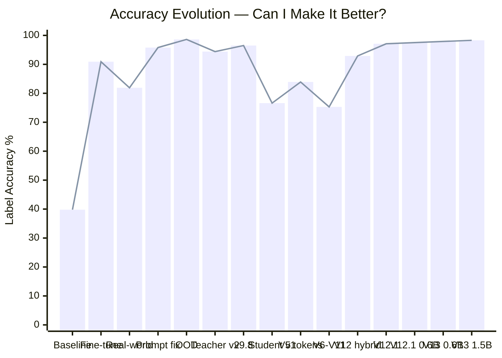
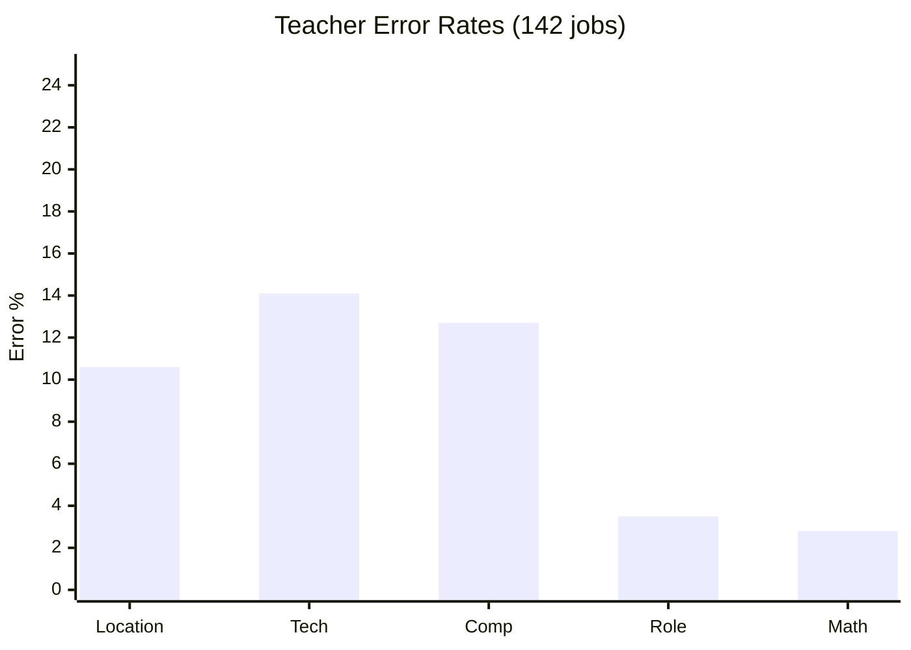
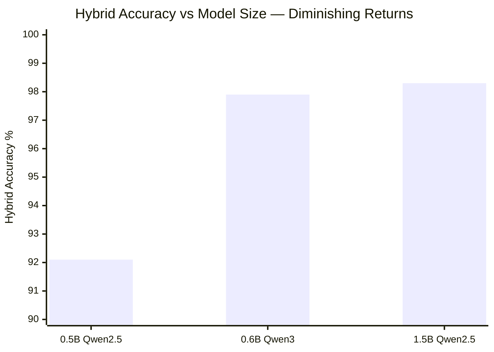

# AI Eval Harness

**Can a model 8,000× smaller than GPT-4 score jobs better than GPT-4 — running locally on a £999 MacBook Air?**

Yes. **97.9% accuracy.** A 351 MB model, trained on a 16 GB M1, matching commercial LLM quality at zero inference cost.

This project is my journey through LLM knowledge distillation — from hand-labeling 103 jobs to building a production-grade hybrid pipeline that outperforms the teacher it learned from. Every technique was learned by doing, every decision driven by data, and every setback turned into a better solution.

---

## The headline

```text
GPT-4.1-mini (teacher)     → labels 860 jobs         → 95%+ accuracy, ~£0.08/batch
Qwen3-0.6B (student)       → learns from teacher      → 97.9% hybrid accuracy
                              351 MB, runs on M1 16GB    0 cost per inference
```

The student surpassed the teacher. Not by being smarter — by combining a tiny neural network with surgical regex rules, each handling what it does best.

| What | Number |
|------|--------|
| Final accuracy | **97.9%** (234/239 test jobs) |
| Model size | **351 MB** (Qwen3-0.6B, 4-bit) |
| Hardware | Apple M1, 16 GB RAM (£999 MacBook Air) |
| Training data | 842 labeled jobs |
| Inference speed | ~3 sec/job locally |
| Inference cost | **£0.00** |
| Models tested | 20+ across 3 runtimes |
| Prompt iterations | 9 major versions |
| Training versions | 13 pipeline iterations (V1–V13.1) |

---

## The journey at a glance

Each row is a phase of the project. Click any phase to jump to its story.

| # | Phase | Accuracy | What I learned |
|---|-------|----------|----------------|
| 1 | [Ground truth](#phase-1--building-ground-truth) | — | Hand-labeled 103 jobs. Lost data to a bad script. Always have a rubric. |
| 2 | [Model selection](#phase-2--finding-the-right-model) | 60% | 20 models, 3 runtimes. 4B Qwen beat every 7B and 8B. Size ≠ quality. |
| 3 | [Speed breakthrough](#phase-3--the-5x-speedup) | 60% | 5.8× faster with llama.cpp. 0% parse failures. Changed everything. |
| 4 | [Prompt engineering](#phase-4--prompt-engineering) | 80% | More instructions hurt small models. Simple prompts win. |
| 5 | [First fine-tune](#phase-5--first-fine-tune) | 90.9% | Model knew the rules but wrote wrong numbers. LoRA fixed the outputs. |
| 6 | [Real-world eval](#phase-6--reality-check) | 95.8% | 81.9% on real jobs. One prompt fix → 95.8%. Prompt before training. |
| 7 | [OOD testing](#phase-7--out-of-distribution-testing) | 98.6% | Model correctly scored nurses as bad_fit. Added a domain gate. |
| 8 | [Distillation begins](#phase-8--knowledge-distillation) | — | Teacher thought Oxford was London. 39% of labels wrong. |
| 9 | [Teacher retrain](#phase-9--fixing-the-teacher) | 96.5% | 9 prompt iterations. Discovered prompt overfitting. |
| 10 | [OpenAI pivot](#phase-10--the-openai-pivot) | 76.6% | £0.08 per batch vs 3 hours. Speed unlocked iteration. |
| 11 | [Semantic tokens](#phase-11--the-architectural-pivot) | 83.9% | Stopped predicting numbers. Classification > regression. |
| 11½ | [V6–V11 gauntlet](#the-v6v11-training-gauntlet) | 75.3% | 8 experiments, most failed. Regex beats model on mechanical tasks. |
| 12 | [Hybrid pipeline](#phase-12--the-hybrid-breakthrough) | 97.5% | Model + regex, each doing what it does best. |
| 13 | [Final push](#phase-13--the-final-push) | **97.9%** | Contrastive training, surgical fixes. Hit the 0.6B ceiling. |
| 14 | [Still pushing](#whats-next) | 🔄 | 1.5B training complete. Sweeping checkpoints. |



> Every dip in the chart is a moment I raised the bar — harder data, smaller model, stricter eval. The drops aren't regressions; they're ambition.

---

## What it does

The pipeline scores LinkedIn job postings for personal fit across 5 dimensions, producing a 0–100 score and a label (`good_fit` / `maybe` / `bad_fit`).

```text
┌─────────────────────────────────────────────────────┐
│                  Job Description                     │
└──────────────────────┬──────────────────────────────┘
                       │
          ┌────────────┴────────────┐
          ▼                         ▼
   ┌─────────────┐          ┌──────────────┐
   │  Neural Net  │          │    Regex     │
   │  (0.6B model)│          │  (rules)    │
   │             │          │              │
   │ • seniority │          │ • location   │
   │ • work arr. │          │ • tech stack │
   │             │          │ • comp       │
   └──────┬──────┘          └──────┬───────┘
          │                        │
          └────────┬───────────────┘
                   ▼
          ┌────────────────┐
          │  Score Engine   │
          │  (deterministic)│
          │                │
          │  tokens → score │
          │  score → label  │
          └────────────────┘
```

**Why hybrid?** The model alone gets tech right **38%** of the time and comp at **48%**. Regex gets tech at 88% and comp at 96%. But regex can't judge seniority from a job description — that requires reading context, understanding role levels, interpreting ambiguous titles. The model gets seniority at 87%. Each system handles what it's best at.

| Field | Model alone | Regex alone | Hybrid uses | Hybrid accuracy |
|-------|------------|-------------|-------------|----------------|
| **Location** | 90.0% | **100%** | Regex | **100%** |
| **Tech stack** | 38.2% | **88.3%** | Regex | **88.3%** |
| **Compensation** | 47.7% | **95.8%** | Regex | **95.8%** |
| **Seniority** | 87.3% | 79.9% | **Model** | **86.6%** |
| **Work arrangement** | 73.6% | 77.4% | **Model** | **72.8%** |
| **Combined label** | 67.3% | 95.0% | **Both** | **97.9%** |

The model still outputs predictions for **all 5 fields** — even the 3 that regex overrides. Why keep predictions you don't use? Because they're diagnostic gold: they reveal the model's weak points, track whether the model is improving on regex-handled fields across training versions, and could enable a future cross-validation architecture where model-regex disagreement flags jobs for human review. The model doesn't know which fields will be overridden — it learns to classify everything, and the hybrid layer picks the best source per field.

The model outputs semantic tokens (not numbers), and a code layer converts them to scores:

```python
score = loc_score + role_score + tech_score + comp_score  # 0–100
label = "good_fit" if score >= 70 else "maybe" if score >= 50 else "bad_fit"
```

> For the full semantic token vocabulary (5 fields, 21 categories, scoring rules), see [Architecture Details](docs/ARCHITECTURE.md).

---

## Phase 1 — Building ground truth

Before any model touches a job description, I needed ground truth. I hand-labeled 103 jobs against a 100-point rubric (25 pts each: role, tech, location, comp). Midway through, a bad script wiped all labels — no git history to restore from. Re-labeled 57 surviving records and generated 46 synthetic jobs to fill gaps.

**Lesson:** Always version your data. Always have a rubric. Always commit before running scripts.

---

## Phase 2 — Finding the right model

Every decision flows from one constraint: Apple M1, 16 GB RAM. Models above 4B don't fit for training. And Ollama — the only runtime I had — ran at 81 sec/job. A full 103-job eval took 2+ hours, so testing all 20 models exhaustively was out of the question. Each round's decisions were costly in time, so I built a **3-round tournament** (smoke test → qualifying → full eval) to eliminate bad candidates early and concentrate expensive full evals on the survivors.

Before models even ran, I found a **prompt-to-golden mismatch**: the scoring prompt said `bad_fit = 0–39` but golden data used `bad_fit = 0–49`. Every model was evaluated against a rubric it wasn't given. Then Ollama crashed three ways: OOM from oversized KV cache (11 GB pre-allocated for a 2K-token task), model swap collisions, and silent mid-run failures.

**6 of 16 models survived.** The 4B Gemma beat every 7B and 8B model. The largest model (14B) scored worst — aggressive quantization erased the size advantage. 14 of 16 systematically over-scored everything.

> Full tournament data in [Detailed Journey](docs/DETAILED_JOURNEY.md#phase-2--finding-the-right-model).

---

## Phase 3 — The 5× speedup

Ollama ran at 81 sec/job — too slow to iterate. **llama.cpp: 14.1s, 5.8× faster, 0% parse failures.** Same model, same weights — llama.cpp didn't improve accuracy directly. But its efficiency freed RAM, and that freed RAM translated to more tokens for the model. Grammar-constrained decoding eliminated parse failures entirely by restricting which tokens could be emitted at each position.

The speed changed the project. The tournament was a solution to Ollama's latency — if each job takes 80 seconds, you have to be clever about what to test. At 14s/job I could just test everything. Scrapped 1,235 lines of tournament code and built `eval-runner.ts` (~500 lines) with direct inference.

> [Detailed Journey](docs/DETAILED_JOURNEY.md#phase-3--the-5x-speedup)

---

## Phase 4 — Prompt engineering

The universal finding: **more instructions hurt small models.** Adding ~50% more prompt text dropped Qwen3-4B from 80% to 60%. Every line costs attention budget.

| Model | Size | Best Acc | Key weakness |
|-------|------|----------|-------------|
| **Qwen3-4B** | 4B | **80%** | Reasons correctly, writes wrong numbers |
| Gemma-3-4B | 4B | 70% | Awards tech points for ANY tech mention |
| Qwen2.5-7B | 7B | 70% | Fabricates GBP salaries for USD jobs |
| Llama-3.1-8B | 8B | 60% | Can't parse "Senior" from titles |
| WizardLM-2-7B | 7B | 60% | Copy-pastes worked examples verbatim |

Qwen3-4B won — not on accuracy, but on **trainability.** I looked at error patterns, not just error counts. Qwen's errors were systematic: it understood the rules (reasoning was correct) but wrote wrong numbers. Gemma's errors were comprehension failures — it couldn't distinguish "tech mentioned in a job description" from "tech required for the role." Teaching a model to output different values is a pattern-correction task (LoRA's sweet spot). Teaching it to understand new concepts is much harder.

The Qwen family also handled JSON exceptionally well — critical for a pipeline that depends on structured output parsing. This same "error theme analysis" drove every model selection afterwards: choose the model whose failures look fixable, not the one with the fewest failures.

> [Detailed Journey](docs/DETAILED_JOURNEY.md#phase-4--prompt-engineering)

---

## Phase 5 — First fine-tune

### 20 wrong golden labels, then the real baseline

I found **20 of 103 golden jobs had wrong labels** (13 location errors, 8 comp errors). Re-ran on corrected data: **39.8%.** The 80% was on 10 jobs against wrong labels.

### "Thinks correctly, writes wrong answers"

> **Backend Developer (Edinburgh):**
> Reasoning: *"no Senior keyword, role=0... no Node.js, tech=0... total=10 → bad_fit"*
> JSON output: `{"role":25,"tech":10,"score":70,"label":"good_fit"}`
> **The reasoning says bad_fit. The JSON says good_fit. Same response.**

This happened on **~45 of 62 wrong answers.** The model has a "default high" bias:

| Pattern | Count | What happens |
|---------|-------|-------------|
| role defaults to 25 | ~30 | "Software Engineer" gets role=25 despite no senior keyword |
| tech defaults to 10–15 | ~25 | Java, Rust, AWS get tech points despite not qualifying |
| comp defaults to 25 | ~20 | "Up to £X", USD salaries all get comp=25 |
| loc won't go negative | ~8 | Bangalore, Prague get loc=10 instead of -50 |

**Why?** The JSON format puts scores before reasoning. The model generates numbers first (defaulting high), then reasons after — by which time the numbers are committed.

### 39.8% → 90.9% with LoRA

The model already knew the rules — it just couldn't write the right numbers. LoRA updated ~0.3% of parameters: rank=4 (narrow task, 70 examples), lr=1e-5. The key setting: `mask_prompt=true` — loss is computed only on the ~100-token response, ignoring the ~470-token prompt. Without this, the model wastes capacity learning to predict prompt tokens (which are identical every time). With masking, every gradient update teaches the model to produce better classifications, not to memorize the instructions. **90.9% on 33 held-out test jobs.**

> [Detailed Journey](docs/DETAILED_JOURNEY.md#phase-5--first-fine-tune)

---

## Phase 6 — Reality check

90.9% on held-out data from the same pool. **72 fresh LinkedIn UK jobs: 81.9%.**

### The detective story

Every `maybe→bad_fit` error had the same signature: `loc=-50`. Traced it to the JDs:

| Job | JD starts with | What the model "knew" |
|-----|----------------|----------------------|
| Senior ML/AI SW Engineer | *"PlayStation isn't just the Best Place to Play..."* | PlayStation = Japanese/US company |
| Senior Software Engineer | *"Flexera saves customers billions of dollars..."* | Flexera = US SaaS company |
| Senior Software Engineer | *"Minute Media is a global technology company..."* | "Global" = non-UK signal |
| Senior Software Engineer | *"Bonsai, now part of Zoom..."* | Zoom = US company |

The model wasn't hallucinating — it genuinely "knows" these companies are American. But it was **using company identity as a location signal** instead of reading the `job_location` field. This failure was **masked** in the accuracy: only 9 of 24 wrong location predictions caused label errors. The underlying problem was worse than 81.9% suggested.

### The 5-minute fix: +14 percentage points

Two prompt additions: "Do NOT use company name as location signal" + one worked example.

| | Before | After |
|---|--------|-------|
| Location accuracy | 65.3% | **100%** |
| Label accuracy | **81.9%** | **95.8%** |

**Lesson:** Prompt engineering should always come before fine-tuning. 5 minutes vs hours, instantly reversible.

---

## Phase 7 — Out-of-distribution testing

Is the model pattern-matching or actually applying the rubric? **72 random UK jobs — nurses, chefs, town planners. All should be bad_fit.**

**88.9%** — not memorisation. All 8 failures: "Senior [non-tech role]" at exactly 50 points. Added a Step 0 domain gate: **88.9% → 98.6%.**

---

## Phase 8 — Knowledge distillation

Teacher scores 96.5%. Simple plan: label 500 jobs, train student.

I audited the teacher labels first. **39% disagreement** with deterministic scores:

- **Every UK city became London.** Cambridge, Oxford, Bristol — all scored as London. 67% of training data was London
- **Compensation hallucination.** Fabricated GBP salaries for jobs without them
- **Arithmetic errors.** `25+0+0+0 = 25` → teacher wrote `score=50`



**Decision:** Fix the teacher before distilling. Garbage in, garbage out.

---

## Phase 9 — Fixing the teacher

Added non-London UK cities, salary edge cases. Location balance: 67% London → 40%. Then a three-day marathon of 9 prompt iterations revealed **prompt overfitting:**

**v9.4 scored 97% on tuning data and 76% on held-out.** I didn't know prompt overfitting was a thing.

| Version | Tuning | Held-out | Combined |
|---------|--------|----------|----------|
| v9.4 | **97.0%** | 79.2% | 89.6% |
| **v9.8** | 95.0% | **98.6%** | **96.5%** |

The fix: tested 8 failing jobs across all prompt versions. "Search for required skills sections" (focused attention) fixed 7/8 tech errors. "Scan the ENTIRE text" (diffuse attention) fixed 1–2. **For small models, tell them WHERE to look, not just WHAT.**

A contamination audit then revealed **67% of the held-out test set appeared in training data** (22 of 33 jobs). The "90.9% held-out accuracy" from Phase 5 was partially meaningless. Built a 3-level contamination pipeline — job_id match, family ID match, and JD text SHA-256 fingerprint — because the fingerprint layer alone caught 92 overlaps that simpler checks missed. Also tried pushing harder: teacher v2.2 duplicated good_fit examples 3–4× (282 records from 130 unique jobs). **Training loss started at 0.039 and flatlined** — the model had already memorized everything. 15 unique examples teach more than 50 copies of the same 15.

> All 9 prompt versions in [Prompt Iteration Log](docs/PROMPT_ITERATION_LOG.md).

---

## Phase 10 — The OpenAI pivot

The original plan was to use a local Qwen3-8B as the teacher — train it to label, then distill into the student. Three problems killed that plan:

1. **Speed.** Qwen3-8B ran at 81 sec/job on M1 — 2+ hours per 500-job labeling run, 6–9 hour iteration cycles. At that pace, each teacher improvement takes a full day to validate.
2. **Quality ceiling.** Three retrains, each fixing one field while breaking another. The teacher inherited all the scorer bugs from earlier phases — a cascading bias chain.
3. **A discovery that changed everything.** While auditing the local teacher's labels against GPT, I found GPT catching errors in my hand-scored golden data — errors the local teacher had been learning from. The student of a flawed teacher inherits its flaws and adds its own.

| | Local teacher (Qwen3-8B) | OpenAI (gpt-4.1-mini) |
|---|---|---|
| Speed | 81 sec/job (2–3 hours / 500 jobs) | **~0.6 sec/job (5 min / 500 jobs)** |
| Cost | Free | ~£0.08 / batch |
| Quality | 96.5% (inherited scorer bugs) | ~95%+ (independent judgment) |
| Iteration cycle | 6–9 hours | **Minutes** |

Switching to GPT wasn't about capability — it was about iteration speed. At 5 min/batch, I could run 50 experiments in the time one local retrain took. The £0.08/batch cost paid for itself in development velocity.

But first I had to pick a student. Two candidates: Qwen2.5-0.5B (500M, same family as teacher) and LFM2.5-1.2B (Liquid Foundation Model, hybrid architecture). Both were useless out of the box — **each latched onto a worked example in the prompt and repeated it for every single job.** Qwen always predicted good_fit (copied Example A). LFM always predicted bad_fit (copied Example B). Neither model ever predicted `maybe` — 0% on both. LFM's seemingly higher accuracy (57% vs 22%) was fake — the dataset was 57% bad_fit, so always-predicting bad_fit was "right" by accident.

The architecture killed LFM. It's 75% gated convolutions + 25% attention layers. LoRA inserts trainable adapters into **attention layers only** — meaning 75% of LFM's computation is permanently frozen. On top of that, 36% parse failures (vs Qwen's 3%). **Qwen2.5-0.5B won** — not on accuracy, but on trainability.

The first OpenAI runs used gpt-4o-mini, which generated 10.3% phantom tokens that the fuzzy matcher silently "corrected" — corrupting ~50 training labels. Upgrading to gpt-4.1-mini dropped this to 0.3%.

Even gpt-4.1-mini **disagrees with itself on 52.5% of AI_ML edge cases** — "AI-powered company" sometimes triggers AI_ML, sometimes doesn't. The student can never be more consistent than its teacher on these cases. (Spoiler: the hybrid system sidesteps this entirely — regex handles tech.)

**Student v1 (Qwen2.5-0.5B): 76.6%.** Tech at 57% was the bottleneck.

> [Detailed Journey](docs/DETAILED_JOURNEY.md#phase-10--the-openai-pivot)

---

## Phase 11 — The architectural pivot

Student v1's 76.6% had a root cause: **the model was doing too much** — predict four numbers, compute a total, derive a label — all in one 0.5B forward pass.

### The radical idea: predict tokens, not scores

Instead of numbers, the model predicts **named categories:**

```json
{"loc": "IN_LONDON", "sen": "LEVEL_3", "tech": ["NODE", "JS_TS"], "comp": "NO_GBP"}
```

Deterministic code converts tokens → scores → labels. The model never sees a number.

| | Before (regression) | After (semantic tokens) |
|---|---|---|
| Output space | Integers 0–100 | **21 named categories** |
| Score computation | Model must learn arithmetic | **Code does all maths** |
| Error diagnosis | "15→10" tells you nothing | **`NODE` vs `OOS`** = clear |
| Scoring bugs | Retrain the model | **Fix one line of Python** |

I call this **"code as ground truth"** — a deliberate separation of concerns. The model's job is classification: "this job requires Node.js and TypeScript." How that classification translates to a score is a business decision that lives in code, not in a neural network. If NODE goes from 10 points to 15, or a new `RUST` token is added, or the good_fit threshold moves from 70 to 65 — change one line of Python. Every past prediction recalculates correctly. No retraining, no data relabeling, no regression risk.

### Designing every byte for 0.6B parameters

Why exactly 5 fields? Each one captures a dimension of job fit that requires a different type of reasoning: location is geographic lookup, tech is keyword matching, comp is arithmetic, seniority is contextual judgment, arrangement is implicit inference. Fewer fields would bundle different reasoning types together (the V5 regression model tried this — one number for everything). More fields would fragment the learning signal for a 0.6B model. Five hits the sweet spot between learnability and extensibility — adding a sixth field (say, "industry") would be straightforward without redesigning the architecture.

The compression is deliberate at every level: 3-character field names (`loc` not `location`), short values (`UNK` not `UNKNOWN`, `OOS` not `OUT_OF_SCOPE`), tech as array (`["NODE", "REACT"]` — 5 individual tokens cover all combinations, vs 31 possible combo strings). The OOS scope gate forces `role_score = 0` in code when the job isn't in our tech domain — the model just says "not our tech" and scoring handles the rest.

Two V7 design decisions that came from V5/V6 failures: (1) **Positive definitions beat blocklists.** V5 used a blocklist for engineering titles: "NOT: Marketing Manager, Sales Manager..." — it could never be complete. V7 switched to a positive definition: "IS: engineer, developer, programmer, architect..." Positive rules generalise to unseen titles. (2) **Honest token naming.** V5's `NO_GBP` meant both "no salary found" and "salary found but falls in the £45k-£55k dead zone." That's a dishonest label — the model reasons "£50k → NO_GBP" when a salary WAS found. V7 added `RANGE_45_54K` (score 0) so every token means exactly what it says.

### The `_raw` fields: a pedagogical invention

Each field has a `_raw` companion that forces the model to extract evidence before classifying — not chain-of-thought, but **reasoning-by-construction.** The output format deliberately interleaves evidence and classification:

```json
{"sen_raw": "Staff Backend Engineer", "sen": "LEVEL_3",
 "tech_raw": "Node.js, TypeScript, React, PostgreSQL", "tech": ["NODE", "JS_TS", "REACT"]}
```

Notice `tech_raw` includes "PostgreSQL" — untracked tech the model correctly excludes. The `_raw` field proves the model _saw_ it and chose not to include it. Without `_raw`, you'd never know if the model missed it or deliberately excluded it.

The `_raw` fields serve three purposes that compound:

1. **Training signal.** The teacher (gpt-4.1-mini) produces better classifications when forced to extract evidence first — it's essentially a structured chain-of-thought that the teacher uses to think before answering. The data confirms this: teacher accuracy improved when `_raw` was added to the teacher prompt.
2. **Student scaffolding.** During training with `mask_prompt=true`, loss is computed only on the model's response (~430 chars), not the ~470-token prompt. The `_raw` fields provide **5× more gradient signal** per example than token-only format — each `_raw` field is a micro-lesson: "this is the evidence from the JD that determines this classification."
3. **Debugging data.** When the student gets a classification wrong, `_raw` shows you _what it was looking at_ — did it extract the wrong evidence, or extract the right evidence and classify it wrong? These are different bugs with different fixes.

| Format | Accuracy | Delta |
|--------|----------|-------|
| Full `_raw` + tokens | **84.9%** | baseline |
| Tokens only, no `_raw` | 73.6% | **−10pp** |

### The teacher-student prompt arc

An unexpected pattern — the teacher got shorter while the student got longer:

| Version | Teacher | Student | Why |
|---------|---------|---------|-----|
| V5 | 59 lines | 11 lines | Student empty, relies on training |
| V6 | **185 lines** | 12 lines | Teacher expanded for gpt-4.1-mini |
| V7 | 114 lines | 13 lines | Teacher compressed without losing rules |
| V13 | 114 lines | **34 lines** | Student needs rules for production |

The teacher has **28 lines** of tech rules — token definitions, spelling variants ("node/js, nodejs, NodeJs"), slash-joined combos ("Node/TypeScript = NODE + JS_TS"), an explicit IGNORE list (REST, API, GQL, AWS, CSS, HTML...), and the critical rule: "evaluate each technology independently." The student has **1 line** for tech: a bare token list. The 28:1 ratio is the gap that training must close — the student learns all those rules implicitly from 842 labeled examples instead of explicit instructions.

### The data pipeline that made it work

Getting data right was the majority of the work. The cost of discovering bad data after training (8+ hours GPU time + weeks of analysis) is orders of magnitude higher than catching it before. So I built a multi-stage validation pipeline where every quality gate is cheaper than the next step it protects.

#### Promptfoo: 10-second prompt regression tests

Before paying GPT to label 860 jobs, I run **40 edge-case tests** in ~10 seconds (`configs/promptfoo_teacher_v7.yaml`). Each test is a synthetic job designed to trigger a specific failure mode I've already encountered:

| Test category | # Tests | What it catches |
|--------------|---------|-----------------|
| Seniority + tech gate | 15 | "Director Fire Engineering" → must be OOS (not software), "Engineering Manager" → must be L3 |
| Title-mismatch adherence | 3 | Finding 19/24: title says "Node.JS Engineer" but JD says "Senior Backend Developer" — which does the teacher use? |
| AI/ML discrimination | 6 | "AI-powered company" ≠ AI_ML role. "ML experience required" = AI_ML. "AI talent partner" = boilerplate |
| Tech arrays | 4 | Node.js + TypeScript → `["NODE", "JS_TS"]` not `["NODE_JS_TS"]`. Tech as array, never string. |
| Comp edge cases | 6 | Daily rates, "up to only", OTE vs base salary, £45k-£55k dead zone |
| Location & arrangement | 6 | Dublin = OUTSIDE_UK, "UK-wide remote" = REMOTE, Manchester = UK_OTHER |

Every test validates: (1) response is valid JSON, (2) all 10 fields present, (3) all tokens are from the V7 vocabulary, (4) the specific assertion passes. The tests evolved from V6 (28 tests) to V7 (40 tests) — each new test was added because a real labeling run exposed that exact failure mode. This means a ~10-second Promptfoo run catches prompt regressions that previously cost £0.08 + hours of GPU time to discover after the fact.

#### 3-stage quality pipeline

- **Pre-label audit** (`audit-training-data-v7.ts`, 991 lines) — 20+ automated checks split into critical (block pipeline) and warning (flag for review). Duplicate detection runs at three levels: job_id, title+company hash, and JD text SHA-256 fingerprint. Also catches HTML artifacts, JD length outliers, suspicious token combinations (e.g., senior keywords + LEVEL_1), and eval set contamination. Runs in `--pre-label` mode before labeling (checks data quality without token validation) or in full mode after. Quarantines flagged jobs into separate files — `duplicates.jsonl`, `bad_data.jsonl`, `suspicious.jsonl` — so nothing is silently dropped. One run on 860 jobs found 17 critical issues and 107 duplicates.

- **Labeling guards** (`label-jobs-v7.ts`, 571 lines) — preflight API check on the first job catches wrong model names, invalid prompts, or auth failures before committing to a 239-job labeling run. Non-retryable fast-fail on 401/403/404 (don't retry auth errors 8 times). Every job response gets real-time token validation with fuzzy matching (edit distance ≤2) that logs corrections rather than silently applying them. Auto-ID generation for empty job_ids. Tech dedup + OOS cleanup. Per-run log file with full metadata.

- **Post-label audit** — same audit script in full mode. Token validation against V7 vocabulary, score recomputation to catch label drift, suspicious pattern detection. This is what caught gpt-4o-mini's 10.3% phantom token rate — tokens like `RANGE_35_44K` that don't exist were being fuzzy-matched to wrong values, silently corrupting ~50 training labels with +30 point score errors.

#### Contamination and truncation

- **Three-level contamination prevention** — job_id match, family ID match, and JD text SHA-256 fingerprint. The fingerprint layer caught 92 overlaps from jobs scraped twice under different company names — same JD text, different IDs.
- **Smart truncation** — when JDs exceed the token limit, naive truncation loses salary or requirements data. The truncator protects three regions: first 300 words, last 200 words, and 100-word windows around every `£`/`$`/salary keyword, then surgically removes the largest unprotected gap.

**The title-data mismatch.** An audit before training revealed 8 jobs where the stored title didn't match the title GPT-4.1-mini actually used. Example: database says "Node.JS Engineer" but the JD body says "Senior Backend Developer." GPT found the in-JD title more prominent and used that instead — labeling LEVEL_3 (correct for the JD's title, wrong for the stored title). Four of these were duplicates of the same job, creating 4× amplified wrong gradient. I traced the data flow through 10 scripts to confirm the pipeline wasn't corrupting titles — it was a LinkedIn artifact. Companies post listing titles that differ from JD body titles. Fix: pre-label audit flags title mismatches, post-label audit verifies teacher respected the title field.

**The SIGPIPE disaster.** One day I tested a write script with `| head -5`. SIGPIPE killed the process _after_ `fs.createWriteStream()` truncated the output file to 0 bytes but _before_ any data was written. The output pointed to the V5 eval set — 150 locked test jobs, unrecoverably destroyed. I built four layers of defense: `--force` flag for overwrites + `chmod 444` on eval files + documentation rules (never pipe write scripts through `head`) + git tracking. No single safeguard would have been enough.

**Result: 83.9%** at iter 875 (training crashed at 890 from OOM).

> Full pipeline details in [Detailed Journey](docs/DETAILED_JOURNEY.md#phase-11--the-architectural-pivot).

---

### The V6–V11 training gauntlet

Between 83.9% and the hybrid breakthrough: **8 experiments, most failed.**

| Version | Change | Accuracy | Outcome |
|---------|--------|----------|---------|
| V7 | Clean data + `_raw` + gpt-4.1-mini | **80.8%** (1.5B) | Best model-only result |
| V8 | Removed `_raw` fields | 73.6% | **−10pp.** `_raw` is essential |
| V9 | +57% more data | 68.3% | **More data made it worse** (see below) |
| V11d | +261 synthetic JDs | 61.6% | **Synthetic hurt by 9.4pp** |
| V11e | Aggressive distribution caps | 48.1% | **−27pp.** Lost all signal |

**Why V9 was worse with more data.** The root cause wasn't the quantity — it was a 50-character hard cap on `tech_raw`. 44% of training examples had `tech_raw` truncated mid-word: `"tech_raw":"ClickHous"` followed by `tech":["NODE"]` — note the missing opening quote on `tech`. The model learned this broken boundary pattern as "normal JSON." At inference, it generated malformed JSON, causing 48–63 parse failures (vs 15 in V7). Also found a field name bug: `job.location` vs `job_location` — the TypeScript type declared `location` but the data files used `job_location`. Result: 83% of locations labeled UNK instead of 30% IN_LONDON. One typo in a field name corrupted an entire training run.

**The deeper diagnostic** (44 findings across 1,500+ lines of analysis):

**Checkpoint oscillation.** Across 9 checkpoints of the same training run: 73 eval jobs were always correct, 7 were always wrong, and **38 (25%) oscillated** between correct and wrong. That's not noise — it means the training data contains contradictory signals. One "Engineering Manager" title was labeled 3 different seniority levels across 10 copies, 4 of which were duplicates of the same job. One wrong duplicate teaches the model more strongly than one correct unique example — it's 4× gradient in the wrong direction.

**Multi-token accuracy scaling.** Tech field accuracy degrades predictably with array length:

| Tech array size | Accuracy | Example |
|----------------|----------|---------|
| 1 token | ~85% | `["NODE"]` |
| 2 tokens | ~70% | `["NODE", "JS_TS"]` |
| 3 tokens | ~55% | `["NODE", "JS_TS", "REACT"]` |
| 4 tokens | 36–60% | `["NODE", "JS_TS", "REACT", "AI_ML"]` |

The co-occurrence bias was specific: REACT appeared with JS_TS in **83.3%** of training examples. The model learned `REACT → always add JS_TS` as a rule, not as a correlation. Both 0.5B and 1.5B made identical errors on 52% of shared failures — proving this is a data signal problem, not a capacity problem.

**Three high-level lessons:** (1) The 0.5B's real gap was formatting, not intelligence — 9.6pp difference between valid-only and all-jobs accuracy was entirely parse failures. (2) "Easy" examples teach base rates — remove 123 trivially easy bad_fit jobs (16% of training data) and the model collapses. (3) Synthetic data always hurt — 212 synthetic jobs were 99.5% NODE and 0% OOS, teaching "when uncertain, predict NODE."

**The central finding:** for mechanical tasks, **regex beats the model.** A regex baseline hit 73.6% without training, beating the model on tech and comp. The model's only edge was seniority.

### Data curation: the real differentiator

Every training round specifically targeted weaknesses revealed by the previous round's error analysis. No batch of training data was assembled by simply "getting more data" — each was surgical:

| Version | Training data | What changed | Why |
|---------|--------------|-------------|-----|
| V7 | 713 jobs | 212 synthetic (99.5% NODE, 0% OOS) | Fill distribution gaps — naive approach |
| **V12** | **790 jobs** | **Removed all 212 synthetic** | Synthetic jobs taught "when uncertain, predict NODE" — 29.7% of training data was poisoned |
| **V13** | **842 jobs** | **+52 contrastive** (37 sen, 15 loc) | Error analysis showed L3 under-promotion. 37 examples: "Staff Engineer" → L3, "Scrum Master" ≠ L3 |
| **V13.1** | **860 jobs** | **+18 corrective** (4 error clusters) | 4 specific failure patterns: Lead/Staff→L3, Manager→L3, Internship→L1, "Full Stack Engineer"→L2 |

The 52 contrastive examples in V13 weren't random. They came from a script (`build_contrastive_v13.py`) that generated targeted jobs for each documented error pattern — 10 examples of generic "[Role] Engineer" titles that should be L2, 10 of "Staff/Head/Principal" that should be L3, 10 of "Junior/Intern" that should be L1, and 15 location edge cases. Distribution balanced across labels (bad_fit=30, maybe=11, good_fit=11) to avoid shifting the label prior.

**Stratified splits, not random.** The train/valid split isn't a random 90/10 — it's stratified by computed label. Jobs are grouped by label (good_fit, maybe, bad_fit), each group shuffled with seed=42, then 10% taken from each group for validation. This guarantees every label is proportionally represented in both sets. Without stratification, a random split on imbalanced data could put all `maybe` jobs (the hardest class, only ~15% of data) into training and none into validation — meaning you'd never see validation loss on the class that matters most.

> All 8 experiments in [V6–V11 Deep Analysis](docs/V6_V11_DEEP_ANALYSIS_2026-03-13.md). All 44 diagnostic findings in [Diagnostic Findings](V6_DIAGNOSTIC_FINDINGS.md).

---

## Phase 12 — The hybrid breakthrough

The model struggled with pattern-matching while excelling at comprehension. What if each system does what it's best at?

| Field | Model | Regex | Winner |
|-------|-------|-------|--------|
| tech | 70% | 82% | Regex |
| comp | 78% | 90% | Regex |
| loc | 93% | 100% | Regex |
| sen | 87% | 29% | **Model** |
| arr | 80% | — | **Model** |

### Building the hybrid

First: audited the 239-job test set and found **3 golden label errors** in boundary-zone jobs (score 50–74, where one field flip changes the label). Job 33: £70k–£85k midpoint is £77.5k = RANGE_75_99K, but it was labeled RANGE_55_74K — a midpoint arithmetic error in the teacher's own labels. Job 17: £240k "Total Compensation" should be NO_GBP per the teacher's own rules, but was labeled ABOVE_100K. Fixed all three before building anything — if you're measuring against wrong answers, your accuracy numbers are meaningless.

The regex classifiers aren't simple string matches — they're production-grade parsers, each forged by error analysis on 239 test cases. Each one has a story of bugs caught and fixed:

- **Location** — 5-phase order-dependent classifier. Belfast must be checked before "Ireland" hits the non-UK list. "Little London" (a village) must be excluded from the London match. "Northern Ireland" must be UK_OTHER (not OUTSIDE_UK). Non-UK check runs before REMOTE check — otherwise "Paris, France (Remote)" gets classified REMOTE instead of OUTSIDE_UK. 53 UK cities hardcoded
- **Tech** — Adding bare `\bjs\b` matching seemed obvious, but it dropped accuracy from 81.6% to **74.1%** — because the dot in "Node.js" creates a word boundary, so "Node.js" triggered both NODE and a spurious JS match. Fixed with `(?<!\.)(?<!\w)js(?:/|\s*,|\s+and\b)`. The AI_ML boilerplate filter is a 2-phase pipeline: 15 strong signals (PyTorch, TensorFlow, LLM) always count; bare "AI" mentions get checked against 13 context patterns within 80-char windows to filter "AI-powered screening tools" from actual AI requirements
- **Comp** — Candidate-based salary parser with its own debugging story. A "£500 home budget" in one JD was being multiplied to £500k (the regex assumed bare numbers = thousands). Fix: track whether the `£` sign was present; skip multiplication when explicit currency found. 5 regex patterns collect all £-amounts in reading order, plausibility filter (£15k–£500k), 7 disqualifiers (OTE, daily rates, TC), midpoint bucketing. Also found a **dead zone bug**: salaries between £45k-£55k mapped to NO_GBP ("no salary found") when a salary WAS found — a dishonest label. Added RANGE_45_54K to fix it

### Results

| Phase | Accuracy |
|-------|----------|
| Baseline (model-only) | 89.1% |
| + regex overrides | **92.9%** |
| + regex refinement (V12.1) | **97.1%** |

92.9% → 97.1% with zero retraining — purely better rules.

### Three student models: finding the Goldilocks size

The 0.5B and 1.5B weren't just experiments — they validated the pipeline. If both sizes have the same error patterns (they did — tech was ~70% for both), the problem is training data, not model capacity. That finding justified spending months on data curation instead of chasing bigger models.

Then I tried the 0.6B Qwen3 — a newer architecture with built-in reasoning capability (`<think>` tokens). The same-family pipeline advantage was real: Qwen 0.5B/0.6B/1.5B share tokenizers and config patterns, so switching sizes means changing one config line, not rebuilding the pipeline.

| Model | Size | Hybrid | Sen | Parse Fail | Notes |
|-------|------|--------|-----|-----------|-------|
| 0.5B Qwen2.5 | 290 MB | 92.1% | 69.5% | 44 | 44 parse failures — formatting, not comprehension |
| **0.6B Qwen3** | **351 MB** | **97.5%** | **84.5%** | **0** | Zero parse failures, +15pp seniority over 0.5B |
| 1.5B Qwen2.5 | 880 MB | 97.1% | 90.0% | 8 | Best raw comprehension, but 2.5× the size for −0.4pp hybrid |

The 0.6B is the Goldilocks model. It's 60% smaller than the 1.5B but scores higher on hybrid accuracy — because zero parse failures mean cleaner seniority predictions on every job. The 0.6B → 1.5B jump gains only +0.4pp for 2.5× the size, making the 0.6B the clear production choice.

The deeper lesson: **architecture generation matters more than parameter count.** The 0.6B Qwen3 beat the 0.5B Qwen2.5 by 4.6pp despite being only 21% larger — the newer Qwen3 architecture with built-in reasoning produces better structured output. The 5.0pp gap between 0.5B and 1.5B on hybrid accuracy is entirely explained by 52 more unusable outputs (60 vs 8) — the models' comprehension is similar, but the smaller one can't reliably produce valid JSON.

### Three surprises from the hybrid

**Prompt-LoRA coupling:** LoRA fine-tuning creates an unbreakable coupling between training prompt and model behaviour. Any inference-time prompt change — even one hint line — causes catastrophic regressions:

| Change | Model-only | Hybrid | What happened |
|--------|-----------|--------|---------------|
| Baseline (training prompt) | 67.7% | 96.7% | Normal |
| +17 lines of rules | 76.4% (+8.7pp) | 93.7% (**−3.0pp**) | Model-only improved but hybrid regressed |
| +1 line hint | — | — | 35% parse failures, killed after 14 jobs |

The model-only improvement was a mirage. Comp improved +14pp but arr (−9.8pp) and sen (−4.2pp) — the only model-dependent fields — both regressed. **For fine-tuned models, the only path is retraining.**

**Making small models produce valid JSON:** Moving from llama.cpp to MLX meant losing grammar-constrained decoding. Built a 4-layer replacement: `{` pre-fill trick (cuts parse failures ~50%) → wrapper extraction → auto-close truncated JSON (recovers ~80% of failures) → regex fallback. Each layer exists because a specific model failure exposed the need. The `{` pre-fill is model-conditional — it works for Qwen2.5 but corrupts Qwen3's `<think>` reasoning tags, so the code checks model type at runtime: `if not is_qwen3 or no_think: formatted += "{"`. Discovered this when switching architectures broke inference completely.

**Defensive resource management:** On a 16 GB M1, two models loaded simultaneously = OOM. Even single-model eval on 239 jobs causes memory fragmentation. The eval runner (`eval-runner.ts`) uses `global.gc?.()` + 100ms sleep after every job to prevent gradual memory pressure from killing a 20-minute eval at job 200. When GPU memory is tight, it tries **progressive context fallback** — starting at the configured context size, then falling back through 2048 → 1024 → 512 tokens until allocation succeeds. The alternative was crashing and restarting from scratch.

**Model-only accuracy is misleading for hybrid.** V13's model-only tech dropped 20pp from V12, but hybrid tech _improved_ — because regex overrides the model for tech. I wasted time diagnosing a "regression" that didn't exist in the hybrid pipeline. **Always compare hybrid-to-hybrid.**

> Full regex evolution, JSON parsing pipeline, prompt-LoRA experiments, and training configs in [V12 Implementation](docs/V12_IMPLEMENTATION_PROGRESS.md).

---

## Phase 13 — The final push

97.5% with the 0.6B. Deep error analysis revealed what actually matters in the hybrid:

| Field | Model errors | Impact on hybrid |
|-------|-------------|-----------------|
| comp | 109 (48%) | None — regex handles it |
| tech | 94 (42%) | None — regex handles it |
| **sen** | **28 (12%)** | **5 label flips — the only thing that matters** |

### Val loss ≠ best checkpoint

I evaluated 9 checkpoints from iter 1500 to 1900. Best val loss was iter 1600 (0.165), but best hybrid accuracy was iter 1500 (97.9%) with val loss 0.170. This isn't noise — it repeated across V12 and V13. Val loss optimises per-token prediction quality; hybrid accuracy optimises label-boundary decisions. They have different gradients and different optima.

### V13 strategy: surgical, not brute force

Three fronts, each targeting documented errors:

1. **Prompt** — UK city list (40 cities), seniority keywords (L3: senior/lead/staff, L1: junior/intern), clearer tech/comp rules
2. **Regex** — Removed false positives (Next.js ≠ React, VueJS ≠ JS_TS), added AI/ML concatenation patterns. Tech: 87.9% → **88.3%**
3. **52 contrastive examples** — not random, but surgical: 37 sen examples ("Staff Engineer" → L3, "Scrum Master" ≠ L3), 15 loc edge cases

| Model | Hybrid | Sen | Arr | Parse Fail |
|-------|--------|-----|-----|-----------|
| **0.6B Qwen3 (V13)** | **97.9%** | **86.6%** | 72.8% | 19 |
| 1.5B Qwen2.5 (V12.1 + V13 regex) | **98.3%** | 90.0% | 90.4% | 8 |

### The 5 remaining errors

All seniority misclassifications in the fragile `maybe` class (score 50–74), where ±10 points flips the label:

| Job | Golden | Predicted | Why it's hard |
|-----|--------|-----------|---------------|
| Scrum Master | L2 | L3 | "Master" triggers L3 heuristic |
| Backend Engineer | L3 | L2 | No "Senior" keyword, but senior-level |
| Frontend Product Engineer | L3 | L2 | Ambiguous title |
| Project Manager | L2 | L3 | "Manager" ≠ always L3 |
| Front End Developer | L2 | L1 | Generic title |

**Irreducible at 0.6B capacity.** This is the wall.

### What I deliberately didn't fix

| Considered | Decision | Why |
|-----------|----------|-----|
| Fix model comp (109 errors) | **No** | Regex handles comp at 95.8%. Model comp is irrelevant in hybrid |
| Fix model tech (94 errors) | **No** | Regex handles tech at 88.3%. Same reasoning |
| Fix arr regression (−7.5pp) | **No** | Arr scores 0 — kept for future-proofing, diagnostics (canary for model comprehension), and indirect training signal |
| Config sweep (rank 8 vs 16) | **No** | M1 limits compute. Proven config wins over speculation |

These decisions follow one principle: **fix only what affects the hybrid metric.** Everything else is noise.

### The Qwen3 thinking token trade-off

Qwen3 emits `<think>` reasoning tokens before generating JSON — consuming 500–900 of the 1,000-token budget on complex jobs. This caused the 19 parse failures (V12 had 0). I tested three options:

| Config | Hybrid | Parse failures | Speed |
|--------|--------|---------------|-------|
| Thinking ON, 1000 tokens | **97.9%** | 19 | ~8 sec/job |
| Thinking OFF, 1000 tokens | 97.9% | **26** (worse) | ~6 sec/job |
| Thinking ON, 3000 tokens | killed | — | 55 sec/job |

Disabling thinking made it _worse_ — the model relies on that reasoning step. Raising the budget was impractical on M1. The solution: accept the parse failures and let regex handle fallback for those 19 jobs. The hybrid architecture turns this from a problem into a non-issue.

### The error interdependency surprise

V13.1 improved the regex (tech 88.3% → **90.4%**, comp 95.8% → **96.2%**). Better regex should mean better hybrid — but **V13 model + V13.1 regex = 97.5%**, worse than 97.9%. Job 14 had a comp error that coincidentally cancelled a tech error. Fixing the comp error exposed the hidden tech error.

Fix: corrective retraining — resume from the best adapter (V13 iter 1500) with 10× lower learning rate (2e-6 vs 2e-5) and 18 hand-crafted contrastive examples targeting 4 specific error clusters (Lead/Staff→L3, Manager→L3, Internship→L1, "Full Stack Engineer"→L2). The 10× factor is a surgical choice: high enough to learn from 18 new examples, low enough to preserve the 842-example knowledge already baked into the adapter. MLX LoRA resume loads adapter weights but resets optimizer state (Adam m/v estimates) — so warmup replays from zero, but at 2e-6 this is harmless. Peaked at 97.5%; all 6 remaining errors irreducible sen boundary cases.

> V13 error analysis, checkpoint sweeps, and corrective retraining protocol in [V13 Plan](docs/V13_PLAN.md).

---

## Where it stands now

### Production model

| Property | Value |
|----------|-------|
| Model | Qwen3-0.6B-4bit |
| Size | **351 MB** |
| Adapter | `finetune/adapters_v13_0.6B/0001500_adapters.safetensors` |
| Hybrid accuracy | **97.9%** (234/239, 95% CI: 95.1%–99.0%) |
| Hardware | Apple M1, 16 GB RAM |
| Inference | ~3 sec/job, £0.00/inference |

### Accuracy by model size



| Model | Size | Hybrid | Sen | Parse Fail |
|-------|------|--------|-----|-----------|
| 0.5B Qwen2.5 | 290 MB | 92.1% | 69.5% | 44 |
| **0.6B Qwen3** | **351 MB** | **97.9%** | **86.6%** | 19 |
| 1.5B Qwen2.5 | 880 MB | 98.3% | 90.0% | 8 |

The 0.6B → 1.5B jump gains only 0.4pp for 2.5× the size.

---

## What's next

**V13.1 — 1.5B Qwen2.5 training complete.** 2,000 iterations finished, val loss converged at 0.129. Eval sweep covers iters 200–800 so far (best: **92.9% hybrid at iter 800**, on an upward trajectory). Iters 1000–2000 still need evaluation — given the V13 0.6B peaked at iter 1500, the best 1.5B checkpoint is likely in that unevaluated range. Target: match/beat V12.1's 98.3%.

The 0.6B hit its ceiling — all remaining errors are seniority boundary cases that need more model capacity.

The question I keep asking: **can I make it better?**

---

## What I learned

Across 13 versions, 20+ models, and 9 prompt iterations:

**Data quality beats quantity.** Every training failure traced back to data composition — London bias, NODE-biased synthetic jobs, comp imbalance — never model capacity. More data often hurt (V9: +57% data, −16pp accuracy). Targeted data always helped (V13: +52 surgical contrastive examples, +0.4pp). Both 0.5B and 1.5B models made identical errors on 52% of shared failures, proving the bottleneck is training signal, not parameters. ([Phase 8](#phase-8--knowledge-distillation), [Phase 10](#phase-10--the-openai-pivot), [V6–V11 Gauntlet](#the-v6v11-training-gauntlet))

**Validate before training, not after.** A pre-training audit script takes 5 seconds and catches the same problems that cost 8+ hours of GPU time to diagnose after training. Of 13 major issues found across V5/V5.1, 8 were prompt problems catchable with a 5-second Promptfoo test. The title-data mismatch that created 4× amplified wrong gradient was catchable with a pre-label audit. I built the 3-stage pipeline (pre-label, labeling guards, post-label) after learning this the hard way. ([Phase 11](#phase-11--the-architectural-pivot))

**Prompt before training, always.** Location fix: +14pp in 5 minutes. Domain gate: +10pp. Fine-tuning takes hours and can break things. ([Phase 6](#phase-6--reality-check))

**Hybrid > pure anything.** Model alone: 67%. Regex alone: 95.0%. Together: 97.9%. Neither system alone exceeds 95%; combined they reach 97.9%. The model contributes comprehension (seniority at 87%), regex contributes pattern matching (tech at 88%, comp at 96%). ([Phase 12](#phase-12--the-hybrid-breakthrough))

**Separate what models learn from what code computes.** Semantic tokens + deterministic scoring = bugs fixable without retraining, fields addable without retraining, past predictions automatically recalculate. Honest token naming matters — when `NO_GBP` silently also meant "£45k-£55k salary found", the model learned a dishonest label. Adding `RANGE_45_54K` fixed a dead zone without retraining. ([Phase 11](#phase-11--the-architectural-pivot))

**Small models need explicit signal, not bigger prompts.** `_raw` fields provide evidence-before-classification scaffolding — a 10pp improvement over tokens-only. But once LoRA-tuned, the model can't absorb new instructions — only new training data. Even adding one hint line caused 35% parse failures. ([Phase 11](#phase-11--the-architectural-pivot), [Phase 12](#phase-12--the-hybrid-breakthrough))

**Architecture generation > parameter count.** The 0.6B Qwen3 (newer architecture, `<think>` tokens) beat the 0.5B Qwen2.5 by 4.6pp on hybrid accuracy — despite being only 21% larger. The 0.6B also beat the 1.5B Qwen2.5 on hybrid by 0.4pp at 40% of the size. Model architecture matters more than raw parameter count for structured output tasks. ([Phase 12](#phase-12--the-hybrid-breakthrough))

**Val loss ≠ downstream accuracy.** Confirmed three times: best validation loss (iter 1600, val loss 0.165) consistently appeared after best hybrid accuracy (iter 1500, 97.9%). Val loss optimises token prediction; hybrid accuracy optimises label boundaries. Different objectives, different optima. ([Phase 13](#phase-13--the-final-push))

**The student can surpass the teacher.** gpt-4.1-mini disagrees with itself on 52.5% of AI_ML edge cases at temperature=0. Temperature zero doesn't guarantee determinism — the same job re-labeled twice gets different tokens. The student, constrained to 21 categories + deterministic regex, is more consistent than its source. ([Phase 13](#phase-13--the-final-push))

**Hardware constraints are design constraints.** M1's 16 GB eliminated large models, drove the OpenAI pivot, forced one-model-at-a-time eval (two models = OOM). Thermal throttling on 30+ minute evals meant budgeting 15–20 min per 239-job eval. GPU memory fragmentation after OOM crashes required reboots, not config changes. The result: a model that runs anywhere, a pipeline that respects resource limits.

**Non-destructive versioning saves you.** Every version lives alongside its predecessors — never overwritten. V13 regex was created next to V12's, not replacing it. This was intentional from the start: I wanted to always be able to go back and replicate results, reuse earlier pipelines if needed, and document the full journey — not just the final output. After losing V5's eval set to SIGPIPE, I added 4 layers of defense: script guards, `chmod 444`, documentation rules, git tracking. No single safeguard is enough — defense-in-depth is the only reliable strategy.

**Trace errors to root causes, not symptoms.** A 50-char hard cap on `tech_raw` taught the model to generate broken JSON boundaries. A field name typo (`job.location` vs `job_location`) made 83% of locations UNK. A single duplicate job with a wrong label created 4× gradient in the wrong direction. These problems all looked like "model capacity" on the surface; the root cause was always data.

**Measure confidence, not just accuracy.** 97.9% on 239 jobs has a 95% Wilson CI of [95.1%, 99.0%]. I deliberately chose Wilson score intervals over normal approximation — at 97.9%, the normal CI extends beyond 100%, which is meaningless for a proportion. Wilson handles extreme proportions correctly and is well-behaved even at small sample sizes. Without the confidence interval, you don't know if 97.9% vs 97.5% is meaningful or noise. At n=239, each percentage point is ~2.4 jobs.

---

## Technical stack

| Component | Technology |
|-----------|-----------|
| ML framework | [MLX](https://github.com/ml-explore/mlx) (Apple Silicon native — the most effective option for Mac with limited resources) |
| Fine-tuning | LoRA via mlx-lm |
| Student models | Qwen3-0.6B-4bit, Qwen2.5-1.5B-4bit |
| Teacher | gpt-4.1-mini |
| Local inference | node-llama-cpp (grammar-constrained JSON) |
| Pipeline | TypeScript (30+ CLI tools) + Python |
| Hardware | Apple M1 MacBook Air, 16 GB RAM |

<details>
<summary><strong>Key commands</strong></summary>

```bash
# Evaluate production model (V13 0.6B)
.venv/bin/python3 finetune/eval_student_v7.py \
  --model mlx-community/Qwen3-0.6B-4bit \
  --adapter finetune/adapters_v13_0.6B/0001500_adapters.safetensors \
  --test-file data/v12/test_labeled_audited.jsonl \
  --prompt prompts/student_v13.txt \
  --output-dir eval_results/v13/ --save-predictions

# Hybrid accuracy (regex + model)
.venv/bin/python3 finetune/compute_hybrid_v13.py \
  --test-file data/v12/test_labeled_audited.jsonl \
  --predictions eval_results/v13/predictions.jsonl --v12

# Label new jobs with teacher
npx tsx src/cli/label-jobs-v7.ts --input data/raw.jsonl --output data/labeled.jsonl

# Train a new model
.venv/bin/python3 -m mlx_lm.lora --config finetune/lora_config_v13_0.6B.yaml
```

</details>

---

## Project structure

```
ai_eval_harness/
├── src/cli/                       # 30+ TypeScript CLI tools
│   ├── label-jobs-v7.ts           # Teacher labeling (gpt-4.1-mini)
│   ├── audit-training-data-v7.ts  # Pre/post-label quality checks
│   └── format-for-mlx-v7.ts      # MLX format conversion
├── finetune/                      # Python ML scripts
│   ├── eval_student_v7.py         # Model evaluation
│   ├── compute_hybrid_v13.py      # Hybrid scoring (regex + model)
│   ├── deterministic_baseline_v13.py # Regex classifiers
│   ├── semantic_tokens_v7.py      # Token vocabulary & scoring
│   └── adapters_v13_0.6B/        # Production adapter
├── prompts/                       # 9 prompt versions
├── data/                          # Training & eval data
├── eval_results/                  # All sweep results
└── docs/                          # Deep-dive documentation
```

---

## Deep-dive documentation

| Document | What's inside |
|----------|--------------|
| [Detailed Journey](docs/DETAILED_JOURNEY.md) | The complete narrative — every phase, failure, and fix with full technical depth |
| [Architecture](docs/ARCHITECTURE.md) | Semantic token vocabulary, scoring rules, hybrid pipeline mechanics |
| [V13 Plan](docs/V13_PLAN.md) | V13 execution: error analysis, contrastive training, checkpoint sweeps |
| [V12 Implementation](docs/V12_IMPLEMENTATION_PROGRESS.md) | Regex evolution, JSON parsing pipeline, model comparisons, training configs |
| [V6–V11 Analysis](docs/V6_V11_DEEP_ANALYSIS_2026-03-13.md) | Deep analysis of 8 experiments that led to the hybrid approach |
| [Diagnostic Findings](V6_DIAGNOSTIC_FINDINGS.md) | All 44 numbered findings with root causes and decisions |
| [Prompt Iterations](docs/PROMPT_ITERATION_LOG.md) | All 9 prompt versions with per-field accuracy and failure analysis |
| [Data Lineage](DATA.md) | Every data file, its origin, contamination boundary, regeneration instructions |
