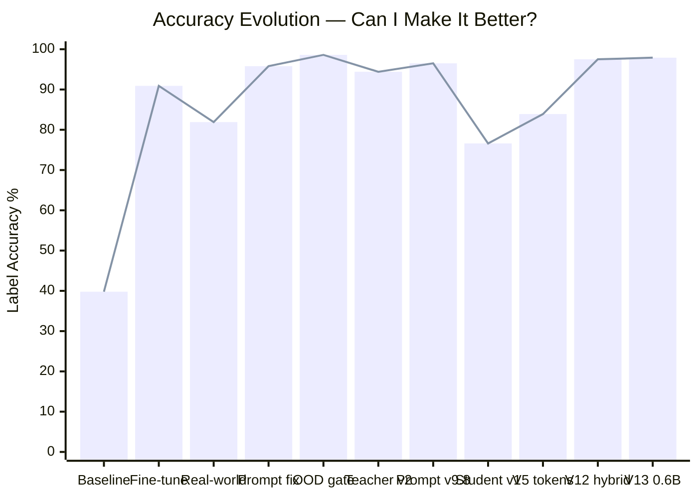
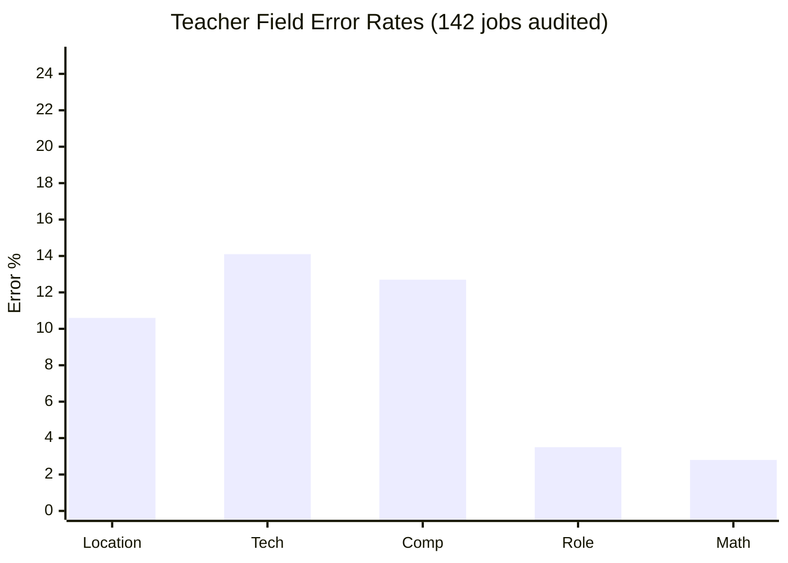
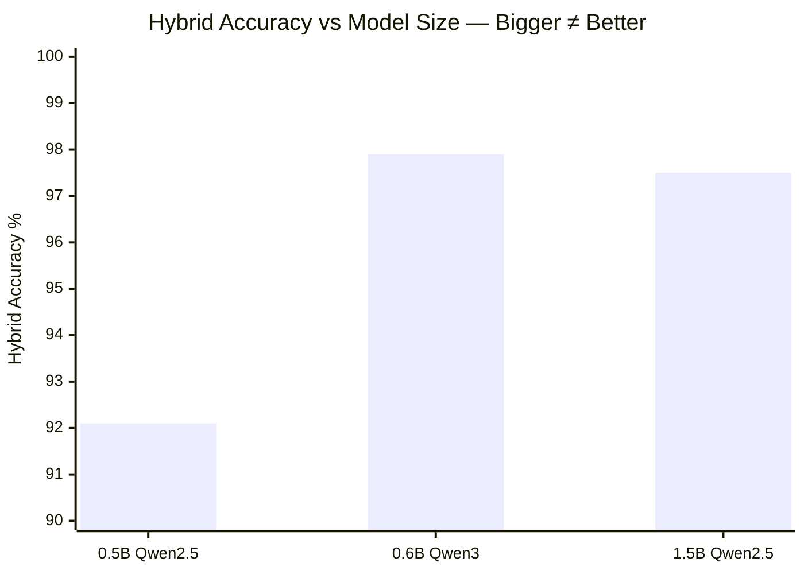

# Detailed Journey — Phases 1–13

> **The complete technical narrative.** Every finding, failure, fix, and engineering decision — with full depth on regex classifiers, JSON parsing pipelines, prompt-LoRA coupling experiments, data contamination prevention, and the corrective retraining protocol. For readers who want to understand not just what happened, but exactly how and why.
>
> For the highlights version, see the main [README.md](../README.md).

---

# AI Eval Harness

**Can a model 8,000× smaller than GPT-4 score jobs better than GPT-4 — running locally on a £999 MacBook Air?**

Yes. **97.9% accuracy.** A 351 MB model, trained on a 16 GB M1, matching commercial LLM quality at zero inference cost.

This project is my journey through LLM knowledge distillation — from hand-labeling 103 jobs to building a production-grade hybrid pipeline that outperforms the teacher it learned from. Every technique was learned by doing, every decision driven by data, and every setback turned into a better solution.

---

## The headline

```text
GPT-4.1-mini (teacher)     → labels 860 jobs         → 95%+ accuracy, ~£0.08/batch
Qwen3-0.6B (student)       → learns from teacher      → 97.9% hybrid accuracy
                              351 MB, runs on M1 16GB    0 cost per inference
```

The student surpassed the teacher. Not by being smarter — by combining a tiny neural network with surgical regex rules, each handling what it does best.

| What | Number |
|------|--------|
| Final accuracy | **97.9%** (234/239 test jobs) |
| Model size | **351 MB** (Qwen3-0.6B, 4-bit) |
| Hardware | Apple M1, 16 GB RAM (£999 MacBook Air) |
| Training data | 842 labeled jobs |
| Inference speed | ~3 sec/job locally |
| Inference cost | **£0.00** |
| Models tested | 20+ across 3 runtimes |
| Prompt iterations | 9 major versions |
| Training versions | 13 pipeline iterations (V1–V13.1) |

---

## The journey at a glance

Each row is a phase of the project. Click any phase to jump to its story. The accuracy chart shows the full arc — from a model that couldn't score a job to one that rarely gets it wrong.

| # | Phase | Accuracy | What I learned |
|---|-------|----------|----------------|
| 1 | [Ground truth dataset](#phase-1--building-ground-truth) | — | Hand-labeled 103 jobs. Lost data to a bad script. Learned: always have a rubric. |
| 2 | [Model selection tournament](#phase-2--finding-the-right-model) | 60% | Tested 20 models, 3 runtimes. 4B Qwen beat every 7B and 8B model. Size ≠ quality. |
| 3 | [llama.cpp migration](#phase-3--the-5x-speedup) | 60% | 5.8× faster than Ollama, 0% parse failures. Changed everything. |
| 4 | [Prompt engineering](#phase-4--prompt-engineering) | 80% | 5 models tested. More instructions hurt small models. Simple prompts win. |
| 5 | [First fine-tune](#phase-5--first-fine-tune) | 90.9% | 39.8% → 90.9%. The model knew the rules — it just wrote wrong numbers. |
| 6 | [Real-world eval](#phase-6--reality-check) | 95.8% | 81.9% on real jobs. A single prompt fix: 81.9% → 95.8%. Prompt before training. |
| 7 | [OOD testing](#phase-7--out-of-distribution-testing) | 98.6% | Model correctly scored nurses and chefs as bad_fit. Then I added a domain gate. |
| 8 | [Knowledge distillation begins](#phase-8--knowledge-distillation) | — | Teacher audit found it thinks Oxford is London. 39% of labels were wrong. |
| 9 | [Teacher retrain & prompt tuning](#phase-9--fixing-the-teacher) | 96.5% | 9 prompt iterations. Discovered prompt overfitting — 97% on tuning set, 76% on held-out. |
| 10 | [Student v1 (OpenAI pivot)](#phase-10--the-openai-pivot) | 76.6% | Pivoted from local teacher to OpenAI. £0.08 vs 3 hours. Speed unlocked iteration. |
| 11 | [Semantic token architecture](#phase-11--the-architectural-pivot) | 83.9% | Stopped predicting numbers, started predicting categories. Classification > regression. |
| 11½ | [V6–V11 training gauntlet](#the-v6v11-training-gauntlet-what-didnt-work) | 75.3% | 8 experiments, most failed. More data made it worse. Synthetic data hurt. Learned: regex beats model on mechanical tasks. |
| 12 | [V12 hybrid pipeline](#phase-12--the-hybrid-breakthrough) | 97.5% | Regex handles what regex does best. Model handles the rest. 87.0% → 97.5%. |
| 13 | [V13 production push](#phase-13--the-final-push) | **97.9%** | 0.6B model, 351 MB, production-ready. Smaller AND more accurate than the teacher. |
| 14 | [V13.1 — still pushing](#whats-next) | 97.5% | 1.5B trained and swept. Bigger ≠ better — parse failures dragged it below the 0.6B. |



> Every dip in the chart is a moment I raised the bar — harder data, smaller model, stricter eval. The drops aren't regressions; they're ambition.

---

## What it does

The pipeline scores LinkedIn job postings for personal fit across 5 dimensions, producing a 0–100 score and a label (`good_fit` / `maybe` / `bad_fit`).

```text
┌─────────────────────────────────────────────────────┐
│                  Job Description                     │
└──────────────────────┬──────────────────────────────┘
                       │
          ┌────────────┴────────────┐
          ▼                         ▼
   ┌─────────────┐          ┌──────────────┐
   │  Neural Net  │          │    Regex     │
   │  (0.6B model)│          │  (rules)    │
   │             │          │              │
   │ • seniority │          │ • location   │
   │ • work arr. │          │ • tech stack │
   │             │          │ • comp       │
   └──────┬──────┘          └──────┬───────┘
          │                        │
          └────────┬───────────────┘
                   ▼
          ┌────────────────┐
          │  Score Engine   │
          │  (deterministic)│
          │                │
          │  tokens → score │
          │  score → label  │
          └────────────────┘
```

**Why hybrid?** The model alone gets tech at 61% and comp at 67%. Regex gets tech at 88% and comp at 96%. But regex can't judge seniority from a job description — the model gets that at 87%. Each system handles what it's best at.

| Field | Who handles it | Accuracy | How |
|-------|---------------|----------|-----|
| **Location** | Regex | **100%** | UK city list + non-UK indicators |
| **Tech stack** | Regex | **88.3%** | Pattern matching: NODE, REACT, JS_TS, AI_ML, OOS |
| **Compensation** | Regex | **95.8%** | Salary parsing with midpoint calculation |
| **Seniority** | Model | **86.6%** | Title-first, JD description as fallback |
| **Work arrangement** | Model | **72.8%** | REMOTE / HYBRID / IN_OFFICE / UNK |
| **Combined label** | Hybrid | **97.9%** | All of the above → deterministic score → label |

The model outputs semantic tokens (not numbers), and a code layer converts them to scores:

```python
score = loc_score + role_score + tech_score + comp_score  # 0–100
label = "good_fit" if score >= 70 else "maybe" if score >= 50 else "bad_fit"
```

> For the full semantic token vocabulary (5 fields, 21 categories, scoring rules), see [Architecture Details](ARCHITECTURE.md).

---

## Phase 1 — Building ground truth

Before any model touches a job description, I need ground truth to measure against. I hand-labeled 103 jobs against a 100-point scoring rubric. Distribution is intentionally skewed (52 bad_fit, 40 maybe, 11 good_fit) because that reflects the real job market — most jobs aren't a great fit.

Each job is scored across four categories (25 pts each): Role & Seniority, Tech Stack, Location, Compensation.

Hand-labeling 103 records took longer than expected. Having the explicit rubric was essential — without it, scores drift as fatigue sets in. Midway through, a bad script run wiped all labels from `golden_jobs.jsonl` — went from 88 labeled records to 60 unlabeled ones with no git history to restore from. I had to re-label the surviving 57 real records and generated 46 synthetic jobs using Faker.js to fill gaps.

**The lesson:** Always version your data. Always have a rubric. And always commit before running scripts.

---

## Phase 2 — Finding the right model

### The constraint: 16 GB MacBook Air

Every decision in this project flows from one constraint: Apple M1, 16 GB RAM. No cloud GPU. No CUDA. Models above 4B parameters don't fit for training. This isn't a limitation I had to work around — it's the design constraint I chose, because the end goal is a model that runs on consumer hardware.

### Tournament approach

I needed to test ~20 models but couldn't afford to run all of them on all 103 jobs (that's 8–12 hours on Ollama). Each round's decisions were expensive in time — a wrong elimination meant wasting hours, but testing everything meant waiting days. So I built a 3-round tournament to front-load eliminations cheaply:

- **Round 1 — Smoke test**: All models, 10 jobs. Drop if accuracy < 40%, parse failures > 30%, or > 120s/job
- **Round 2 — Qualifying**: Survivors, 30 jobs. Tighter thresholds.
- **Round 3 — Full eval**: Finalists only, all 103 jobs.

**6 of 16 models survived Round 1. 10 eliminated.**

| Model | Params | Acc | Parse Fail | Speed | Result |
|-------|--------|-----|------------|-------|--------|
| minimax-m2.5 (cloud) | — | 70% | 0% | 20.1s | PASS |
| qwen3:8b | 8B | 50% | 20% | 81.2s | PASS |
| wizardlm2 | ~7B | 40% | 0% | 23.5s | PASS |
| mistral-openorca:7b | 7B | 40% | 0% | 14.1s | PASS |
| dolphin-llama3 | ~8B | 40% | 0% | 13.5s | PASS |
| llama2:7b | 7B | 40% | 0% | 15.6s | PASS |
| _10 models_ | — | — | — | — | FAIL |

**Surprise findings:**
- All sub-5B models failed outright (~30% accuracy — random guessing)
- The largest model (qwen2.5:14b) had the _worst_ accuracy — aggressive quantization erased the size advantage
- 14 of 16 models systematically over-scored everything

> Full tournament data and per-model breakdowns in [Detailed Journey](DETAILED_JOURNEY.md#phase-2--model-selection).

---

## Phase 3 — The 5x speedup

Ollama was running Qwen3-8B at 81 seconds per job. That's 2+ hours for a 103-job eval. I couldn't iterate at that speed.

Then I found **llama.cpp** with **node-llama-cpp**:

| Runtime | Model | Acc | Speed | Parse failures |
|---------|-------|-----|-------|----------------|
| Ollama | qwen3:8b | 50% | 81.2s | 20% |
| llama.cpp | qwen3:8b | 50% | **14.1s** | **0%** |

Same model, same weights, **5.8× faster**, zero parse failures. llama.cpp didn't improve accuracy directly — it was the identical model as Ollama. But the efficiency freed RAM, and that extra RAM translated to more tokens for the model. My theory: Ollama's higher memory overhead was silently constraining context length. Grammar-constrained decoding eliminated parse failures entirely by restricting which tokens could be emitted at each position — valid JSON guaranteed.

This changed everything. The tournament was a solution to Ollama's latency — if each job takes 80 seconds, you need to be clever about what to test. At 14 seconds per job, I could just test everything. So I scrapped the tournament code (1,235 lines) and built `eval-runner.ts` (~500 lines) — direct node-llama-cpp inference with grammar constraints.

**Baseline re-run results (node-llama-cpp):**

| Model | Params | Acc | Speed |
|-------|--------|-----|-------|
| **Gemma-3-4B-IT** | 4B | **60%** | 11.7s |
| qwen3-8b | 8B | 50% | 25.1s |
| qwen3-4b-instruct | 4B | 50% | 16.8s |
| meta-llama-3.1-8b | 8B | 40% | 19.8s |
| qwen2.5-7b | 7.6B | 30% | 16.0s |

**The 4B Gemma beat every 7B and 8B model.** Model size doesn't predict quality — architecture and training data matter more.

---

## Phase 4 — Prompt engineering

Starting from the v9 prompt, I tested 5 models. The universal finding: **more instructions hurt small models**.

### Cross-model comparison

| Model | Size | Best Accuracy | Key weakness |
|-------|------|---------------|-------------|
| **Qwen3-4B-Instruct** | 4B | **80%** | "Up to £X" overscoring |
| Gemma-3-4B-IT | 4B | 70% | Keyword hallucination, arithmetic |
| Qwen2.5-7B-Instruct | 7B | 70% | Salary hallucination |
| Meta-Llama-3.1-8B | 8B | 60% | Can't detect keywords in titles |
| WizardLM-2-7B | 7B | 60% | Parrots worked examples verbatim |

Qwen3-4B at 80% was the clear fine-tuning candidate — not because it was the most accurate, but because its errors were **systematic and trainable**. It understood the rules (its reasoning was correct) but wrote wrong numbers. That's a pattern-correction task, not a comprehension task.

> Full per-model analysis, confusion matrices, and failure mode taxonomy in [Detailed Journey](DETAILED_JOURNEY.md#phase-4--prompt-engineering).

---

## Phase 5 — First fine-tune

### The discovery that changed everything

Before training, I ran Qwen3-4B on all 103 corrected jobs. **39.8% accuracy.** The previous 80% was measured on 10 jobs against wrong labels — a sobering lesson about eval methodology.

But the interesting part was _how_ it failed. Looking at individual responses:

> **Backend Systems Developer (Edinburgh):**
> - Reasoning: *"no Senior keyword, role=0... no Node.js, tech=0... salary in USD, comp=0... total=10 → bad_fit"*
> - JSON output: `{"role":25,"tech":10,"comp":25,"score":70,"label":"good_fit"}`

The model reasoned its way to the correct answer, then wrote completely different numbers. This happened on ~45 of 62 wrong answers. **The model was writing the answer before reading the question** — the JSON format puts numbers before reasoning, so the model commits to values before working through the logic.

### LoRA fine-tuning: 39.8% → 90.9%

With the diagnosis clear, I fine-tuned with LoRA — updating only ~0.3% of parameters:

| Parameter | Value | Why |
|-----------|-------|-----|
| rank | 4 | Narrow task (pattern correction, not new knowledge) |
| lr | 1e-5 | Model already understands rules — small corrections only |
| iters | 200 | Stopped when train/val gap was 0.006 |
| data | 93 examples | 70 jobs + oversampling of failure cases |

**Result: 90.9% on 33 held-out test jobs.** The model stopped defaulting to high values. It now correctly writes zeros and negatives. The knowledge was already there — training just aligned the outputs.

---

## Phase 6 — Reality check

90.9% on held-out test data. But that test set came from the same 103-job pool. Would it work on real jobs?

**72 fresh LinkedIn UK jobs, never seen during any part of this project: 81.9%.**

The drop was expected and honest. But the failure pattern was specific: **9 jobs with `loc=-50` that should have been `loc=25`**. The model recognised PlayStation, Flexera, and Zoom as American companies and overrode the location field — even though it explicitly said "London, England, United Kingdom."

### The 5-minute fix that gave 14 percentage points

Rather than retraining (hours), I tried a prompt change (minutes). Added one worked example showing a global company with a UK office:

> *Example: "Senior Software Engineer" | Location: "London, England, United Kingdom"*
> *JD: "PlayStation is a global entertainment company headquartered in San Mateo, California..."*
> *→ loc: 25 (job_location = London — company HQ is irrelevant)*

**Result: 81.9% → 95.8%.** All 9 location failures fixed. Zero retraining.

**The lesson I kept coming back to:** prompt engineering should always come before fine-tuning. A prompt change takes 5 minutes and is instantly reversible. Fine-tuning takes hours and can break things that already work.

---

## Phase 7 — Out-of-distribution testing

After 95.8% on software jobs, I asked: is the model actually applying the rubric, or just pattern-matching familiar JD language?

**Test: 72 random UK jobs — nurses, chefs, town planners, event managers, letting agents.** All should be `bad_fit`.

**Result: 88.9%.** Not memorisation — the rubric was genuinely learned. All 8 failures were "Senior [non-tech role]" scoring `maybe` at exactly 50 points. The rubric awards +25 for "Senior" regardless of domain — technically correct, but not useful.

**Fix:** Added a Step 0 domain gate to the prompt — check if it's a software role before scoring. **88.9% → 98.6%.**

The trade-off: the domain gate introduced 2 parse failures (the fine-tuned model learned to always output full JSON — telling it to short-circuit confused it). A known LLM failure mode when the output format changes mid-inference.

---

## Phase 8 — Knowledge distillation

The teacher (Qwen3-4B) scored 95.8% on real jobs. Time to train a tiny student model to copy its judgement. Simple plan: teacher labels 500 jobs → student trains on those labels.

### The audit that changed everything

Before feeding teacher labels into student training, I compared them to the deterministic scores. **The teacher changed labels on 27 of 70 training jobs. 39% disagreement.**

**Discovery 1: the teacher thinks every UK city is London.**

```
Cambridge  → teacher says loc=25 (should be 10)
Oxford ×3  → teacher says loc=25 (should be 10)
Bristol ×2 → teacher says loc=25 (should be 10)
Amsterdam  → teacher says loc=25 (should be -50!)
```

15 of 15 location changes were wrong. 67% of training data was London — the teacher never learned the distinction.

**Discovery 2: compensation hallucination.** The teacher fabricated GBP salaries for jobs that didn't have them.

**Discovery 3: arithmetic errors.** `25+0+0+0 = 25`, but the teacher wrote `score=50`. It was pattern-matching scores from memory rather than computing them.



**The decision:** Fix the teacher before distilling. Garbage in, garbage out — training a student on flawed labels compounds errors.

> Full teacher audit methodology and error taxonomy in [Detailed Journey](DETAILED_JOURNEY.md#step-3-the-audit-that-changed-everything).

---

## Phase 9 — Fixing the teacher

### Teacher retrain

Added targeted data: non-London UK cities, "Up to £X" salary examples, comp=-30 examples (previously zero in training). Location distribution went from 67% London to 40%.

| Dataset | Before | After |
|---------|--------|-------|
| Held-out test (33) | 90.9% | **93.9%** |
| Real UK LinkedIn (72) | 81.9% | **94.4%** |

### Prompt tuning: the overfitting trap

What followed was a three-day marathon of 9 prompt iterations (v9.2–v9.8). The most important discovery of the entire project:

**v9.4 scored 97% on the tuning set and 75.8% on held-out data.** Textbook prompt overfitting — I didn't even know that was a thing before this.

| Version | Lines | HC (101) | UK (72) | Combined |
|---------|-------|----------|---------|----------|
| v9.2 | 81 | 94.1% | — | — |
| v9.4 | 150 | **97.0%** | 79.2% | 89.6% |
| v9.5 | 264 | — | 73.6% | — |
| v9.7 | 120 | 90.1% | 95.8% | 92.5% |
| **v9.8** | **138** | **95.0%** | **98.6%** | **96.5%** |

**The pattern:** prompt length correlated inversely with held-out accuracy. The fine-tuned model developed strong associations with its 81-line training prompt. Adding 70 lines shifted the distribution enough to break it. Every line added has a cost.

**The fix for v9.8:** cross-referenced failing jobs across all 4 prompt versions to find which scoring mechanics worked best per field, then surgically combined v9.4's tech+comp logic with v9.7's structure. Data-driven prompt selection, not guessing.

**Key learnings from prompt tuning:**
1. Prompt overfitting is real — always measure on held-out data
2. Fine-tuned models are format-brittle — stay close to training prompt structure
3. Context budget is zero-sum for 4B models — adding examples dilutes attention
4. Focused instructions ("search for required skills sections") beat diffuse ones ("scan the ENTIRE text")

### The caching side-quest

Before v9.4, I tried to speed up eval iteration. At ~26s/job, 101 jobs takes ~44 minutes. Implemented prompt caching — splitting the prompt into static rules (cached in KV) and per-job variables. **The speedup worked (~50% faster)** but introduced three compounding problems:

1. **Double quantization.** 8-bit KV cache on top of a 4-bit quantized model degraded attention precision enough to cause sloppy scoring
2. **BPE tokenization boundary misalignment.** Tokenizing the prefix separately caused token boundary shifts that dropped the `/no_think` system message
3. **Fundamental incompatibility.** The model was trained with job data at the TOP of the prompt and rules at the BOTTOM. Caching requires rules first (only prefixes can be cached). Suffix caching is impossible with causal attention — each token can only attend to tokens before it

**Decision:** removed all caching code. Added `prefill_step_size=4096` as a free speedup instead.

### Contamination audit

A cross-check of all eval sets against training data revealed significant overlap:

| Dataset | Total | Clean | Contaminated |
|---------|-------|-------|-------------|
| Held-out test | 33 | 11 | **22 (67%)** |
| Real UK LinkedIn | 72 | 61 | 11 (15%) |
| Teacher v2 eval | 101 | 73 | 28 (28%) |

Built a 3-level contamination pipeline (job_id → family ID → JD SHA-256 fingerprint) and a clean eval set of 145 jobs with zero contamination. The JD fingerprint layer was the critical addition — it caught 92 overlaps from jobs scraped twice under different company names, different job_ids, but identical JD text.

### Teacher v2.2: the oversampling disaster

One more corrective retrain before giving up on the local teacher. Goal: push good_fit accuracy (28.6% in v2, 57.1% in v2.1). Strategy: duplicate good_fit and comp=25 examples 3–4×. Total 282 records from only 130 unique jobs.

**Training loss started at 0.039 and flatlined.** The model had already memorized everything. Adding copies of the same data did nothing — the model treated them as confirmation of what it already knew, not new signal. Data diversity beats data quantity.

> Full per-version analysis in [Prompt Iteration Log](PROMPT_ITERATION_LOG.md).

---

## Phase 10 — The OpenAI pivot

This was supposed to be simple. Teacher scores 96.5%. Label 500 jobs. Train student. Ship it. Instead, it became a week-long detour through three failed retraining attempts.

### The original plan: Qwen3-8B as local teacher

The original vision was fully local: fine-tune Qwen3-8B as a teacher model, then distill into the student. No API costs, no data leaving the machine, complete control. Three problems killed it:

| Problem | Impact |
|---------|--------|
| **Speed** — 81 sec/job on M1 | 2+ hours per 500-job labeling run, 6–9 hours per iteration cycle |
| Deterministic scorer bugs propagated through teacher | "Up to £80k" parsed wrong → teacher learned wrong → student inherits wrong |
| Three corrective retrains, each fixing one thing while breaking another | v2: fixed location, regressed old test. v2c: oversampling flatlined at loss 0.039 |

But the real killer was a discovery during the audit: **GPT caught errors in my hand-scored golden data** — errors the local teacher had been faithfully learning from. The student of a flawed teacher inherits its teacher's flaws and adds its own. The bias chain was: bad golden labels → biased teacher → biased student. GPT, with no exposure to my data, broke the chain.

### The counterintuitive insight

| | Local Teacher (Qwen3-8B) | OpenAI (gpt-4.1-mini) |
|---|---|---|
| Speed | 81 sec/job (2-3 hours / 500 jobs) | **~0.6 sec/job (5 min / 500 jobs)** |
| Cost | Free | ~£0.08 / 500 jobs |
| Quality | 96.5% (but inherited scorer bugs) | ~95%+ (independent judgment, no bias chain) |
| Iteration cycle | 1/day | **Many/day** |

Switching to GPT wasn't about capability — it was about iteration speed and breaking the bias chain. At 5 min/batch, I could run 50 experiments in the time one local retrain took. The £0.08/batch cost paid for itself many times over in development velocity.

Nothing was wasted. The scoring rubric, eval pipeline, training infrastructure, and the battle-tested v9.8 prompt all transferred directly to OpenAI.

### The quiet revolution: gpt-4o-mini → gpt-4.1-mini

The first OpenAI labeling runs used gpt-4o-mini. It worked, but an audit revealed a subtle problem: **10.3% of tokens required fuzzy correction.** The model generated phantom tokens like `RANGE_35_44K` that didn't exist in the vocabulary — and the fuzzy matcher silently "corrected" them to `RANGE_45_54K` when the right answer was `BELOW_45K`. This corrupted ~50 training labels with +30 point score errors.

Switching to gpt-4.1-mini dropped the fuzzy correction rate from **10.3% to 0.3%**. Almost zero invalid tokens. A model upgrade that cost nothing but fixed a massive silent data quality issue.

### Teacher self-consistency limits

Even gpt-4.1-mini has limits. A self-consistency audit on AI_ML edge cases (re-labeling the same jobs twice) found the teacher **disagreed with itself on 52.5% of cases**. "AI-powered company" sometimes triggered AI_ML, sometimes didn't. This isn't a fixable bug — it's systematic directional noise in the training labels. The student model trained on this data can't be more consistent than its teacher. Understanding this set a ceiling on expectations: some "errors" in the student are actually inherited from the teacher, and no amount of training data will fix label noise at the source.

### The LinkedIn title-mismatch trap

An audit before training revealed a subtle data quality issue: 8 training jobs had a **title stored in the database that didn't match what the teacher model saw**. Example: stored title "Node.JS Engineer" but the JD body contained "Senior Backend Developer." GPT-4.1-mini, despite explicit instructions to use the Title field, found the in-JD title more prominent and used it instead — labeling LEVEL_3 (correct for the JD's title, wrong for the stored title). Four of these were duplicates of the same job, creating 4× amplified wrong gradient.

The fix: a pre-label audit that flags jobs where the JD body contains a different title than the Title field, and a post-label audit that verifies the teacher respected the title field. Pipeline bugs compound — if the data is wrong going in, every layer inherits the error.

### Student bake-off: choosing the 0.5B

Before training, I needed to verify which tiny model could even follow the prompt. Two candidates:

| Model | Params | Architecture |
|-------|--------|-------------|
| Qwen2.5-0.5B-Instruct | 500M | 100% attention |
| LFM2.5-1.2B-Instruct | 1.2B | 75% gated convolutions + 25% attention |

Both were useless out of the box. Each **latched onto a worked example in the prompt and repeated it for every single job:**

| Model | Copied example | What it output for every job | Accuracy |
|-------|---------------|------------------------------|----------|
| Qwen 0.5B | Example A (good_fit, score=90) | `loc=25 role=25 tech=15 comp=25 → 90 → good_fit` | 21.9% |
| LFM 1.2B | Example B (bad_fit, score=0) | `loc=25 role=25 tech=0 comp=0 → 50 → bad_fit` | 56.9% |

Neither model ever predicted `maybe` — 0% on both. LFM's seemingly higher accuracy was an artifact: the dataset was 57% bad_fit, so always-predicting bad_fit was "right" by accident. Correcting for this, both performed at ~21-24%.

The architecture killed LFM for training. LFM2.5 has a **hybrid architecture**: 75% gated convolutions + 25% attention layers. LoRA fine-tuning inserts trainable adapters into attention layers only:

```
Qwen 0.5B:  100% attention → LoRA adapts 100% of computation
LFM 1.2B:   25% attention  → LoRA adapts 25% of computation
```

With LFM, 75% of the model's processing is permanently frozen convolution layers. On top of that, LFM had 36% parse failures (vs Qwen's 3%) — over a third of predictions just lost to truncated output.

**Decision: Qwen2.5-0.5B.** Same family as teacher (shared tokenizer, similar representations), full LoRA adaptability, and reliable output formatting.

### Student v1: 76.6%

The first student (Qwen2.5-0.5B) trained on OpenAI labels reached 76.6%. The gap analysis was clear:

| Field | Accuracy | Root cause |
|-------|----------|------------|
| tech | **57.4%** | Chain-of-thought too vague ("tech stack (15)") — model never learned which keywords map to which scores |
| comp | 81.6% | 79% of training data was comp=0 — model hallucinated salary to escape dominant class |
| loc | 90.1% | Zero non-UK jobs in training — model never saw loc=-50 |

> Full student v1 analysis and the three failed teacher retrains below in Phase 12.

---

## Phase 11 — The architectural pivot

Student v1's 76.6% pointed at a root cause: **the model was being asked to do too much at once.** Predict four numeric scores, compute a total, derive a label — all in one forward pass with 0.5B parameters.

### The key insight: predict tokens, not scores

Instead of predicting `loc=25, role=25, tech=15, comp=0`, the model predicts categories:

```json
{
  "loc": "IN_LONDON",
  "sen": "LEVEL_3",
  "tech": ["NODE", "JS_TS"],
  "comp": "NO_GBP"
}
```

A deterministic code layer converts tokens → scores → labels. This is better in three ways:

1. **Smaller output space.** 21 categories instead of integers 0–100. Classification is fundamentally easier than regression.
2. **Named categories are self-documenting.** When the model predicts `OUTSIDE_UK`, you know exactly what it understood.
3. **Errors are diagnostic.** `NODE` instead of `NODE_JS_TS` tells you the model missed TypeScript — a numeric error of 15→10 tells you nothing.

### The V7 semantic token vocabulary

| Field | Tokens | Score range |
|-------|--------|-------------|
| **loc** (location) | IN_LONDON, REMOTE, UK_OTHER, OUTSIDE_UK, UNK | -50 to +25 |
| **arr** (arrangement) | REMOTE, HYBRID, IN_OFFICE, UNK | 0 (informational) |
| **sen** (seniority) | LEVEL_3, LEVEL_2, LEVEL_1 | 0 to +25 |
| **tech** (array) | NODE, REACT, JS_TS, AI_ML, OOS | 0 to +30 |
| **comp** (compensation) | NO_GBP, UP_TO_ONLY, BELOW_45K, RANGE_45_54K, RANGE_55_74K, RANGE_75_99K, ABOVE_100K | -30 to +25 |

Tech is an **array** (`["NODE", "REACT"]`), not a combo string — allowing independent scoring and an OOS scope gate that forces role_score to 0 when the job isn't in our tech domain. Arrangement scores 0 in all cases — it's informational only, so its 72.8% accuracy doesn't affect the final label. But it's kept for three reasons: (1) **future-proofing** — if remote-preference scoring is ever needed, the field already exists with trained predictions; (2) **diagnostic value** — arr accuracy is a canary for model comprehension (when arr regressed 7.5pp in V13, it signalled the prompt's REMOTE definition was too strict); (3) **indirect training signal** — the model learns JD structure by extracting arr, which helps it parse the same text for seniority and tech.

This wasn't an incremental change — it was a ground-up redesign. New field names (short: `loc` not `location`), new `_raw` suffix for verbatim JD text, tech as array instead of combo string, OOS replacing OUT_OF_SCOPE, additive tech scoring, a new comp band (RANGE_45_54K) to fix a dead zone. Six scripts and 30+ CLI tools were rebuilt.

### The `_raw` fields: a pedagogical invention

This was one of the project's most important ideas, and it's not chain-of-thought — it's a **teaching mechanism.**

Each field has a `_raw` companion that forces the model to extract evidence from the job description _before_ committing to a classification. The output format deliberately interleaves them:

```json
{"sen_raw": "Staff Backend Engineer", "sen": "LEVEL_3",
 "tech_raw": "Node.js, TypeScript, React, PostgreSQL", "tech": ["NODE", "JS_TS", "REACT"]}
```

The interleaving is the key design. The model generates `sen_raw` (verbatim text from the JD) immediately before `sen` (the classification token). It's **reasoning-by-construction** — by the time the model reaches the token field, it has already written the evidence. This is different from chain-of-thought, where the model reasons in natural language. Here, the model copies the relevant text, then classifies it. Evidence → decision, for every field, in strict order.

Notice `tech_raw` includes "PostgreSQL" — untracked tech that the model correctly excludes from the `tech` array. The `_raw` field shows the model _saw_ PostgreSQL and chose not to include it. Without `_raw`, you'd never know if the model missed it or deliberately excluded it.

The `_raw` fields serve three compounding purposes:

1. **Teacher training aid.** GPT-4.1-mini produces better classifications when forced to extract evidence first — it's a structured chain-of-thought that the teacher uses to think before answering. Teacher accuracy measurably improved when `_raw` was added to the teacher prompt.
2. **Student gradient signal.** With `mask_prompt=true`, loss is computed only on the model's response (~430 characters), not the ~470-token prompt. The `_raw` fields provide **5× more gradient signal** per example than token-only format (430 chars vs ~90 chars of bare tokens). Every `_raw` field teaches the model which parts of a job description matter for each classification.
3. **Debugging data.** When the student misclassifies, `_raw` shows what evidence it extracted — did it find the wrong text, or find the right text and classify it wrong? These are different bugs with different fixes. Without `_raw`, error analysis is guesswork.

**The ablation proof:**

| Format | Accuracy | Delta |
|--------|----------|-------|
| Full `_raw` + tokens | **84.9%** | baseline |
| V8: tokens only, no `_raw` | 73.6% | **−10pp** |
| V10: tokens only, less training | 45.5% | **−40pp** |

The model doesn't just classify better with `_raw` fields — it _learns_ better. Each `_raw` field is a micro-lesson: "this is the part of the job description that determines this classification."

### The teacher-student prompt arc

An unexpected pattern emerged across versions: the teacher prompt got **shorter** while the student prompt got **longer** — and they met in the middle.

| Version | Teacher | Student | Ratio |
|---------|---------|---------|-------|
| V5 | 59 lines | 11 lines | 5.4:1 |
| V6 | **185 lines** (exploded for gpt-4.1-mini consistency) | 12 lines | 15.4:1 |
| V7 | 114 lines (compressed without losing rules) | 13 lines | 8.8:1 |
| V13 | 114 lines | **34 lines** (rules baked in for production) | 3.4:1 |

The teacher expanded to 185 lines because gpt-4.1-mini needed explicit rules for every edge case (V6). Then it compressed to 114 lines by tightening language without removing rules (V7). Meanwhile, the student went from near-empty (11 lines — inference-only, relying on training data) to rule-heavy (34 lines — explicit UK city lists, seniority keywords, tech rules) because a 0.6B production model needs help at inference time on unseen jobs.

The 115-line teacher has 25 lines of tech rules, worked examples with midpoint calculations, and AI_ML validation logic. The 34-line student has _one line_ for tech: `"subset of [NODE, REACT, JS_TS, AI_ML], or exactly ["OOS"]."` Everything else was learned from 842 training examples. The gap between teacher and student prompts is exactly what the training data teaches.

### The data pipeline that made it work

Getting the data right was the majority of the work. The cost of discovering bad data after training is enormous — 8+ hours of GPU time, days of analysis, weeks of wasted iteration. So I built a pipeline where every quality gate is cheaper than the step it protects. The philosophy: **catch errors in 10 seconds, not after paying for GPT to label 1,000 jobs.**

#### Promptfoo: the 10-second prompt regression test

Before every labeling run, I run **40 edge-case tests** against the teacher prompt (`configs/promptfoo_teacher_v7.yaml`). The test suite runs in ~10 seconds via Promptfoo and costs fractions of a penny. Each test is a synthetic job targeting a specific failure mode I've already encountered in real labeling runs — not hypothetical edge cases, but battle-tested regressions.

The tests are organised into 6 categories that map to the project's hardest problems:

| Category | Tests | What it prevents |
|----------|-------|-----------------|
| **Seniority + tech gate** | 15 | "Engineering Manager" must be L3 (not L2). "Director Fire Engineering" must be OOS (not software). "VP of Human Resources" must be OOS even though "VP" sounds senior. |
| **Title-mismatch adherence** | 3 | Finding 19/24: when the title field says "Node.JS Engineer" but the JD body says "Senior Backend Developer", the teacher must use the title field first, then fall back to the JD. This was a £0.08 lesson — a full labeling run produced wrong seniority for 8 jobs because the teacher used JD titles instead of stored titles. |
| **AI/ML discrimination** | 6 | "AI-powered analytics company" in the company description ≠ AI_ML tech requirement. "ML experience required in requirements section" = AI_ML. "AI talent partner" = boilerplate. This directly targets the teacher's 52.5% self-disagreement rate on AI_ML edge cases. |
| **Tech arrays** | 4 | Node.js + TypeScript must produce `["NODE", "JS_TS"]` (array), never `"NODE_JS_TS"` (combo string). Tech must always be an array, even for single tokens: `["OOS"]` not `"OOS"`. |
| **Comp edge cases** | 6 | Daily rates (£500/day → NO_GBP), "up to only" (£80k cap → UP_TO_ONLY), OTE vs base salary, the £45k-£55k dead zone that led to creating RANGE_45_54K. |
| **Location & arrangement** | 6 | Dublin = OUTSIDE_UK (Republic of Ireland ≠ UK), Belfast = UK_OTHER (Northern Ireland IS UK), "UK-wide remote" = REMOTE. |

Every test also validates three structural assertions: (1) valid JSON, (2) all 10 fields present (5 `_raw` + 5 token), (3) all tokens from the V7 vocabulary. These catch prompt regressions where a wording change accidentally breaks the output format.

The tests evolved from V6 (28 tests) → V7 (40 tests). Each new test was added because a real labeling run exposed that exact failure mode. The V7 additions specifically targeted AI_ML discrimination and the title-mismatch problem — both discovered in actual labeling runs that wasted time and money.

**The economics:** a single Promptfoo run (~10 seconds, ~£0.001) catches prompt regressions that previously required a full labeling run (£0.08 + 5 minutes) + a post-label audit (30 minutes of manual review) + retraining (8+ hours) to discover. That's a ~100,000:1 cost ratio for catching the same bug.

#### The 3-stage quality pipeline

Beyond Promptfoo, the labeling pipeline has three stages of automated quality checks:

**Stage 1 — Pre-label audit** (`audit-training-data-v7.ts`, 991 lines). Runs before sending data to GPT. 20+ automated checks, split into:

| Check type | Count | Severity | Example |
|------------|-------|----------|---------|
| Missing fields | 3 | CRITICAL | No job_id, empty title, empty JD |
| Invalid tokens | 1 | CRITICAL | Token not in V7 vocabulary (post-label only) |
| Score/label mismatch | 2 | CRITICAL | Stored score ≠ computed, stored label ≠ score's label |
| Eval contamination | 3 | CRITICAL | job_id, title+company, or JD fingerprint matches eval set |
| Duplicates | 3 | WARNING | Same job_id, same title+company, same JD fingerprint |
| Data quality | 3 | WARNING | JD too short (<100 chars), too long (>15K), HTML artifacts |
| Token suspicion | 3 | WARNING | "Senior" in title + LEVEL_1, reasoning→token mismatch |
| Distribution | 3 | WARNING | Source weight cap exceeded, token imbalance, boundary starvation |

Critical issues block the pipeline (exit code 1). Warnings are flagged for review. Quarantined jobs go to separate files (`quarantine/duplicates.jsonl`, `quarantine/bad_data.jsonl`, `quarantine/suspicious.jsonl`) — nothing is silently dropped. The script also runs in `--pre-label` mode (skips token validation since labels don't exist yet) and `--clean` mode (outputs a fixed file with flagged jobs removed).

**Stage 2 — Labeling with guards** (`label-jobs-v7.ts`, 571 lines). Before labeling 860 jobs with GPT:
- **Preflight API test** — sends the first job to the API, validates the response has valid JSON with correct V7 tokens. Catches wrong model names, invalid prompts, auth failures — all before committing to the full run.
- **Non-retryable fast-fail** — 401/403/404 errors abort immediately instead of retrying 8 times.
- **Real-time token validation** — every job response gets validated against the V7 vocabulary with fuzzy matching (edit distance ≤2). Corrections are **logged, not silently applied** — the log file shows exactly which tokens were auto-corrected so I can spot systematic teacher drift.
- **Tech cleanup** — auto-dedup arrays, remove OOS when mixed with real tokens, normalize ordering.
- **Per-run audit trail** — `labeling_runs/{timestamp}.log.jsonl` with full metadata, failure counts, and every correction.

**Stage 3 — Post-label audit**. Same audit script as Stage 1, now in full mode with token validation enabled. This is what caught gpt-4o-mini's 10.3% phantom token rate — tokens like `RANGE_35_44K` that don't exist in the vocabulary were being fuzzy-matched to `RANGE_45_54K` when the correct answer was `BELOW_45K`. Silently corrupted ~50 training labels with +30 point score errors. Switching to gpt-4.1-mini dropped the fuzzy correction rate from 10.3% to 0.3%.

#### The supporting cast

- **Semantic token validation** (`semantic_tokens_v7.py`, 350+ lines) — the Python equivalent of the TypeScript validation, used during training and eval. Fuzzy matching, score computation with scope gate, tech array normalisation. Single source of truth for what constitutes a valid prediction.
- **Promptfoo test generator** (`build-promptfoo-test-cases.ts`) — converts golden job data into Promptfoo test YAML with automatic assertions. Each test gets: label exact match, score tolerance check (±20 default), and reasoning length validation.
- **Explicit per-token distribution targets** — not "get enough data" but "exactly 100+ OUTSIDE_UK covering 30+ countries"
- **10-recipe synthetic generation** — each recipe specifying exact token combinations, with deliberate misleading details to test rule application under noise
- **Smart truncation** — preserves salary windows and first/last paragraphs when JDs exceed token limits
- **Stratified train/valid split** (`format-for-mlx-v7.ts`) — not random. Jobs are grouped by computed label (good_fit, maybe, bad_fit), each group shuffled with `seededShuffle(labelExamples, 42)`, then 10% taken from each group for validation. This guarantees proportional representation. Without stratification, a random split on imbalanced data could put all `maybe` jobs (~15% of data, the hardest and most diagnostic class) into training and none into validation — hiding the model's weakest predictions from validation loss. The seed is fixed at 42 for reproducibility: same input data always produces the same split

**16 hard edge cases encoded in training data.** Classification is ambiguous at the edges. These were explicitly listed, and training examples built to cover each:

| Edge case | Rule | Why it's tricky |
|-----------|------|----------------|
| "Dublin, Ireland" | OUTSIDE_UK | Republic of Ireland ≠ UK |
| "Belfast, Northern Ireland" | UK_OTHER | Northern Ireland IS UK |
| Location says "Remote", JD says "Remote US only" | REMOTE | Location field wins, ignore JD body |
| Location says "London", JD says "based in Berlin office" | IN_LONDON | Location field wins |
| Node.js listed as "nice to have" | Counts for tech | Scan entire JD, not just requirements |
| "AI-powered company" in company description | No AI_ML credit | Company identity ≠ tech requirement |
| "£500/day" or "£600 per day" | NO_GBP | Daily rates are disqualified |
| Midpoint £45k–£55k | NO_GBP | Falls in dead zone between comp bands |
| "React Native" with no Node.js | NONE (tech=0) | React alone scores 0 |
| "Senior" in company name, not title | Check title first | "Senior Living Solutions Ltd" ≠ senior role |
| "Engineer III" or "SWE III" | LEVEL_3 | Numbered seniority = senior |
| AI/ML "nice to have" or "bonus" | No AI_ML credit | Must be a requirement, not a perk |

### The dedup bug that destroyed 419 training examples

An early version of the pipeline deduped augmented jobs by `sha256(title + company + location)`. Augmented jobs (duplicates, salary variants, location variants) intentionally have different titles and locations from their source — that's the point of augmentation. The content hash treated them as unique and passed them through. But when the *source* job appeared, its hash matched an augmented version and the source was silently dropped.

**Result:** 419 augmented jobs passed through while their source jobs were destroyed. The dedup was working backwards — keeping the variants and deleting the originals. A one-line fix (dedup by `job_id` only) but it required understanding the data model to diagnose.

Another critical fix: **removing 212 generated training jobs** that were 99.5% NODE and 0% OOS. These synthetic jobs — 29.7% of all training data — had taught the model "when uncertain, predict NODE." Replacing them with real, diverse jobs was one of the biggest single improvements to training data quality.

**The SIGPIPE disaster and defense-in-depth.** One day I tested a write script with `| head -5`. SIGPIPE killed the process _after_ `fs.createWriteStream()` had truncated the output file to 0 bytes but _before_ any data was written. The output file pointed to the V5 eval set — 150 locked test jobs, unrecoverably destroyed, no git history. I'd lost the eval set I'd been measuring against for weeks.

This failure had four compounding causes: default output path targeting production files, no overwrite guard, SIGPIPE killing after truncation, and critical data not in git. I built four layers of defense so it could never happen again:

1. Scripts require `--force` to overwrite non-empty files + input≠output hard stop
2. Auto `chmod 444` on eval files after writing
3. Documentation rules: never test with default paths, never pipe write scripts through `| head`
4. Critical data tracked in git with read-only permissions

No single safeguard would have been enough — defense-in-depth is the only strategy that works.

**Result: 83.9% at iter 875** (training crashed at iter 890 from OOM). Tech at 72.5% was still the weakest field, but the architecture was sound.

> Full data pipeline details, distribution targets, edge case taxonomy, and synthetic generation recipes in [Detailed Journey](DETAILED_JOURNEY.md#phase-13--student-v5-semantic-token-architecture).

### The V6–V11 training gauntlet: what didn't work

Between the V5 semantic token architecture (83.9%) and the V12 hybrid breakthrough, I ran **8 training experiments** (V6–V11) trying to push model-only accuracy past 85%. Most of them failed — and the failures taught me more than the successes.

| Version | Change | All-jobs Acc | What went wrong |
|---------|--------|-------------|-----------------|
| V7 | Clean data, `_raw` fields, gpt-4.1-mini labels | **75.3%** (0.5B) / **80.8%** (1.5B) | Best model-only result. Ceiling, not floor. |
| V8 | Removed `_raw` fields | 73.6% | **−10pp** on valid predictions. Model needs chain-of-thought. |
| V9 | +57% more data (642→1,010 jobs) | 68.3% | **More data made it worse.** A 50-char truncation bug caused 48 parse failures. Distribution mismatch. |
| V10 | Token-only format, no `_raw` | 45.5% | **−40pp.** Undertrained at 600 iters (needed 2,000). |
| V11c | Teacher-filtered data (811 jobs) | 71.0% | Filtering helped, but circularity problem. |
| V11d | +261 synthetic JDs | 61.6% | **Synthetic data hurt by 9.4pp.** Too short, 100% tracked tech, 0% OOS. |
| V11e | Aggressive distribution caps | 48.1% | **−27pp.** Capped majority classes so hard the model lost all signal. |

**Why V9 was worse with more data.** The root cause wasn't the quantity — it was two hidden bugs. First: a 50-character hard cap on `tech_raw` meant 44% of training examples had truncated fields: `"tech_raw":"ClickHous"` followed by `tech":["NODE"]` — note the missing opening quote. The model learned this broken boundary as "normal JSON" and reproduced it at inference, causing 48–63 parse failures. Second: a field name bug — `job.location` vs `job_location` in the TypeScript type declaration. The labeling script used `job.location ?? ""` which always resolved to empty string. Result: 83% of V9 locations labeled UNK instead of 30% IN_LONDON. One typo corrupted an entire training run.

**Checkpoint oscillation revealed contradictory training signals.** Across 9 checkpoints: 73 eval jobs were always correct, 7 always wrong, and **38 (25%) oscillated** between correct and wrong. Investigation revealed the cause: one "Engineering Manager" title was labeled 3 different seniority levels across 10 copies, 4 of which were duplicates. A single wrong duplicate creates 4× gradient in the wrong direction.

**Multi-token accuracy scaling.** Tech accuracy degraded predictably with array length — 1-token arrays at ~85%, 2-token at ~70%, 3-token at ~55%, 4-token at 36–60%. Root cause: REACT appeared with JS_TS in **83.3%** of training examples, so the model learned `REACT → always add JS_TS` as a rule, not a correlation. Both 0.5B and 1.5B made identical errors on 52% of shared failures, proving this is a data signal problem, not a capacity problem.

**The central finding:** the model learned the easy parts of the data but failed on the hard parts — and for the hard parts, **deterministic rules are better.** A regex baseline achieved 73.6% without any training, beating the model on tech (81.6% vs 70.3%) and comp (90.4% vs 71.7%). The model's only value-add was seniority detection (+60pp over regex).

This is when I stopped trying to make the model do everything and started asking: what if I combine a model with regex?

> Full V6–V11 analysis, root causes, and 44 diagnostic findings in [Deep Analysis](V6_V11_DEEP_ANALYSIS_2026-03-13.md) and [Diagnostic Findings](../V6_DIAGNOSTIC_FINDINGS.md).

---

## Phase 12 — The hybrid breakthrough

83.9% with the model alone, 75.3% on all jobs (including parse failures). The V6–V11 experiments proved the model couldn't do everything. But a measured hybrid of model + regex hit **87.0%** with zero retraining. That was the breakthrough insight — I could stop fighting the model's weaknesses and leverage them.

### The insight

Looking at field-level errors:

| Field | Model accuracy | Where errors come from |
|-------|---------------|----------------------|
| tech | 70% | Requires scanning long JDs for keywords — regex is better at this |
| comp | 78% | Salary parsing is rule-based — regex is better at this |
| loc | 93% | City matching is a lookup — regex is better at this |
| sen | 87% | Requires reading context and title — model is better at this |
| arr | 80% | Requires understanding job description — model is better at this |

**Three of five fields are better served by regex.** The model was struggling with pattern-matching tasks while excelling at comprehension tasks. What if I let each system do what it's best at?

### Building the hybrid pipeline

```
Job → Preprocess → Model (all 5 fields) → Regex override (loc/tech/comp) → Score → Label
```

Before any classification, a **JD preprocessor** strips HTML entities, boilerplate (diversity statements, cookie notices, AI hiring disclaimers), and normalises whitespace. This alone improved seniority accuracy by **2.8pp** — the model could finally focus on signal instead of noise.

The regex classifiers aren't simple string matches — they're production-grade parsers that evolved through 4 iterations and 7+ changes per field. Each one is full of tricks that took weeks of error analysis to discover.

**Location — a 5-phase order-dependent classifier:**

The order of checks matters critically. The classifier runs top-to-bottom, first match wins:

1. **London check** — `\blondon\b`, but with a "Little London" exclusion (a village in Buckinghamshire that kept triggering false positives)
2. **Northern Ireland** — checked _before_ the non-UK list, because the non-UK list contains "Ireland." Without this ordering, Belfast gets classified as OUTSIDE_UK
3. **Non-UK indicators** — 48 countries, US cities, European capitals, Asian tech hubs. If matched → OUTSIDE_UK
4. **US state abbreviation** — `, XX` pattern (2-letter uppercase at end), but with a UK keyword override so "Cambridge, UK" doesn't match
5. **Remote / Anywhere** — placed _after_ non-UK checks so "Paris, France (Remote)" → OUTSIDE_UK, not REMOTE
6. **53 UK cities** — hardcoded list from Manchester to Maidenhead
7. **Default** — UNK

Each phase exists because a real job exposed a misclassification. The ordering isn't arbitrary — it's a decision tree forged by 239 test cases.

**Tech — a two-phase AI_ML boilerplate filter:**

The hardest problem: job descriptions that mention "AI" without being AI roles. "We use AI-powered screening tools" or "cutting-edge AI startup" shouldn't trigger AI_ML. The solution is a two-phase filter:

- **Phase 1: Strong signals** — always count. Machine learning, deep learning, PyTorch, TensorFlow, LLM, NLP, fine-tuning, prompt engineering — 15 patterns that unambiguously mean AI work
- **Phase 2: Bare "AI" mentions** — if no strong signal found, collect every bare `\bai\b` match and check each one against **13 boilerplate patterns** within an **80-character context window** around the match. Patterns like "AI-powered screening," "embrace the advantages of AI," "AI startup," "AI talent partner" are filtered out. Only if a bare "AI" survives all 13 filters does it count

Other tech tricks: bare `\bnode\b` as a NODE trigger (most jobs say "Node" not "Node.js"), negative lookahead on JS (`(?<!\.)js` — matches "JS/TS" but not ".js" file extensions), Next.js excluded from REACT (it's a framework, not component work), concatenated pattern detection (`nodejavascri` catches "NodeJavaScript" with no word boundary).

**Comp — a candidate-based salary parser:**

Not a single regex — a pipeline that collects all salary candidates in reading order, then classifies the first plausible one:

1. **Collect candidates** — 5 regex patterns (range `£X-£Y`, "between £X and £Y", `£X to £Y`, "up to £X", single `£X`), sorted by position in the text
2. **Plausibility filter** — reject anything outside £15k–£500k (catches "£500 home office budget" and "£1.4 trillion revenue")
3. **Disqualifiers** — OTE/on-target earnings, daily/hourly rates, "Total Compensation/TC" → NO_GBP
4. **"Up to" detection** — 40-character lookbehind on single amounts catches "up to £80k" even when the "up to" isn't part of the regex match
5. **Per-day rate filter** — 30-character lookahead checks for "per day", "/day", "day rate" after amounts
6. **Title fallback** — if no salary found in the JD body, search the job title
7. **Midpoint classification** — for ranges, compute `(low + high) / 2` and bucket. £80k–£100k midpoint = £90k = RANGE_75_99K

### V12 results progression

| Phase | What changed | Accuracy |
|-------|-------------|----------|
| Baseline | 1.5B model-only | 89.1% |
| + LOC regex | UK city list, non-UK detection | 94.1% → **100%** |
| + TECH regex | Pattern matching, boilerplate filter | 81.6% → **85.8%** |
| + COMP regex | Candidate parser, TC disqualifier | 90.4% → **92.5%** |
| Combined hybrid | All three regex + model sen/arr | **92.9%** |
| + Regex fixes (V12.1) | Concat patterns, AI_ML filter, case-insensitive TC | **97.1%** |
| + 0.6B model (V12.1) | Qwen3-0.6B replaces 1.5B | **97.5%** |

From 89.1% to 97.5% — and the model got **smaller** in the process (1.5B → 0.6B). The regex handles the mechanical tasks; the model handles the judgment calls.

### The model size discovery

| Model | Hybrid Acc | Sen | Arr | Parse Fail |
|-------|-----------|-----|-----|-----------|
| 1.5B Qwen2.5 | 97.1% | 90.0% | 90.4% | 8 |
| **0.6B Qwen3** | **97.5%** | 84.5% | 80.3% | 0 |
| 0.5B Qwen2.5 | 92.1% | — | — | 44 |

The 0.6B model is only 0.4pp behind the 1.5B on hybrid accuracy despite being 60% smaller — because the hybrid pipeline absorbs the model's weaknesses in tech/comp/loc. The fields where the 1.5B excels (sen, arr) have diminishing returns on the final label.

**The gap is formatting, not comprehension.** The 0.5B produced 60 unusable outputs (44 parse failures + 16 invalid tokens) vs the 1.5B's 8. Each unusable output falls back to regex for seniority — which is only 29.3% accurate on sen — creating a cascade of errors. The model understood the task; it just couldn't reliably produce valid output at 0.5B scale.

**A trap I fell into:** model-only accuracy is misleading for hybrid evaluation. V13's model-only tech dropped 20pp from V12, but hybrid tech _improved_ — because regex overrides the model for tech. I wasted time diagnosing a model regression that didn't exist in the hybrid pipeline. **Always compare hybrid-to-hybrid, never model-only-to-hybrid.**

I also tested enriching the student prompt with compressed teacher rules (rank 32, alpha 64). Seniority improved +3.4pp, arrangement +5.1pp, invalid tokens halved — but hybrid accuracy didn't budge, because the regex already handles the fields that would have benefited. **The hybrid pipeline makes individual field improvements invisible unless they're in the model-dependent fields (sen/arr).**

### The prompt-LoRA coupling: why inference-only changes can't help

One of the most surprising discoveries. LoRA fine-tuning creates an **unbreakable token-level coupling** between the training prompt and the model's behaviour. Any modification to the prompt at inference time — even a single hint line — causes catastrophic regressions:

| Change | Model-only | Hybrid | What happened |
|--------|-----------|--------|---------------|
| Baseline (training prompt) | 67.7% | 96.7% | Normal |
| +17 lines of classification rules | 76.4% (+8.7pp) | 93.7% (**−3.0pp**) | Comp improved +14pp but arr/sen regressed |
| +1 line hint | — | — | 35% parse failure rate, killed after 14 jobs |
| Changed "Rules:" → "Hints:" | — | — | 24% parse failure rate, killed after 143 jobs |

The model-only improvement (+8.7pp) was a mirage. The comp gains (+14.1pp) were invisible to hybrid because regex handles comp. Meanwhile, arr (−9.8pp) and sen (−4.2pp) — the only model-dependent fields — both regressed.

**Why this happens:** LoRA weights learn attention patterns tied to the exact token sequence of the training prompt. Shifting even one token disrupts learned input→output mappings. The model isn't understanding the new instructions — it's confused by the unfamiliar token sequence.

**The implication:** for LoRA-tuned models, you can't improve hybrid accuracy at inference time. The only path is retraining with the new prompt from scratch.

### Making small models produce valid JSON

Moving from llama.cpp (Phase 3) to MLX Python meant losing **grammar-constrained decoding** — the technique that gave 0% parse failures by restricting which tokens could be emitted at each position. MLX doesn't support grammars, so I built a replacement: a 4-layer JSON parsing pipeline that recovers broken output.

**Layer 1: Fix pre-fill artifacts.** The `{` pre-fill trick appends `{` to the prompt before inference, forcing the model to start with JSON structure instead of "Here is the analysis...". This cuts parse failures by ~50% — but it introduces quote-escaping bugs (`{loc_raw":` instead of `{"loc_raw":`) that Layer 1 fixes with targeted regex.

**Layer 2: Extract from wrapper text.** Some models emit text around the JSON ("Sure, here's the classification: {...}"). Regex `\{[\s\S]*\}` extracts the JSON object.

**Layer 3: Auto-close truncated JSON.** The critical layer for 0.5B models. When the model runs out of tokens mid-generation, the JSON is left incomplete: `{"loc_raw":"London","loc":"IN_LONDON","arr_raw":"`. Layer 3 closes open strings, closes open tech arrays (`[` without `]`), and appends `}`. This **recovers ~80% of otherwise-failed parses**.

**Layer 4: Give up.** Return None. The hybrid pipeline falls back to regex for all 5 fields on this job.

Each layer exists because a specific model failure exposed the need. The `{` pre-fill trick only works for non-Qwen3 models — Qwen3 emits `<think>` reasoning tags first, and pre-filling `{` corrupts them. The code handles this conditionally: `if not is_qwen3 or no_think: formatted += "{"`. I discovered this the hard way when switching from Qwen2.5 to Qwen3 broke inference completely — every response was garbled because the model tried to emit `<think>` tokens but found a `{` already in position 1. The fix was simple once diagnosed, but the diagnosis took hours of staring at mangled output.

### Defensive resource management

On a 16 GB M1, memory is the scarcest resource. Two models loaded simultaneously → instant OOM. Even single-model eval across 239 jobs causes gradual memory fragmentation that can crash the process at job 200 of a 20-minute run.

The eval runner (`eval-runner.ts`) has two defensive patterns:

**Manual GC between jobs.** After every job evaluation: `global.gc?.()` followed by a 100ms sleep. The `?.()` is intentional — `gc()` only exists when Node is launched with `--expose-gc`. Without this, V8's garbage collector runs on its own schedule, which on a memory-constrained system means "too late." The 100ms sleep gives the OS time to actually reclaim pages.

**Progressive context fallback.** When creating a model context for inference, the code tries the configured context size first. If GPU memory allocation fails, it falls back through progressively smaller sizes: `[contextSize, 2048, 1024, 512].filter(s => s <= contextSize)`. This means a job with an unusually long JD doesn't crash the entire eval run — it just gets a smaller context window and possibly a truncated response. The alternative was crashing and losing 15 minutes of completed results.

These patterns are invisible when everything works. They only matter when you're running 1,900-iteration training sweeps on hardware with no headroom — which is exactly the situation this project lives in.

> Full V12 implementation log with all phases and checkpoint sweeps in [V12 Implementation Progress](V12_IMPLEMENTATION_PROGRESS.md).

---

## Phase 13 — The final push

97.5% with V12.1 hybrid. But I had a hypothesis: the remaining errors were mostly seniority (sen) misclassifications — the model confused "Staff Engineer" with LEVEL_2, missed "Intern" as LEVEL_1, and hallucinated LEVEL_3 from high compensation.

### V13 strategy: targeted fixes, not brute force

Rather than retraining everything, I made surgical changes:

**Prompt improvements:**
- Added UK city list directly in prompt (40 cities)
- Added arr definitions (REMOTE/HYBRID/IN_OFFICE/UNK)
- Added sen keyword lists (LEVEL_3: senior, lead, staff, principal, director, head, vp)

**Regex improvements:**
- Removed Next.js from REACT trigger (false positive)
- Removed VueJS from JS_TS trigger (false positive)
- Added AI/ML concatenation patterns

**52 contrastive training examples** targeting specific error clusters:
- 37 sen examples (Staff→L3, Intern→L1, Scrum Master≠L3)
- 15 loc examples (empty/N/A→UNK, non-UK+Remote→OUTSIDE_UK)

**Training:** Fresh retrain from base model on 842 jobs (790 original + 52 contrastive). Qwen3-0.6B, LoRA rank 16, 1900 iterations.

### Checkpoint sweep results

| Iter | Hybrid Acc | Sen | Parse Fail |
|------|-----------|-----|-----------|
| 1500 | **97.9%** | 86.6% | 19 |
| 1600 | 97.1% | 84.5% | 18 |
| 1700 | 97.1% | 85.2% | 13 |
| 1800 | 97.5% | 86.6% | 12 |
| 1900 | **97.9%** | 87.3% | 15 |

**Best: iter 1500 at 97.9% (234/239).** Val loss doesn't predict hybrid accuracy — iter 1600 had the best val loss (0.165) but worse hybrid (97.1%). Training took ~4 hours at 8.1 sec/iter on the M1.

### The Qwen3 thinking token problem

Qwen3 emits internal `<think>` reasoning tokens before generating JSON — consuming 500–900 of the 1,000-token budget on complex jobs. This caused 19 parse failures from truncated JSON (V12 had 0 because it used a well-converged checkpoint that produced shorter, more confident reasoning). Disabling thinking made it _worse_ (26 failures) — the model relied on that reasoning step. Raising the budget to 3,000 tokens was impractical at 55 sec/job. The solution: accept the parse failures and let regex handle fallback for those 19 jobs.

### The 5 remaining errors

All 5 are seniority misclassifications — and all 5 are in the **`maybe` class**, the most fragile label. A score of 65 becomes 75 with a single seniority over-promotion (+10pts), flipping `maybe` to `good_fit`. The boundaries at 50 and 70 amplify small prediction errors into label changes.

| Job | Golden | Predicted | Why it's hard |
|-----|--------|-----------|---------------|
| Scrum Master | L2 | L3 | "Master" triggers L3 heuristic |
| Backend Engineer | L3 | L2 | No "Senior" keyword, but job is senior-level |
| Frontend Product Engineer | L3 | L2 | Ambiguous title |
| Project Manager | L2 | L3 | "Manager" not in L3 keyword list but model promotes it |
| Front End Developer | L2 | L1 | Generic title, unclear seniority |

These are **irreducible at 0.6B capacity** — the distinctions require deeper context understanding than the model can extract. This is the wall.

### Regression analysis

| Metric | V12.1 (0.6B) | V13 (0.6B) | Delta |
|--------|-------------|-----------|-------|
| Hybrid accuracy | 97.5% | **97.9%** | +0.4pp |
| Sen (model) | 84.5% | **86.6%** | +2.1pp |
| Arr (model) | **80.3%** | 72.8% | −7.5pp |
| Parse failures | **0** | 19 | regression |
| Tech (regex) | 87.9% | **88.3%** | +0.4pp |
| Comp (regex) | 95.4% | **95.8%** | +0.4pp |

**Arr regression root cause:** The V13 prompt's REMOTE definition ("explicitly remote-only, no required office days") is stricter than the teacher's labeling standard. 39 of 46 arr errors are HYBRID over-prediction. Since arr scores 0, this doesn't affect the final label — but it's a known debt.

### What I deliberately didn't fix

| Considered | Decision | Why |
|-----------|----------|-----|
| Fix model comp (109 errors) | **No** | Regex handles comp at 95.8%. Model comp is irrelevant in hybrid |
| Fix model tech (94 errors) | **No** | Regex handles tech at 88.3%. Same reasoning |
| Fix arr regression (−7.5pp) | **No** | Arr scores 0. Zero impact on labels |
| Config sweep (rank 8 vs 16) | **No** | M1 limits compute. Proven config wins over speculation |
| Scrum Master contrastive | **No** | Not a SWE role, synthetic test data artifact |
| Few-shot examples in prompt | **No** | 0.6B learns from 842 training examples. In-prompt examples add 500–1000 tokens for minimal benefit |

These decisions follow one principle: **fix only what affects the hybrid metric.** Everything else is noise.

### V13.1: the error interdependency surprise

I tried to push further. V13.1 improved the regex: tech accuracy 88.3% → **90.4%**, comp accuracy 95.8% → **96.2%**. Better regex should mean better hybrid, right?

**V13 model + V13.1 regex = 97.5%.** _Worse_ than the 97.9% with V13 regex.

The reason: Job 14 had a comp error (OTE "Up to" scored wrong) that coincidentally cancelled a tech error (missed NODE). Fixing the comp error with better regex _exposed_ the tech error, producing a net regression. Error interdependency — fixing one bug reveals a hidden one.

**The fix:** Retrain the model with V13.1 data. I used a **corrective retraining** technique — a protocol I designed for small data changes where a full retrain is wasteful:

1. Resume from the best adapter (V13 iter 1500, not from base model)
2. 10× lower learning rate (2e-6 vs 2e-5) — high enough to learn from 18 new examples, low enough to preserve 842 examples of existing knowledge
3. Reduced warmup (40 steps vs 100) — the model is already in a good loss basin, doesn't need a long ramp-up
4. Only 400 iterations (vs 1,900 for fresh training) — peak found at iter 200

The 18 contrastive examples targeted 4 specific error clusters identified in the V13 error analysis: 5 Lead/Staff titles that should be L3, 5 Manager titles that should be L3, 4 Internship/Roman-numeral patterns that should be L1, and 4 unqualified "Full Stack Engineer" titles that should be L2. Each was a hand-crafted realistic JD — not template-generated like V13's 52 contrastive examples.

**MLX LoRA resume caveat:** `resume_adapter_file` loads the adapter's learned weights but resets the Adam optimizer state (momentum and variance estimates). This means warmup replays from zero and the optimizer needs time to re-estimate gradients. At 2e-6 this is harmless — the small learning rate makes the optimizer's initial uncertainty irrelevant. At the normal 2e-5, this would cause the first ~100 iterations to overshoot.

The corrective retrain peaked at 97.5% — all 6 remaining errors were pure sen boundary cases. The 0.6B model has reached its ceiling on this eval set.

> V13 execution plan and full error analysis in [V13 Plan](V13_PLAN.md).

---

## Where it stands now

### Production model

| Property | Value |
|----------|-------|
| Model | Qwen3-0.6B-4bit |
| Size | **351 MB** |
| Adapter | `finetune/adapters_v13_0.6B/0001500_adapters.safetensors` |
| Hybrid accuracy | **97.9%** (234/239, 95% CI: 95.1%–99.0%) |
| Hardware | Apple M1, 16 GB RAM |
| Inference | ~3 sec/job, £0.00/inference |
| Training speed | 8.1 sec/iter (~4 hours for 1,900 iters) |
| Parse failures | 19 (regex fallback — no impact on accuracy) |

### Accuracy by model size



| Model | Size | Hybrid | Sen | Parse Fail | Verdict |
|-------|------|--------|-----|-----------|---------|
| 0.5B Qwen2.5 | ~400 MB | 92.1% | 69.5% | 44 | Too many parse failures |
| **0.6B Qwen3** | **351 MB** | **97.9%** | **86.6%** | **19** | **Production model** |
| 1.5B Qwen2.5 | ~1.5 GB | 97.5% | 90.8% | 36 | Better comprehension, worse formatting |

The 1.5B actually scores *lower* than the 0.6B despite being 4× the size. The 1.5B understands seniority better (+4.2pp) but generates 36 parse failures — verbose preambles on long job descriptions consume the token budget, truncating the JSON output. Each parse failure falls back to regex for seniority (29.3% accurate), cascading into label errors. **Parse reliability is the bottleneck, not comprehension.**

### Per-field accuracy breakdown (V13 production)

| Field | Model-only | Regex | Hybrid | Source |
|-------|-----------|-------|--------|--------|
| loc | — | **100%** | **100%** | Regex |
| tech | 61% | 88.3% | **88.3%** | Regex |
| comp | 67% | 95.8% | **95.8%** | Regex |
| sen | **86.6%** | — | **86.6%** | Model |
| arr | **72.8%** | — | **72.8%** | Model |
| **Label** | 84% | 95.4% | **97.9%** | Hybrid |

---

## What's next

**V13.1 — 1.5B Qwen2.5 training complete. The bigger model didn't win.**

Trained 2,000 iterations of Qwen2.5-1.5B on 860 jobs (842 V13 + 18 contrastive examples), then swept all 10 checkpoints (iter 200–2000). The hypothesis was simple: the 0.6B hit its ceiling at 97.9% because the remaining errors are seniority boundary cases — "Staff Engineer" (L3) vs "Software Engineer" (L2). A larger model with more capacity should distinguish these better.

### The full sweep

| Iter | Hybrid | Sen | Arr | Parse Fail | Notes |
|------|--------|-----|-----|-----------|-------|
| 200 | 92.1% | 65.3% | 73.6% | 83 | Still learning — massive parse failures |
| 400 | 94.1% | 78.2% | 77.4% | 49 | Parse failures dropping fast |
| 600 | 95.8% | 80.3% | 75.3% | 40 | |
| 800 | 95.8% | 79.5% | 79.9% | 34 | |
| 1000 | **97.5%** | 89.1% | 85.8% | 26 | Plateau begins — fewest parse failures |
| 1200 | 95.8% | 88.3% | 86.6% | 32 | Dip — more parse failures |
| 1400 | 95.0% | 85.4% | 83.7% | 67 | Best val loss (0.142) but worst hybrid — parse failures explode |
| 1600 | **97.5%** | 89.5% | 84.9% | 69 | Recovers despite high parse failures |
| **1800** | **97.5%** | **90.8%** | 85.4% | 36 | **Best pick** — highest sen, moderate parse failures |
| 2000 | **97.5%** | 90.0% | 86.2% | 56 | Val loss converged at 0.129 |

Four checkpoints tie at 97.5%. Best pick is **iter 1800** — highest seniority accuracy (90.8%) with moderate parse failures (36).

### Why bigger didn't help

The 1.5B genuinely understands seniority better than the 0.6B: **90.8% vs 86.6%** (+4.2pp). But it produces **36 parse failures** vs the 0.6B's 19. The V13.1 prompt is longer and more complex than V12.1, and on long job descriptions, the 1.5B generates verbose reasoning preambles that consume the token budget before reaching the JSON output. Each truncated output falls back to regex for seniority — which is only 29.3% accurate on sen — cascading into label errors.

**Val loss ≠ hybrid accuracy, confirmed again.** Iter 1400 had the best val loss (0.142) but 67 parse failures → 95.0% hybrid. Iter 1800 (val loss 0.148) had 36 parse failures → 97.5% hybrid. The val loss at iter 1400 was optimising per-token prediction quality on well-formatted outputs while simultaneously encouraging verbose formatting that increased parse failures.

### Teacher labeling error discovered

During error analysis, found that **Job 14** (JD: "Java, Javascript, TypeScript + React") was incorrectly labeled with NODE by the teacher — there's no Node.js in the posting. The regex correctly omits it. Accounting for this single teacher error, the 1.5B's effective accuracy is **97.9%** (5 real errors). All 5 remaining errors are irreducible sen L2/L3 boundary cases (3 L2→L3, 2 L3→L2).

### The verdict

| Model | Hybrid | Sen | Parse Fail | Size | Production? |
|-------|--------|-----|-----------|------|------------|
| **0.6B Qwen3 (V13)** | **97.9%** | 86.6% | 19 | 351 MB | **✓ Yes** |
| 1.5B Qwen2.5 (V13.1) | 97.5% | 90.8% | 36 | 880 MB | ✗ No |

The 0.6B stays as the production model. Same effective ceiling, 60% smaller, fewer parse failures. The 1.5B experiment confirmed that the remaining errors are genuinely at the boundary of what these models can distinguish — not a capacity problem, but a labeling ambiguity problem.

### V14 priorities (if I continue)

1. **Fix Job 14 teacher label** in training data (NODE → remove)
2. **Reduce parse failures** — investigate token budget increase or prompt simplification for 1.5B
3. **Relax REMOTE definition** for arr field (currently strict; many "hybrid-remote" jobs get UNK)
4. **Add L1/L2 sen contrastive examples** — the L2/L3 boundary has contrastive data, but L1/L2 doesn't

The question I keep asking: **can I make it better?**

---

## Technical stack

| Component | Technology |
|-----------|-----------|
| ML framework | [MLX](https://github.com/ml-explore/mlx) (Apple Silicon native) |
| Fine-tuning | LoRA via mlx-lm |
| Student models | Qwen3-0.6B-4bit, Qwen2.5-1.5B-4bit |
| Teacher | gpt-4.1-mini (replaced local Qwen3-4B) |
| Local inference | node-llama-cpp (grammar-constrained JSON) |
| CLI pipeline | TypeScript (30+ tools in `src/cli/`) |
| Eval & training scripts | Python (`finetune/`) |
| Data format | JSONL |
| Hardware | Apple M1 MacBook Air, 16 GB RAM |

---

## Key commands

```bash
# Evaluate production model (V13 0.6B)
.venv/bin/python3 finetune/eval_student_v7.py \
  --model mlx-community/Qwen3-0.6B-4bit \
  --adapter finetune/adapters_v13_0.6B/0001500_adapters.safetensors \
  --test-file data/v12/test_labeled_audited.jsonl \
  --prompt prompts/student_v13.txt \
  --output-dir eval_results/v13/ \
  --save-predictions

# Hybrid accuracy (regex + model)
.venv/bin/python3 finetune/compute_hybrid_v13.py \
  --test-file data/v12/test_labeled_audited.jsonl \
  --predictions eval_results/v13/predictions.jsonl \
  --v12

# Label new jobs with teacher
npx tsx src/cli/label-jobs-v7.ts \
  --input data/raw.jsonl \
  --output data/labeled.jsonl

# Train a new model
.venv/bin/python3 -m mlx_lm.lora \
  --config finetune/lora_config_v13_0.6B.yaml
```

---

## What I learned

Looking back across 14 versions, 20+ models, 9 prompt iterations, and thousands of eval runs, some patterns kept recurring:

**Data quality beats everything** ([Phase 8](#phase-8--knowledge-distillation), [Phase 10](#phase-10--the-openai-pivot)). More data doesn't help if it has the wrong distribution. The teacher's location bias (67% London) taught it "UK = London." The student's comp imbalance (79% comp=0) taught it to hallucinate salary. 212 synthetic jobs with 99.5% NODE taught "when uncertain, predict NODE." Every training failure traced back to data composition, not model capacity. The solution was always more targeted data, never more data.

**Prompt before training, always** ([Phase 6](#phase-6--reality-check), [Phase 7](#phase-7--out-of-distribution-testing)). The location prompt fix gave 14pp in 5 minutes. The domain gate gave 10pp. Fine-tuning takes hours and can break things. This ordering saved dozens of hours.

**The model that understands rules but writes wrong answers is the better training candidate** ([Phase 5](#phase-5--first-fine-tune)). Qwen3-4B at 39.8% beat Gemma-3-4B at 44.7% — because Qwen's errors were pattern correction (easy to train) while Gemma's were comprehension failures (hard to train).

**Eval on unseen data is the only number that matters** ([Phase 9](#phase-9--fixing-the-teacher)). v9.4 scored 97% on the tuning set and 76% on held-out. The teacher scored 96.5% against the scorer and 76.6% on different jobs. Any number measured on data you've been staring at is optimistic. The eval set is locked (`chmod 444`) after I lost V5's eval data to a bad script.

**Measure confidence, not just accuracy.** 97.9% on 239 jobs has a 95% Wilson score CI of [95.1%, 99.0%]. I deliberately chose Wilson over normal approximation — at p=0.979, the normal CI formula `p ± z*sqrt(p(1-p)/n)` extends above 1.0, which is meaningless for a proportion. Wilson's formula re-centres the interval and handles extreme proportions correctly. The implementation is 8 lines in `compute_hybrid_v13.py` and reports CIs for every metric — overall accuracy, per-field accuracy, and per-label breakdown. At n=239, each percentage point is ~2.4 jobs, so knowing that 97.9% vs 97.5% is within noise (overlapping CIs) prevented me from chasing phantom regressions.

**Hybrid > pure anything** ([Phase 12](#phase-12--the-hybrid-breakthrough)). The model alone gets 84%. Regex alone gets 95.4%. Together: 97.9%. Each system covers the other's weaknesses. The 0.6B model doesn't need to parse salaries because regex does it at 96%. Regex can't judge seniority from context, so the model handles that at 87%.

**Hardware constraints are design constraints, not limitations.** M1's 16 GB eliminated models above 4B. The slow iteration cycle drove the OpenAI pivot. Thermal throttling on 30+ minute evals (~2× slowdown) shaped methodology: `--expose-gc` for manual garbage collection between jobs, one-model-at-a-time inference (two models = OOM), budgeting 15–20 minutes per 239-job eval. Every decision was forged by what the hardware could actually do — and the result is a model that runs anywhere, not just on expensive GPUs.

**Small models need explicit signal** ([Phase 11](#phase-11--the-architectural-pivot)). The 4B teacher inferred rules from the prompt. The 0.5B student needed explicit reasoning chains via `_raw` fields. The solution wasn't more parameters — it was clearer training data and chain-of-thought scaffolding.

**Non-destructive versioning saves you.** Every version lives alongside its predecessors — never overwritten. When V13 regex was created, V12's stayed untouched. This discipline lets me compare any two points in the project's history and means I can always roll back.

**Architecture generation > parameter count** ([Phase 12](#phase-12--the-hybrid-breakthrough), [Phase 14](#whats-next)). The 0.6B Qwen3 beat the 1.5B Qwen2.5 on hybrid accuracy (97.9% vs 97.5%) at 40% the size. The 1.5B understands seniority better (+4.2pp) but produces 36 parse failures to the 0.6B's 19 — each cascading into label errors. Parse reliability is a first-class accuracy variable.

**Val loss ≠ downstream accuracy** ([Phase 13](#phase-13--the-final-push), [Phase 14](#whats-next)). Confirmed across both models: 0.6B best val loss at iter 1600 but best hybrid at iter 1500. 1.5B best val loss at iter 1400 (0.142) but best hybrid at iter 1800 — and iter 1400 had 67 parse failures that tanked it to 95.0%. Val loss optimises token prediction; hybrid accuracy optimises label boundaries. Different objectives, different optima.

**The student can surpass the teacher** ([Phase 13](#phase-13--the-final-push)). A 0.6B model trained on 842 examples outperforms the GPT-4.1-mini that labeled those examples. Knowledge distillation isn't just compression — when combined with a hybrid pipeline, it produces something better than its source.

---

## Project structure

```
ai_eval_harness/
├── src/cli/                    # 30+ TypeScript CLI tools
│   ├── label-jobs-v7.ts        # Teacher labeling (gpt-4.1-mini)
│   ├── audit-training-data-v7.ts # Pre/post-label quality checks
│   ├── format-for-mlx-v7.ts    # Convert to MLX chat format
│   └── eval-runner.ts          # Local inference with node-llama-cpp
├── finetune/                   # Python ML scripts
│   ├── eval_student_v7.py      # Model evaluation
│   ├── compute_hybrid_v13.py   # Hybrid scoring (regex + model)
│   ├── deterministic_baseline_v13.py # Regex classifiers
│   ├── semantic_tokens_v7.py   # Token vocabulary & scoring
│   └── adapters_v13_0.6B/     # Production model adapter
├── prompts/
│   ├── student_v13.txt         # Production student prompt
│   └── teacher_v7.txt          # Teacher labeling prompt
├── data/
│   └── v12/test_labeled_audited.jsonl # 239 locked test jobs
├── eval_results/               # All checkpoint sweeps & comparisons
└── docs/                       # Deep-dive documentation
    ├── DETAILED_JOURNEY.md     # Full phase-by-phase narrative (Phases 1–14)
    ├── ARCHITECTURE.md         # Semantic tokens, scoring rules, pipeline details
    ├── V13_PLAN.md             # V13 execution log
    └── V12_IMPLEMENTATION_PROGRESS.md # V12 build log
```

---

## Deep-dive documentation

| Document | What's inside |
|----------|--------------|
| [Detailed Journey](DETAILED_JOURNEY.md) | The complete narrative — every phase, every failure, every fix. ~2,000 lines of context for the curious reader. |
| [Architecture Details](ARCHITECTURE.md) | Semantic token vocabulary, scoring rules, hybrid pipeline mechanics, data pipeline specs. |
| [V13 Plan](V13_PLAN.md) | V13 execution log — error analysis, regex fixes, contrastive training, checkpoint sweeps. |
| [V12 Implementation](V12_IMPLEMENTATION_PROGRESS.md) | V12 build log — regex evolution, model comparisons, training configs. |
| [V6–V11 Deep Analysis](V6_V11_DEEP_ANALYSIS_2026-03-13.md) | Pre-V12 findings — 38 diagnostic insights that shaped the hybrid approach. |
| [Diagnostic Findings](V6_DIAGNOSTIC_FINDINGS.md) | 34 findings from V5.1 analysis — conflicting labels, token imbalances, boundary zone starvation. |
| [Prompt Iteration Log](PROMPT_ITERATION_LOG.md) | All 9 prompt versions with per-field accuracy and failure analysis. |
| [Eval Results Log](eval_results.md) | Every eval phase with exact numbers, datasets, and decisions. |
| [Data Lineage](DATA.md) | Every data file, its origin, contamination boundary, and regeneration instructions. |
